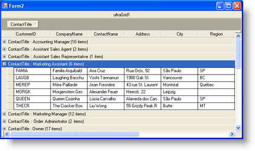
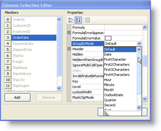
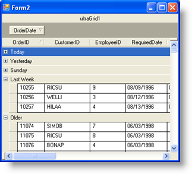

////

|metadata|
{
    "name": "wingrid-groupby-break-behavior",
    "controlName": ["WinGrid"],
    "tags": ["Grids","Grouping"],
    "guid": "{2C33B3E2-7104-40EB-9BAA-56780B36F2DF}",  
    "buildFlags": [],
    "createdOn": "0001-01-01T00:00:00Z"
}
|metadata|
////

= GroupBy Break Behavior

Whenever you enable Outlook GroupBy, the end user can drag and drop column headers into the GroupBy Area. This action, by default, causes WinGrid™ to create a distinct list of values for the dragged column and each distinct value becomes a parent row. The rows that are associated with each distinct value are then displayed as child rows to each parent, in a nested indented fashion.

The following screenshot shows WinGrid with Outlook GroupBy enabled. The user has dragged the ContactTitle column into the GroupBy Area, which caused the WinGrid to create a distinct list of ContactTitle values. Each value has become a parent Row in the WinGrid and each associated Row is nested underneath each parent. Since the WinGrid control in the screenshot below is using the Default GroupBy Break Behavior, the Parent Rows are created by the Distinct List of ContactTitle values:

We can change this behavior by setting a property on the Column level. Each Column has a GroupByMode property that accepts one of several enumeration members: Default, Date, FirstCharacter, First2Characters, First3Characters, First4Characters, Hour, Minute, Month, OutlookDate, Quarter, Second, Text, Value and Year.

Choosing any one of these values will cause the Outlook GroupBy feature to create Parent rows in different ways. For example, choosing Hour (which only works on a DateTime DataType Column) will cause the GroupBy to make a distinct list of values based only on the Hour portion of the Column’s Data. Choosing First2Characters only evaluates the first two characters in the column’s cells. OutlookDate creates a list that emulates the Outlook Today, Yesterday, Last Week and Older grouping.

The following Image shows how to set the GroupByMode property on the OrderDate column by navigating to the WinGrid.DisplayLayout.Bands[0].Columns property through the Property Window:

Here are the values before performing the Outlook GroupBy:

image::images/WinGrid_GroupBy_Break_Behavior_03.png[ultragrid's groupby break behavior]

Here is the WinGrid after performing a GroupBy on the OrderDate Column and the OrderDate Column’s GroupByMode is set to OutlookDate:

As you can see, this can allow you to fully customize the logic applied to the GroupBy functionality.