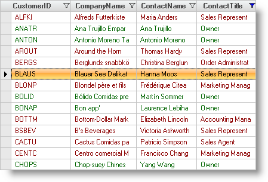

////

|metadata|
{
    "name": "wingrid-handling-filtered-rows-using-filter-actions",
    "controlName": ["WinGrid"],
    "tags": ["Filtering","Grids","How Do I"],
    "guid": "{D6F19AC2-0D01-4422-A426-13C8DF8CCDBE}",  
    "buildFlags": [],
    "createdOn": "2005-11-07T00:00:00Z"
}
|metadata|
////

= Handling Filtered Rows Using Filter Actions

Row filtering in the WinGrid™ was previously an all-or-nothing process. Filtered rows were removed from view, or no filtering was performed. With the addition of row filter actions, you have much more flexibility in handling the rows that have been filtered. You can still choose to simply hide the rows that have been filtered out, and this is the default action taken when filtering is applied.

You can now also color-code rows based on the results of filtering, applying one set of appearances to rows that were included by the filter and another set of appearances to the rows that were excluded. In addition to applying different appearances to included and excluded rows, you can opt to disable the rows that were filtered out by the operation.

The  pick:[win-forms="link:{ApiPlatform}win{ApiVersion}~infragistics.win.appearance.html[Appearance]"]  objects that you use to perform the formatting are found in the  pick:[win-forms="link:{ApiPlatform}win.ultrawingrid{ApiVersion}~infragistics.win.ultrawingrid.ultragridoverride.html[Override]"]  object, and so can be applied at the grid or individual band level. The  pick:[win-forms="link:{ApiPlatform}win.ultrawingrid{ApiVersion}~infragistics.win.ultrawingrid.ultragridoverride~rowfilteraction.html[RowFilterAction]"]  property of the Override object determines the type of filter action that will be taken.

To implement row filter actions other than the default, follow these steps. Note that this code assumes that you have placed an UltraGrid on your form and taken the steps necessary to populate it with data. If you need help doing this, see the topic  pick:[win-forms="link:wingrid-binding-wingrid-to-a-flat-data-source-clr2.html[Bind WinGrid to a Flat Data Source]"] .

[start=1]
. Before you start writing any code, you should place using/imports directives in your code-behind so you don't need to always type out a member's fully qualified name.

*In Visual Basic:*

----
Imports Infragistics.Win
Imports Infragistics.Win.UltraWinGrid
----

*In C#:*

----
using Infragistics.Win;
using Infragistics.Win.UltraWinGrid;
----

[start=2]
. In the IntializeLayout event of the grid element:

*In Visual Basic:*

----
Private Sub UltraGrid1_InitializeLayout(ByVal sender As Object, _
  ByVal e As Infragistics.Win.UltraWinGrid.InitializeLayoutEventArgs) _
  Handles UltraGrid1.InitializeLayout
	e.Layout.Override.AllowRowFiltering = DefaultableBoolean.True
	e.Layout.Override.RowFilterAction = RowFilterAction.AppearancesOnly
	e.Layout.Override.FilteredInCellAppearance.ForeColor = Color.DarkGreen
	e.Layout.Override.FilteredOutCellAppearance.ForeColor = Color.DarkRed
End Sub
----

*In C#:*

----
private void ultraGrid1_InitializeLayout(object sender, 
  Infragistics.Win.UltraWinGrid.InitializeLayoutEventArgs e)
{
	e.Layout.Override.AllowRowFiltering = DefaultableBoolean.True;
	e.Layout.Override.RowFilterAction = RowFilterAction.AppearancesOnly;
	e.Layout.Override.FilteredInCellAppearance.ForeColor = Color.DarkGreen;
	e.Layout.Override.FilteredOutCellAppearance.ForeColor = Color.DarkRed;
}
----

[start=3]
. If you run the project, you will see the row filter icon in the column headers of your grid. Choose a column that has multiple values displayed, then click the row filter icon in that column's header and select one of the values for the drop-down list. The row data will be color coded according to the filter criteria you selected. Data that meets the criteria will appear in green, data that fails to meet the criteria will appear in red.

If you click on any cell that appears in red, you will see that it is still available for editing.

This exercise gives you a basic idea of how to change the way row filtering works by using filter actions. Although only the changing of the ForeColor of affected cells was illustrated, you can easily apply any Appearance-related property based on row filtering by using the techniques shown.