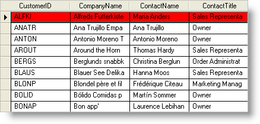

////

|metadata|
{
    "name": "wingrid-highlighting-an-active-row-with-background-color",
    "controlName": ["WinGrid"],
    "tags": ["Grids","How Do I","Styling"],
    "guid": "{A2DA6FCF-E278-4D70-BAB8-AF6E5CC8848D}",  
    "buildFlags": [],
    "createdOn": "2005-11-07T00:00:00Z"
}
|metadata|
////

= Highlighting an Active Row with Background Color

Using the  pick:[win-forms="link:{ApiPlatform}win{ApiVersion}~infragistics.win.appearance~backcolor.html[BackColor]"]  property of the  pick:[win-forms="link:{ApiPlatform}win.ultrawingrid{ApiVersion}~infragistics.win.ultrawingrid.ultragridoverride~activerowappearance.html[ActiveRow's]"]   pick:[win-forms="link:{ApiPlatform}win{ApiVersion}~infragistics.win.appearance.html[Appearance]"]  object, you can choose to highlight the active row with a color.

*In Visual Basic:*

----
Private Sub Highlight_Active_Row_with_Background_Color_Load(ByVal sender As System.Object, _
  ByVal e As System.EventArgs) Handles MyBase.Load
        Me.UltraGrid1.DisplayLayout.Override.ActiveRowAppearance.BackColor = Color.Red
End Sub
----

*In C#:*

----
private void Highlight_Active_Row_with_Background_Color_Load(object sender, EventArgs e)
{
        this.ultraGrid1.DisplayLayout.Override.ActiveRowAppearance.BackColor = Color.Red;
}
----

