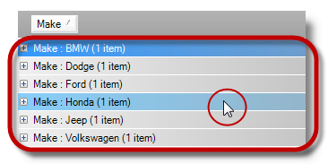

////

|metadata|
{
    "name": "wingrid-hottracking-grouped-rows",
    "controlName": ["WinGrid"],
    "tags": ["Grids","Selection","Styling"],
    "guid": "3a2032c2-eb9d-4589-8cce-80f4d5e5197a",  
    "buildFlags": [],
    "createdOn": "2012-12-21T19:31:47.6135745Z"
}
|metadata|
////

= HotTracking Grouped Rows

== Topic Overview

=== Purpose

This topic is an overview of the `HotTracking` feature and provides a code example demonstrating how to enable `HotTracking` appearance on rows in `GroupBy` mode.

=== Required background

The following topics are prerequisites to understanding this topic:

[options="header", cols="a,a"]
|====
|Topic|Purpose

| link:wingrid-groupby-view.html[GroupBy View]
|This topic explains about an intuitive and powerful way to organize your data using `GroupBy` view feature of the _WinGrid™_ control.

|====

=== In this topic

This topic contains the following sections:

* <<_Ref343696074,Enabling HotTracking in Grouped Rows>>

** <<_Ref341518673,Introduction and preview>>
** <<_Ref341518679,Property settings>>

* <<_Ref341518687,Related Content>>

[[_Ref341518665]]
[[_Ref343696074]]
== Enabling HotTracking in Grouped Rows

[[_Ref341518673]]

=== Introduction and preview

`HotTracking` visually enhances UI elements when the mouse point passes over them. In this case, the UI elements are the grouped by rows and based on your settings via link:{ApiPlatform}win.ultrawingrid{ApiVersion}~infragistics.win.ultrawingrid.ultragridoverride~groupbyrowhottrackappearance.html[GroupByRowHotTrackAppearance] property displays the result with a highlighted appearance. The  _WinGrid™_   introduces the link:{ApiPlatform}win.ultrawingrid{ApiVersion}~infragistics.win.ultrawingrid.ultragridoverride_members.html[UltraGridOverride] object’s link:{ApiPlatform}win.ultrawingrid{ApiVersion}~infragistics.win.ultrawingrid.ultragridoverride~groupbyrowhottrackappearance.html[GroupByRowHotTrackAppearance] property allowing you to define the appearance of `HotTracked` items in grouped rows.

[[_Ref341518679]]

=== Property settings

Setting the `HotTracking` appearance in code.

*In C#:*

[source,csharp]
----
ultraGrid1.DisplayLayout.Override.GroupByRowHotTrackAppearance.BackColor = Color.LightSkyBlue;
----

*In Visual Basic:*

[source,vb]
----
ultraGrid1.DisplayLayout.Override.GroupByRowHotTrackAppearance.BackColor = Color.LightSkyBlue
----

[[_Ref341518687]]
== Related Content

=== Topics

The following topics provide additional information related to this topic.

[options="header", cols="a,a"]
|====
|Topic|Purpose

| link:wingrid-styling-wingrid.html[Styling WinGrid]
|This topic contains valuable links to know about the various ways by which you can style the _WinGrid_ control.

|====