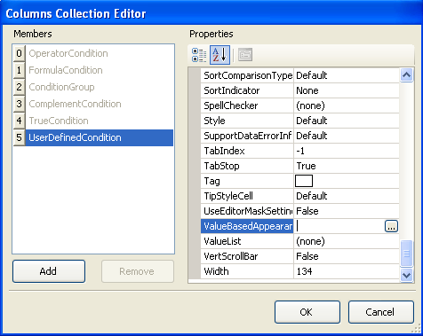
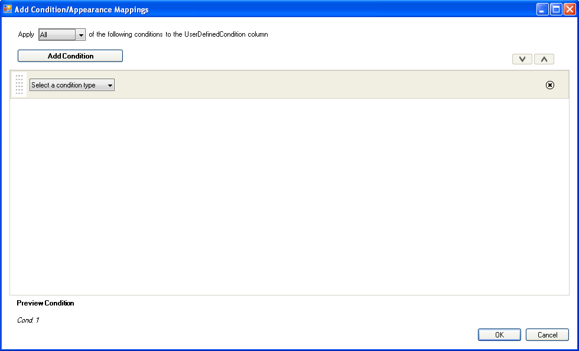
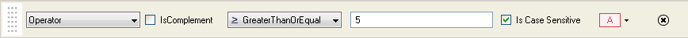
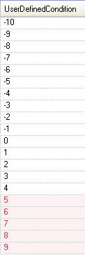

////

|metadata|
{
    "name": "wingrid-implementing-conditional-formatting-at-design-time",
    "controlName": ["WinGrid"],
    "tags": ["Design Environment","Grids","Styling"],
    "guid": "{7D455421-96C7-449D-B6B0-5B704055EBAE}",  
    "buildFlags": [],
    "createdOn": "0001-01-01T00:00:00Z"
}
|metadata|
////

= Implementing Conditional Formatting at Design Time

Conditional Formatting allows you to add rules to a WinGrid™ column that conditionally formats cells if the rule evaluates to true. You can define Conditional Formatting rules in the WinGrid during runtime using the Conditional Formatting dialog. The dialog is available via the Columns Collection Editor through the ValueBasedAppearance property.

.Note
[NOTE]
====
Design time conditional formatting is only possible if the WinGrid's DataSource is set at design time. The design time configuration is required so the IDE is aware of which columns are defined in the data, and therefore the ValueBasedAppearance property is available to be set.
====

== Showing the Conditional Formatting Dialog at Design Time

To show the conditional formatting dialog, follow these steps:

[start=1]
. With WinGrid selected on the form, expand the link:{ApiPlatform}win.ultrawingrid{ApiVersion}~infragistics.win.ultrawingrid.ultragridbase~displaylayout.html[DisplayLayout] object in the Properties window.
[start=2]
. Navigate to the link:{ApiPlatform}win.ultrawingrid{ApiVersion}~infragistics.win.ultrawingrid.ultragridlayout~bands.html[Bands] collection and expand it.
[start=3]
. Expand the band of your choice.
[start=4]
. Find the link:{ApiPlatform}win.ultrawingrid{ApiVersion}~infragistics.win.ultrawingrid.ultragridband~columns.html[Columns] collection and click the ellipsis. The Columns Collection Editor appears.

[start=5]
. Click the ellipsis to the right of the link:{ApiPlatform}win.ultrawingrid{ApiVersion}~infragistics.win.ultrawingrid.ultragridcolumn~valuebasedappearance.html[ValueBasedAppearance] property. The Conditional Formatting dialog box appears.

== Creating a Condition

The steps below demonstrate the process of creating an Operator condition through the conditional formatting dialog. A column containing an integer is used in this example.

[start=1]
. Click the “Select a condition type” drop down, and select Operator.
[start=2]
. Click the comparison operator drop down and select GreaterThanOrEqualTo.
[start=3]
. In the editor, type the value 5.
[start=4]
. Using the appearance drop down, configure the cell’s appearance to your liking. Your condition should look similar to the following.

[start=5]
. Click OK to close the Conditional Formatting Dialog.
[start=6]
. Click OK to the close the Columns Collection Editor. The appearance condition is now set on the grid. Running your application will show the conditional formatting in the grid.

== Related Topics

* link:wingrid-creating-a-formula-condition.html[Create a Formula Condition]
* link:wingrid-creating-an-operator-condition.html[Create an Operator Condition]
* link:wingrid-combining-multiple-conditions.html[Combining Multiple Conditions]