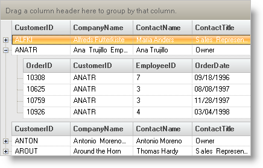
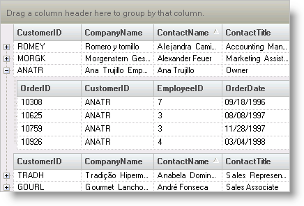

////

|metadata|
{
    "name": "wingrid-limiting-band-indentation",
    "controlName": ["WinGrid"],
    "tags": ["Grids","How Do I","Layouts"],
    "guid": "{6524EF2D-2855-43D9-A3CA-179CDA27FABC}",  
    "buildFlags": [],
    "createdOn": "2005-11-07T00:00:00Z"
}
|metadata|
////

= Limiting Band Indentation

Occasionally, you may want to save screen space by limiting the amount of indentation used when displaying child bands. The  pick:[win-forms="link:{ApiPlatform}win.ultrawingrid{ApiVersion}~infragistics.win.ultrawingrid.ultragridband~indentation.html[Indentation]"]  property controls the amount of space used when indenting.

Code controlling the overall appearance of the WinGrid™ is usually placed within the  pick:[win-forms="link:{ApiPlatform}win.ultrawingrid{ApiVersion}~infragistics.win.ultrawingrid.ultragrid~initializelayout_ev.html[InitializeLayout]"] event. Enter the following code for the element's InitializeLayout event handler.

Set the Indentation property of the specified Bands object.

.Note
[NOTE]
====
Setting this value equal to zero disables indentation of child bands.
====

*In Visual Basic:*

----
Private Sub Limit_Band_Indentation_Load(ByVal sender As System.Object, _
  ByVal e As System.EventArgs) Handles MyBase.Load
	Me.UltraGrid1.DisplayLayout.Bands(1).Indentation = 5
End Sub
----

*In C#:*

----
private void Limit_Band_Indentation_Load(object sender, System.EventArgs e)
{
	this.ultraGrid1.DisplayLayout.Bands[1].Indentation = 5;
}
----

The following screen shots show the difference with this property set. The first one shows what a standard indentation looks like for WinGrid. The second shows what it looks like using the above code.

 

