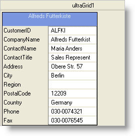

////

|metadata|
{
    "name": "wingrid-limiting-the-amount-of-displayed-cards",
    "controlName": ["WinGrid"],
    "tags": ["Application Scenarios","Grids"],
    "guid": "{DDF75E7D-FDB1-4D0A-A006-EE8C542F3699}",  
    "buildFlags": [],
    "createdOn": "2008-10-04T16:09:42Z"
}
|metadata|
////

= Limiting the Amount of Displayed Cards

You can specify how many Cards show on WinGrid™ at any given time. You can configure the maximum amount of Cards to show horizontally and vertically by setting the  pick:[win-forms="link:{ApiPlatform}win.ultrawingrid{ApiVersion}~infragistics.win.ultrawingrid.ultragridcardsettings~maxcardareacols.html[MaxCardAreaCols]"]  and  pick:[win-forms="link:{ApiPlatform}win.ultrawingrid{ApiVersion}~infragistics.win.ultrawingrid.ultragridcardsettings~maxcardarearows.html[MaxCardAreaRows]"]  properties off the  pick:[win-forms="link:{ApiPlatform}win.ultrawingrid{ApiVersion}~infragistics.win.ultrawingrid.ultragridcardsettings.html[CardSettings]"]  object, respectively.

.Note
[NOTE]
====
Keep in mind that if you want to reset the MaxCardAreaCols and MaxCardAreaRows properties, you can set their values to 0.
====

The following code below is used to allow only one card to show in WinGrid at all times:

*In Visual Basic:*

----
Me.UltraGrid1.DisplayLayout.Bands(0).CardSettings.MaxCardAreaCols = 1
Me.UltraGrid1.DisplayLayout.Bands(0).CardSettings.MaxCardAreaRows = 1
----

*In C#:*

----
this.ultraGrid1.DisplayLayout.Bands[0].CardSettings.MaxCardAreaCols = 1;
this.ultraGrid1.DisplayLayout.Bands[0].CardSettings.MaxCardAreaRows = 1;
----