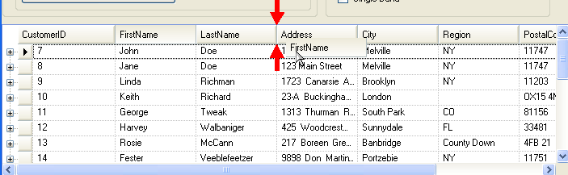
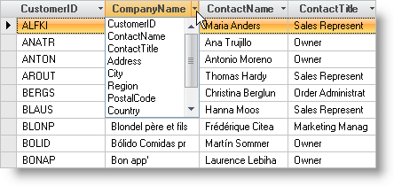

////

|metadata|
{
    "name": "wingrid-moving-swapping-columns",
    "controlName": ["WinGrid"],
    "tags": ["Grids","How Do I"],
    "guid": "{5F1AEDCB-169E-41BA-9EE4-C54C45C24480}",  
    "buildFlags": [],
    "createdOn": "2005-11-07T00:00:00Z"
}
|metadata|
////

= Moving/Swapping Columns

The WinGrid™ has built-in functionality for allowing the user to move and swap columns. By default, column moving is enabled in non-Row Layout mode. In Row Layout mode you must explicitly enable column moving by setting the  pick:[win-forms="link:{ApiPlatform}win.ultrawingrid{ApiVersion}~infragistics.win.ultrawingrid.ultragridoverride~allowcolmoving.html[AllowColMoving]"]  to WithinBand. Column swapping is not enabled by default. To enable it, you must set the  pick:[win-forms="link:{ApiPlatform}win.ultrawingrid{ApiVersion}~infragistics.win.ultrawingrid.ultragridoverride~allowcolswapping.html[AllowColSwapping]"]  to WithinBand.

.Note
[NOTE]
====
This topic assumes you have a bound grid on a form with at least one row of data. If necessary, set the above-mentioned properties as well.
====

You can move a column at run-time by selecting the column, then clicking and dragging it into it's new position.

== To move a column:

[start=1]
. Run the program.
[start=2]
. Select a Column by clicking on the Column Header. You can click and drag on a column header to select multiple columns.
[start=3]
. Once the Column or Columns are selected, click the Column header again and drag the mouse. As you move the mouse over the column headers, you will see red arrow indicating where the columns will be placed when you release the mouse button.
[start=4]
. Release the mouse to drop the columns into their new position.
[start=5]
. The following snapshot shows column moving in action.

== To swap a column:

Column swapping allows you to swap the position of two columns. By default, column swapping is disabled.

[start=1]
. Before you start writing any code, you should place using/imports directives in your code-behind so you don't need to always type out a member's fully qualified name.

*In Visual Basic:*

----
Imports Infragistics.Win.UltraWinGrid
----

*In C#:*

----
using Infragistics.Win.UltraWinGrid;
----

[start=2]
. To enable Column Swapping, you must first set the AllowColSwapping property of the Override object. You would typically do this in the InitializeRow event.

*In Visual Basic:*

----
Private Sub Move_and_Swap_Columns_Load(ByVal sender As System.Object, _
  ByVal e As System.EventArgs) Handles MyBase.Load
	Me.UltraGrid1.DisplayLayout.Override.AllowColSwapping = _
	  AllowColSwapping.WithinBand
End Sub
----

*In C#:*

----
private void Move_and_Swap_Columns_Load(object sender, EventArgs e)
{
	this.ultraGrid1.DisplayLayout.Override.AllowColSwapping = 
	  AllowColSwapping.WithinBand;
}
----

[start=3]
. When the program is run, the Column Header for each row will display a drop-down arrow. To swap columns, drop down the arrow and select the column with which to swap.
[start=4]
. As soon as an item is selected from the list, the two columns will switch positions.
[start=5]
. The following snapshots shows a swap drop-down. Notice that every column header has a small drop down arrow on the right of it.

== Group Moving and Swapping

If you have column groups defined in the grid, they can be moved and swapped in exactly the same manner as columns. You must set the AllowGroupMoving and AllowGroupSwapping properties as appropriate. Then simply select a group's header instead of a column's header, and proceed as outlined above. Note that selecting a group automatically selects all of the columns in that group.