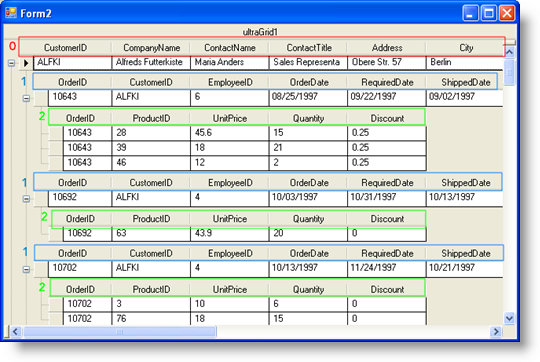
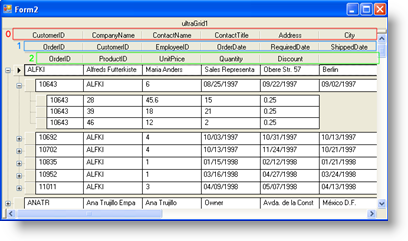
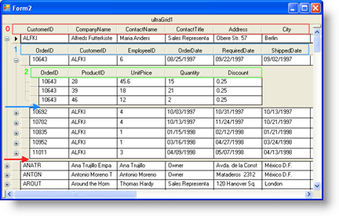

////

|metadata|
{
    "name": "wingrid-no-repeat-column-headers",
    "controlName": ["WinGrid"],
    "tags": ["Grids","Layouts"],
    "guid": "{AD2A1EDA-2A0B-485A-8119-5CC49D04A9FB}",  
    "buildFlags": [],
    "createdOn": "0001-01-01T00:00:00Z"
}
|metadata|
////

= No Repeat Column Headers

Another cosmetic feature of WinGrid™ is called No Repeat Column Headers. Through a single property setting, you can cause WinGrid to display column headers several different ways. Normally, when working with a hierarchical WinGrid, column headers are repeated for each nested sub-collection or data island.

The following screenshot shows WinGrid with a hierarchical data model using a default column display:

To illustrate this better, each band’s column schema is colored so you can see the column header repetition throughout the different data islands. Most end users prefer this default look and feel; however, if maximizing the available real estate to show as much data as possible is critical, then the No Repeat Column Header feature may be for you. The property that controls this feature is DisplayLayout.Override.HeaderPlacement. Currently, this enumeration accepts one of several values: Default, RepeatOnBreak, FixedOnTop, OncePerRowIsland, OncePerGroupedRowIsland.

The same WinGrid as shown above can be altered by setting HeaderPlacement to FixedOnTop:

The FixedOnTop value causes all bands' column headers to display once while being fixed against the Top. Screen space is maximized to show actual data rows. The following screenshot displays how the same WinGrid would look if HeaderPlacement were set to OncePerRowIsland.

Notice carefully how each underlying object collection contains only one set of column headers. In other words, if you look at the underlying data model, the customers collection is one individual Collection; therefore, because of the OncePerRowIsland property value, you only have one set of columns to describe the customers collection (indicated by Band 0 in Red). The red arrow in the screenshot above points to the area where band 0’s column headers would normally appear. Bands 1 and 2 also exhibit the same behavior as each individual sub collection will only have one set of column headers.