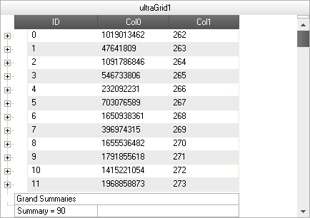
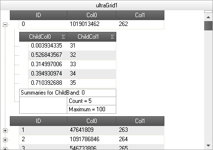

////

|metadata|
{
    "name": "wingrid-performing-external-summary-calculations",
    "controlName": ["WinGrid"],
    "tags": ["Grids","How Do I","Summaries"],
    "guid": "2652de63-ceaf-4a32-ac0d-ed11bbe90d9c",  
    "buildFlags": [],
    "createdOn": "2012-03-12T18:38:16.1575048Z"
}
|metadata|
////

= Performing External Summary Calculations

== Topic Overview

=== Purpose

This topic explains, with code examples, the most common tasks related to performing external summary calculations in the UltraGrid™ control.

=== Required Background

The following table lists the topics required as a prerequisite to understanding this topic.

[options="header", cols="a,a"]
|====
|Topic|Purpose

| link:windatasource-load-data-on-demand.html[Load Data On-Demand]
|This topic demonstrates loading of data on demand with the link:{ApiPlatform}win.ultrawindatasource{ApiVersion}~infragistics.win.ultrawindatasource.ultradatasource~celldatarequested_ev.html[CellDataRequested] event.

|====

=== In This Topic

This topic contains the following sections:

* <<External_1,External Summary Calculations Overview>>
* <<External_2,Enabling External Summary Calculations>>
** Overview
** Property settings
** Code

* <<_Ref317876774,Implementing External Summary Calculations – Conceptual Overview>>
** Overview
** Property settings

* <<_Ref31787690,Implementing External Summary Calculations –Code Example>>
** Description
** Preview
** Code

* <<_Ref317876962,Implementing External Summary Calculations on the Summary Calculator – Conceptual Overview>>
** Overview
** Property settings

* <<_Ref317877004,Implementing External Summary Calculations on the Summary Calculator – Code Example>>
** Description
** Preview
** Code
** Related Content

[[External_1]]
== External Summary Calculations Overview

=== External summary calculations tasks chart

The following table lists the configurable aspects of the WinGrid control. Additional details are available after the summary table.

[options="header", cols="a,a,a"]
|====
|External calculation task|Details|Property/Enum/Method

|Enabling external summary calculations
|The summary type is set to External on the summaries collection for the specific Band.
|
* link:{ApiPlatform}win.ultrawingrid{ApiVersion}~infragistics.win.ultrawingrid.summarytype.html[SummaryType] - enum 

|Implementing external summary calculations
|The link:{ApiPlatform}win.ultrawingrid{ApiVersion}~infragistics.win.ultrawingrid.ultragrid~externalsummaryvaluerequested_ev.html[ExternalSummaryValueRequested] event exposes a link:{ApiPlatform}win.ultrawingrid{ApiVersion}~infragistics.win.ultrawingrid.summaryvalue~setexternalsummaryvalue.html[SetExternalSummaryValue] method that is used to set the summary value directly or externally.
| link:{ApiPlatform}win.ultrawingrid{ApiVersion}~infragistics.win.ultrawingrid.summaryvalue~setexternalsummaryvalue.html[SetExternalSummaryValue] - method

|Implementing external summary calculations on summary calculator
|Set the link:{ApiPlatform}win.ultrawingrid{ApiVersion}~infragistics.win.ultrawingrid.ultragridoverride~useexternalsummarycalculator.html[UseExternalSummaryCalculator] property to true.
|
* link:{ApiPlatform}win.ultrawingrid{ApiVersion}~infragistics.win.ultrawingrid.ultragridoverride~useexternalsummarycalculator.html[UseExternalSummaryCalculator] - property 

|====

[[External_2]]
== Enabling External Summary Calculations

=== Overview

To enable external summary calculations, the summary type must be set to External on the summaries collection for the specific Band. With the external summary calculation functionality, the UltraGrid control’s summary calculation logic is bypassed that ends up iterating the rows collection to calculate the summary value and will also avoid requesting all of the data to be loaded. This provides the ability to add summaries to the UltraGrid control as well as load data on demand.

=== Property settings

The following table maps the desired configuration to property setting.

[options="header", cols="a,a,a"]
|====
|In order to:|Use this Enum:|And set it to:

|Enable external summary calculation
| link:{ApiPlatform}win.ultrawingrid{ApiVersion}~infragistics.win.ultrawingrid.summarytype.html[SummaryType]
|External

|====

=== Code Example

The following sample code sets the Summary type to External using the Add method on the Summaries collection.

*In Visual Basic:*

[source,vb]
----
Dim band As UltraGridBand = Me.ultraGrid1.DisplayLayout.Bands(0)
' Add a summary of type External.
Dim summary As SummarySettings = band.Summaries.Add(SummaryType.External, band.Columns("ID"))
----

*In C#:*

[source,csharp]
----
UltraGridBand band = this.ultraGrid1.DisplayLayout.Bands[0];
// Add a summary of type External.
SummarySettings summary = band.Summaries.Add( SummaryType.External, band.Columns["ID"] );
----

[[_Code_Example:_ExternalSummaryValueR]]
[[_Implementing_External_Summary]]
[[_Ref317876774]]
== Implementing External Summary Calculations – Conceptual Overview

[[_Overview_1]]

=== Overview

When the summary type is set to External, the link:{ApiPlatform}win.ultrawingrid{ApiVersion}~infragistics.win.ultrawingrid.ultragrid~externalsummaryvaluerequested_ev.html[ExternalSummaryValueRequested] event is fired. This event exposes a link:{ApiPlatform}win.ultrawingrid{ApiVersion}~infragistics.win.ultrawingrid.summaryvalue~setexternalsummaryvalue.html[SetExternalSummaryValue] method that is used to set the summary value directly or externally.

[[_Property_settings_1]]

=== Property settings

The following table maps the desired configuration to property setting.

[options="header", cols="a,a,a"]
|====
|In order to:|Use this property:|And set it to:

|Assign an external summary value
| link:{ApiPlatform}win.ultrawingrid{ApiVersion}~infragistics.win.ultrawingrid.summaryvalue~setexternalsummaryvalue.html[SetExternalSummaryValue]
|The desired value

|====

[[_Example_1]]
[[_Ref31787690]]
== Implementing External Summary Calculations – Code Example

=== Description

The code example that follows demonstrates the UltraGrid control displaying the external summary value as a result of the following setting:

[options="header", cols="a,a"]
|====
|Property|Value

| link:{ApiPlatform}win.ultrawingrid{ApiVersion}~infragistics.win.ultrawingrid.summaryvalue~setexternalsummaryvalue.html[SetExternalSummaryValue]
|90

|====

[[_Preview]]

=== Preview

Following is preview of the external summary value being displayed as a result of implementing the sample code.

[[_Code_1]]

=== Code

The following sample code sets the Summary externally or directly within the ExternalSummaryCalculated event.

*In Visual Basic:*

[source,vb]
----
Private Sub ultraGrid1_ExternalSummaryValueRequested(sender As Object, e As ExternalSummaryValueEventArgs)
e.SummaryValue.SetExternalSummaryValue("90")
End Sub
----

*In C#:*

[source,csharp]
----
private void ultraGrid1_ExternalSummaryValueRequested(object sender, ExternalSummaryValueEventArgs e)
{
         e.SummaryValue.SetExternalSummaryValue("90");
}
----

[[_Implementing_External_Summary_1]]
[[_Ref317876962]]
== Implementing External Summary Calculations on the Summary Calculator – Conceptual Overview

[[_Overview_2]]

=== Overview

Summaries (Average, Count, Maximum, Minimum and Sum) on the Summary Calculator can also be calculated externally. This is achieved by setting the link:{ApiPlatform}win.ultrawingrid{ApiVersion}~infragistics.win.ultrawingrid.ultragridoverride~useexternalsummarycalculator.html[UseExternalSummaryCalculator] property to true. This property is available on `UltraGrid.Override` as well as on a particular `Band.Override`. When this property is set to True, UltraGrid will cease summary calculations and fire the ExternalSummaryValueRequested event, requesting the value to place in the summary.

[[_Property_settings_2]]

=== Property settings

The following table maps the desired configuration to property setting.

[options="header", cols="a,a,a"]
|====
|In order to:|Use this property:|And set it to:

|Enable external summary calculation on summary calculator
| link:{ApiPlatform}win.ultrawingrid{ApiVersion}~infragistics.win.ultrawingrid.ultragridoverride~useexternalsummarycalculator.html[UseExternalSummaryCalculator]
|DefaultableBoolean.True

|Assign an external summary value to the _Count_ summary type
| link:{ApiPlatform}win.ultrawingrid{ApiVersion}~infragistics.win.ultrawingrid.summaryvalue~setexternalsummaryvalue.html[SetExternalSummaryValue]
|The desired value

|Assign an external summary value to the _Maximum_ summary type
| link:{ApiPlatform}win.ultrawingrid{ApiVersion}~infragistics.win.ultrawingrid.summaryvalue~setexternalsummaryvalue.html[SetExternalSummaryValue]
|The desired value

|====

[[_Ref317877004]]
== Implementing External Summary Calculations on the Summary Calculator – Code Example

[[_Example]]

=== Description

The ode example that follows demonstrates the UltraGrid control displaying external summary value on the Summary Calculator as a result of the following setting:

[options="header", cols="a,a"]
|====
|Property|Value

|SetExternalSummaryValue
|5

|SetExternalSummaryValue
|100

|====

[[_Preview_1]]

=== Preview

The following snapshot demonstrates the effect of the settings listed in the Example text block: the UltraGrid displaying external Summary value on the Summary Calculator for a child band.

[[_Code_2]]

=== Code

The following sample code sets the Summary Calculator to External. The link:{ApiPlatform}win.ultrawingrid{ApiVersion}~infragistics.win.ultrawingrid.ultragridoverride~useexternalsummarycalculator.html[UseExternalSummaryCalculator] property is set to `True`. UltraGrid displays external summary value on Summary Calculator for child band. The summary value is set within the link:{ApiPlatform}win.ultrawingrid{ApiVersion}~infragistics.win.ultrawingrid.ultragrid~externalsummaryvaluerequested_ev.html[ExternalSummaryValueRequested] event.

*In Visual Basic:*

[source,vb]
----
' Allow summary calculator to calculate summaries externally for the entire Grid 
' this.ultraGrid1.DisplayLayout.Override.UseExternalSummaryCalculator = DefaultableBoolean.True;
' Allows Summary Calculator to calculate summaries externally for a specific band(Bands[1]).
' UltraGrid summary calcuation is stopped and                                    'ultraGrid1_ExternalSummaryValueRequested event is  fired.
Me.ultraGrid1.DisplayLayout.Bands(1).Override.UseExternalSummaryCalculator = Infragistics.Win.DefaultableBoolean.True
Private Sub ultraGrid1_ExternalSummaryValueRequested(sender As Object, e As ExternalSummaryValueEventArgs)
      Select Case e.SummaryValue.SummarySettings.SummaryType.ToString()
            Case "Count"
                  e.SummaryValue.SetExternalSummaryValue(5)
                  Exit Select
            Case "Maximum"
                  e.SummaryValue.SetExternalSummaryValue(100)
                  Exit Select
      End Select
End Sub
----

*In C#:*

[source,csharp]
----
// Allow summary calculator to calculate summaries externally for the entire // Grid 
// this.ultraGrid1.DisplayLayout.Override.UseExternalSummaryCalculator = 
// DefaultableBoolean.True;
// Allows Summary Calculator to calculate summaries externally for a specific 
// band(Bands[1]).
// UltraGrid summary calcuation is stopped and 
// ultraGrid1_ExternalSummaryValueRequested event is fired.
this.ultraGrid1.DisplayLayout.Bands[1].Override.UseExternalSummaryCalculator =
Infragistics.Win.DefaultableBoolean.True;
private void ultraGrid1_ExternalSummaryValueRequested(object sender, ExternalSummaryValueEventArgs e)
{
        switch (e.SummaryValue.SummarySettings.SummaryType.ToString())
        {
            case "Count":
            e.SummaryValue.SetExternalSummaryValue(5);
            break;
            case "Maximum":
            e.SummaryValue.SetExternalSummaryValue(100);
            break;
        }
}
----

[[_Related_Content]]
== Related Content

=== Topics

The following topics provide additional information related to this topic.

[options="header", cols="a,a"]
|====
|Topic|Purpose

| link:wingrid-positioning-column-summaries.html[Positioning Column Summaries]
|This topic illustrates how to display the column summaries in a position other than the bottom of the column

| link:wingrid-displaying-non-scrolling-summaries.html[Display Non-Scrolling Summaries]
|This topic shows how to fix the summaries so they don't scroll.

|====