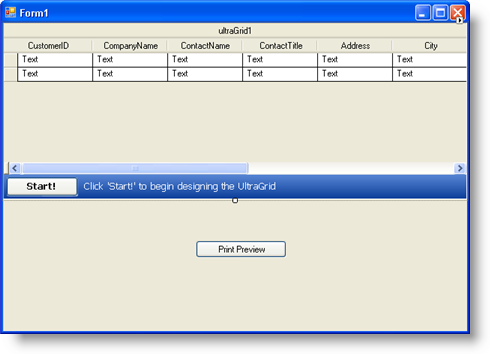
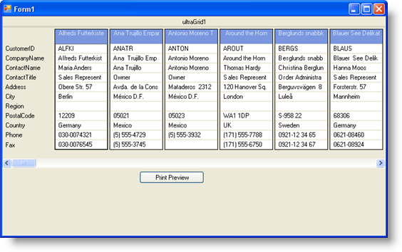
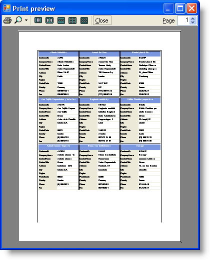

////

|metadata|
{
    "name": "wingrid-printing-wingrid-in-card-view",
    "controlName": ["WinGrid"],
    "tags": ["Application Scenarios","Grids","Printing"],
    "guid": "{AECA10E5-D406-42C0-B57A-275BFAC4FD95}",  
    "buildFlags": [],
    "createdOn": "0001-01-01T00:00:00Z"
}
|metadata|
////

= Printing WinGrid in Card View

== Before You Begin

WinGrid™ offers several printing options from exporting your grid to a Microsoft® Excel® file or PDF document, to sending your grid to a print preview dialog or printer. WinGrid can be in several visual states when you print or export it. However, WinGrid's look on the computer screen is rarely fit for a printed document due to size restrictions. This is why it's important to realize that you can initialize WinGrid's layout for general viewing on a computer monitor in the  pick:[win-forms="link:{ApiPlatform}win.ultrawingrid{ApiVersion}~infragistics.win.ultrawingrid.ultragrid~initializelayout_ev.html[InitializeLayout]"]  event, but can also initialize WinGrid's layout for printing in the  pick:[win-forms="link:{ApiPlatform}win.ultrawingrid{ApiVersion}~infragistics.win.ultrawingrid.ultragrid~initializeprint_ev.html[InitializePrint]"]  or  pick:[win-forms="link:{ApiPlatform}win.ultrawingrid{ApiVersion}~infragistics.win.ultrawingrid.ultragrid~initializeprintpreview_ev.html[InitializePrintPreview]"]  events without modifying WinGrid's original visual state.

== What You Will Accomplish

This topic will guide you through initializing WinGrid's layout for link:wingrid-about-card-view.html[card view] in the InitializeLayout event. You will then learn how to modify the layout in the InitializePrintPreview event.

== Follow these Steps

[start=1]
. *Set up your form* .

You need to place both a WinGrid control and a WinButton control on the form. WinGrid will hold data from the Northwind database (for more information, see link:wingrid-binding-wingrid-to-a-flat-data-source-clr2.html[Bind WinGrid to a Flat Data Source]) and WinButton™ will call WinGrid's  pick:[win-forms="link:{ApiPlatform}win.ultrawingrid{ApiVersion}~infragistics.win.ultrawingrid.ultragrid~printpreview.html[PrintPreview]"]  method.

.. Drag both an UltraGrid and UltraButton control from the Microsoft® Visual Studio® toolbox onto the form.
.. Set up WinGrid using the topic mentioned in the paragraph above (or you could use your own data).
.. Set WinButton's Text property to 'Print Preview'.

Arrange the controls so your form looks similar to the following screen shot.

[start=2]
. *Initialize WinGrid's layout to use card view* .

In WinGrid's InitializeLayout event, you can set properties exposed by the  pick:[win-forms="link:{ApiPlatform}win.ultrawingrid{ApiVersion}~infragistics.win.ultrawingrid.ultragridlayout.html[DisplayLayout]"]  object to modify WinGrid's look and feel. You will turn card view mode on in this event, as well as set several properties to configure how you want the cards to look. An important property to set when printing in card view is the  pick:[win-forms="link:{ApiPlatform}win.ultrawingrid{ApiVersion}~infragistics.win.ultrawingrid.ultragridlayout~allowcardprinting.html[AllowCardPrinting]"]  property. This property's default setting is Never; therefore, you'll need to set AllowCardPrinting to RootBandOnly in order to allow WinGrid to print in card view.

Double-click anywhere on WinGrid and Visual Studio will generate the InitializeLayout event. Place the following code in the InitializeLayout event in order to enable printing in card view.

*In Visual Basic:*

----
'You must set this property in order to print in card view.
Me.UltraGrid1.DisplayLayout.AllowCardPrinting = _
   Infragistics.Win.UltraWinGrid.AllowCardPrinting.RootBandOnly
'Display WinGrid in card view.
Me.UltraGrid1.DisplayLayout.Bands(0).CardView = True
'Set a caption for each card using the CompanyName field.
Me.UltraGrid1.DisplayLayout.Bands(0).CardSettings.CaptionField = "CompanyName"
----

*In C#:*

----
//You must set this property in order to print in card view.
this.ultraGrid1.DisplayLayout.AllowCardPrinting =
   Infragistics.Win.UltraWinGrid.AllowCardPrinting.RootBandOnly;
//Display WinGrid in card view.
this.ultraGrid1.DisplayLayout.Bands[0].CardView = true;
//Set a caption for each card using the CompanyName field.
this.ultraGrid1.DisplayLayout.Bands[0].CardSettings.CaptionField = "CompanyName";
----

[start=3]
. *Initialize WinGrid's print layout to print cards* .

In WinGrid's InitializeLayout event, you set properties to modify WinGrid's look and feel. In WinGrid's InitializePrintPreview event, you will also be setting properties to modify WinGrid's look and feel, but these settings will only affect the printed WinGrid. Rather than modifying WinGrid's DisplayLayout, you will be modifying the PrintLayout exposed by the EventArgs. Doing so will leave WinGrid's original look and feel untouched, while only changing what will be printed.

.. In Design view with WinGrid selected, click the lightning bolt towards the top of the properties window. A list of WinGrid properties appears.
.. Scroll down until you see InitializePrintPreview and double-click it. Visual Studio generates the InitializePrintPreview event for you.
.. Place the following code in the InitializePrintPreview event in order to change how WinGrid prints cards.

*In Visual Basic:*

----
'Standard labels makes it easier for each card to
'stand on its own, allowing you to possibly cut out
'the cards for distribution.
e.PrintLayout.Bands(0).CardSettings.Style = _
	Infragistics.Win.UltraWinGrid.CardStyle.StandardLabels
'Setting the MaxCardAreaCols and MaxCardAreaRows properties
'allow you to limit the amount of cards per page. Setting
'these properties to 3 will give you nine cards per page.
e.PrintLayout.Bands(0).CardSettings.MaxCardAreaCols = 3
e.PrintLayout.Bands(0).CardSettings.MaxCardAreaRows = 3
'Each card will automatically increase width in order to 
'fit in the available space.
e.PrintLayout.Bands(0).CardSettings.AutoFit = True
----

*In C#:*

----
//Standard labels makes it easier for each card to
//stand on its own, allowing you to possibly cut out
//the cards for distribution.
e.PrintLayout.Bands[0].CardSettings.Style =
	Infragistics.Win.UltraWinGrid.CardStyle.StandardLabels;
//Setting the MaxCardAreaCols and MaxCardAreaRows properties
//allow you to limit the amount of cards per page. Setting
//these properties to 3 will give you nine cards per page.
e.PrintLayout.Bands[0].CardSettings.MaxCardAreaCols = 3;
e.PrintLayout.Bands[0].CardSettings.MaxCardAreaRows = 3;
//Each card will automatically increase width in order to 
//fit in the available space.
e.PrintLayout.Bands[0].CardSettings.AutoFit = true;
----

[start=4]
. *Display WinGrid's print preview* .

.. In Design view, double-click the WinButton control. Visual Studio generates the button's Click event.
.. Place the following code in the Click event to display WinGrid's print preview.

*In Visual Basic:*

----
'Calling the PrintPreview method displays WinGrid's
'print preview dialog box.
Me.UltraGrid1.PrintPreview()
----

*In C#:*

----
//Calling the PrintPreview method displays WinGrid's
//print preview dialog box.
this.ultraGrid1.PrintPreview();
----

[start=5]
. *Run the application* .

When you build and run the application, you will see WinGrid in card view with merged labels. If you expand the width of the application window, WinGrid will attempt to place as many cards in the viewable space.

However, when you click the Print Preview button, WinGrid generates a new card layout based on the PrintLayout object in the InitializePrintPreview event.

