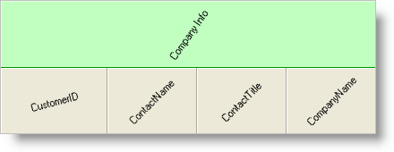

////

|metadata|
{
    "name": "wingrid-rotating-text-in-wingrids-column-headers",
    "controlName": ["WinGrid"],
    "tags": ["Grids","How Do I","Styling"],
    "guid": "{60959449-D3EC-4AC6-9304-74763B57D90F}",  
    "buildFlags": [],
    "createdOn": "0001-01-01T00:00:00Z"
}
|metadata|
////

= Rotating Text in WinGrid's Column Headers

WinGrid™ column headers help your end user identify exactly what it is that they are looking at. Column headers can be very descriptive and very long. In several cases, the text in your column headers may be much longer than the text in the actual column (especially when using numeric data). In order to shorten the column width despite a lengthy column header, you can rotate the column header until the column is a more suitable width.

You can rotate column headers on WinGrid's link:{ApiPlatform}win.ultrawingrid{ApiVersion}~infragistics.win.ultrawingrid.ultragridoverride.html[Override], link:{ApiPlatform}win.ultrawingrid{ApiVersion}~infragistics.win.ultrawingrid.ultragridband.html[Band], and link:{ApiPlatform}win.ultrawingrid{ApiVersion}~infragistics.win.ultrawingrid.ultragridcolumn.html[Column] levels, as well as group headers. For the most part, setting the text orientation for a specific object involves setting a TextOrientation property to an instance of the link:{ApiPlatform}win{ApiVersion}~infragistics.win.textorientationinfo.html[TextOrientationInfo] object. The TextOrientationInfo object exposes several properties which return predefined TextOrientationInfo objects. These predefined objects rotate column header text in common rotations and are provided for your convenience. You can rotate column headers with the following predefined TextOrientationInfo objects:

* link:{ApiPlatform}win{ApiVersion}~infragistics.win.textorientationinfo~horizontal45degrees.html[Horizontal45Degrees] – Rotates column headers horizontally by 45 degrees.
* link:{ApiPlatform}win{ApiVersion}~infragistics.win.textorientationinfo~horizontal90degrees.html[Horizontal90Degrees] -- Rotates column headers horizontally by 90 degrees.
* link:{ApiPlatform}win{ApiVersion}~infragistics.win.textorientationinfo~horizontalnegative45degrees.html[HorizontalNegative45Degrees] -- Rotates column headers horizontally by -45 degrees.
* link:{ApiPlatform}win{ApiVersion}~infragistics.win.textorientationinfo~horizontalnegative90degrees.html[HorizontalNegative90Degrees] -- Rotates column headers horizontally by -90 degrees.
* link:{ApiPlatform}win{ApiVersion}~infragistics.win.textorientationinfo~vertical.html[Vertical] -- Rotates column headers horizontally by 90 degrees.
* link:{ApiPlatform}win{ApiVersion}~infragistics.win.textorientationinfo~horizontal.html[Horizontal] -- No rotation.

*In Visual Basic:*

----
'Rotate all headers in WinGrid horizontally 45 degrees.
Me.CustomersUltraGrid.DisplayLayout.Override.ColumnHeaderTextOrientation = _
	Infragistics.Win.TextOrientationInfo.Horizontal45Degrees
----

*In C#:*

----
//Rotate all headers in WinGrid horizontally 45 degrees.
this.customersUltraGrid.DisplayLayout.Override.ColumnHeaderTextOrientation =
	Infragistics.Win.TextOrientationInfo.Horizontal45Degrees;
----

Of course, if these predefined rotations don't work out, you can always instantiate a new TextOrientationInfo object with your own rotation. The only stipulation is that you can't rotate header text vertically.

*In Visual Basic:*

----
'Rotate all headers in WinGrid by 75 degrees.
Me.CustomersUltraGrid.DisplayLayout.Override.ColumnHeaderTextOrientation = _
	New Infragistics.Win.TextOrientationInfo _
	(75, Infragistics.Win.TextFlowDirection.Horizontal)
----

*In C#:*

----
//Rotate all headers in WinGrid by 75 degrees.
this.customersUltraGrid.DisplayLayout.Override.ColumnHeaderTextOrientation =
	new Infragistics.Win.TextOrientationInfo
	(75, Infragistics.Win.TextFlowDirection.Horizontal);
----

Once you've figured out how you want to rotate your header text, you need to identify on which level you want to rotate your header text. Refer to the following table to figure out which property you need to set to an instance of TextOrientationInfo in order to rotate the proper header text.

[options="header", cols="a,a"]
|====
|I want to rotate...|I should set...

|All Column Headers in WinGrid.
|The ColumnHeaderTextOrientation property of the Override object.

|Individual Band Headers.
|The TextOrientation property of the Header object of the Band I want to rotate. The WinGrid Band Header is hidden by default and can be made visible if the link:{ApiPlatform}win.ultrawingrid{ApiVersion}~infragistics.win.ultrawingrid.ultragridband~headervisible.html[HeaderVisible] property of the Band is set to true.

|A Column Header in a single column.
|The TextOrientation property of the Header object of the specific Column whose header I want to rotate.

|The Group or Level of Column Headers.
|The TextOrientation property of the Header object of the Group whose headers I want to rotate. This will rotate the Group heading that appears above related columns. For more information about Groups and Levels see link:wingrid-creating-multiple-row-layout-use-levels.html[Create a Multiple-Row Layout Using Levels].

|====

.Note
[NOTE]
====
When rotating text in column headers in WinGrid vertically, the total space consumed by the header can be decreased using the  pick:[win-forms="link:{ApiPlatform}win.ultrawingrid{ApiVersion}~infragistics.win.ultrawingrid.ultragridcolumn~performautoresize.html[PerformAutoResize]"]  method of the  pick:[win-forms="link:{ApiPlatform}win.ultrawingrid{ApiVersion}~infragistics.win.ultrawingrid.ultragridcolumn.html[UltraGridColumn]"]  class. But, you may experience that on resizing column header, the sort indicator disappears. In order to accommodate for this issue, set the  pick:[win-forms="link:{ApiPlatform}win.ultrawingrid{ApiVersion}~infragistics.win.ultrawingrid.ultragridoverride~reservesortindicatorspacewhenautosizing.html[ultraGrid.DisplayLayout.Override.ReserveSortIndicatorSpaceWhenAutoSizing]"]  property to either Default, WhenColumnIsSortable or WhenVisible setting.
====