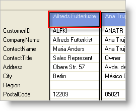

////

|metadata|
{
    "name": "wingrid-setting-a-caption-in-card-view",
    "controlName": ["WinGrid"],
    "tags": ["Grids","How Do I"],
    "guid": "{2036F9F2-339A-44C0-80A9-90A46AFF3C82}",  
    "buildFlags": [],
    "createdOn": "2008-10-04T16:08:35Z"
}
|metadata|
////

= Setting a Caption in Card View

By default, Card View displays a Caption area for each row in WinGrid™. This is an area that allows you to specify what field from the underlying data source will be used to display a value in this area. The following code programmatically specifies which field from the underlying data source will be used for the Card Caption by setting the  pick:[win-forms="link:{ApiPlatform}win.ultrawingrid{ApiVersion}~infragistics.win.ultrawingrid.ultragridcardsettings~captionfield.html[CaptionField]"]  property. To ensure that captions display, set the  pick:[win-forms="link:{ApiPlatform}win.ultrawingrid{ApiVersion}~infragistics.win.ultrawingrid.ultragridcardsettings~showcaption.html[ShowCaption]"]  property to True. 

*In Visual Basic:*

----
Me.UltraGrid1.DisplayLayout.Bands(0).CardSettings.CaptionField = "CompanyName"
Me.UltraGrid1.DisplayLayout.Bands(0).CardSettings.ShowCaption = True
----

*In C#:*

----
this.ultraGrid1.DisplayLayout.Bands[0].CardSettings.CaptionField = "CompanyName";
this.ultraGrid1.DisplayLayout.Bands[0].CardSettings.ShowCaption = true;
----