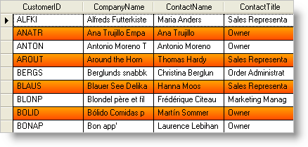

////

|metadata|
{
    "name": "wingrid-setting-alternate-row-colors",
    "controlName": ["WinGrid"],
    "tags": ["Grids","How Do I","Styling"],
    "guid": "{936F7D82-DC35-4D49-89B9-4E495C24E3BA}",  
    "buildFlags": [],
    "createdOn": "2005-11-07T00:00:00Z"
}
|metadata|
////

= Setting Alternate Row Colors

You can use the  pick:[win-forms="link:{ApiPlatform}win{ApiVersion}~infragistics.win.appearance~backcolor.html[BackColor]"] ,  pick:[win-forms="link:{ApiPlatform}win{ApiVersion}~infragistics.win.appearancebase~backcolor2.html[BackColor2]"] , and  pick:[win-forms="link:{ApiPlatform}win{ApiVersion}~infragistics.win.appearancebase~backgradientstyle.html[BackGradientStyle]"]  properties off WinGrid's™  pick:[win-forms="link:{ApiPlatform}win.ultrawingrid{ApiVersion}~infragistics.win.ultrawingrid.ultragridoverride~rowalternateappearance.html[RowAlternateAppearance]"]  object to create unique gradients to style the alternating rows. The following example code shows you how this can be achieved at run time.

*In Visual Basic:*

----
Private Sub Set_Alternate_Row_Colors_Load(ByVal sender As System.Object, _
  ByVal e As System.EventArgs) Handles MyBase.Load
	Me.UltraGrid1.DisplayLayout.Override.RowAlternateAppearance.BackColor = Color.Orange
	Me.UltraGrid1.DisplayLayout.Override.RowAlternateAppearance.BackColor2 = Color.OrangeRed
	Me.UltraGrid1.DisplayLayout.Override.RowAlternateAppearance.BackGradientStyle = _
	  Infragistics.Win.GradientStyle.Vertical
End Sub
----

*In C#:*

----
private void Set_Alternate_Row_Colors_Load(object sender, EventArgs e)
{
	this.ultraGrid1.DisplayLayout.Override.RowAlternateAppearance.BackColor = Color.Orange;
	this.ultraGrid1.DisplayLayout.Override.RowAlternateAppearance.BackColor2 = 
	  Color.OrangeRed;
	this.ultraGrid1.DisplayLayout.Override.RowAlternateAppearance.BackGradientStyle = 
	  Infragistics.Win.GradientStyle.Vertical;
}
----

