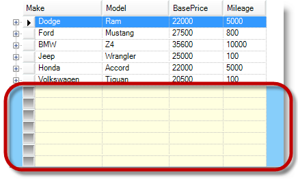
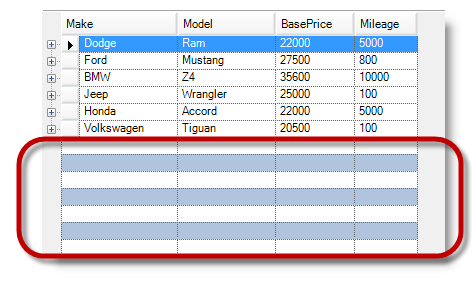

////

|metadata|
{
    "name": "wingrid-showing-empty-rows",
    "controlName": ["WinGrid"],
    "tags": ["Grids","How Do I"],
    "guid": "{EEA9F657-F01E-4776-AC88-907C4B0F9A27}",  
    "buildFlags": [],
    "createdOn": "2005-12-09T00:00:00Z"
}
|metadata|
////

= Showing Empty Rows

== Topic Overview

=== Purpose

This topic provides an overview and uses code examples to demonstrate how to display and apply some styles to the appearance of empty rows.

=== In this topic

This topic contains the following sections:

* <<_Ref341898631,Displaying Empty Rows>>

** <<_Ref341951653,Introduction>>
** <<_Ref341898648,Prerequisites>>
** <<_Ref341898660,Steps>>

* <<_Ref341518687,Related Content>>

[[_Ref341898631]]
== Displaying Empty Rows

[[_Ref341898639]]

=== Introduction

The Empty Rows feature allows you to fill the blank space after the last visible row with empty rows for aesthetic appeal only. The  pick:[win-forms="link:{ApiPlatform}win.ultrawingrid{ApiVersion}~infragistics.win.ultrawingrid.emptyrowsettings_members.html[EmptyRowSettings]"]  object exposes various properties to display empty rows as well as control the appearance of empty rows.

* `AlignWithDataRows`
* `ExtendFirstCell` (Default)
* `ExtendRowSelector`
* `HideRowSelector`
* `PrefixWithEmptyCell`

.Note:
[NOTE]
====
Empty rows are not user interactive.
====

[[_Ref341898648]]

=== Prerequisites

Before you start writing any code, you should place a `using (C#)` or `imports (Visual Basic)` directives in your code-behind. This will save you from always having to type out a member's fully qualified name.

*In C#:*

[source,csharp]
----
using Infragistics.Win.UltraWinGrid;
----

*In Visual Basic:*

[source,vb]
----
Imports Infragistics.Win.UltraWinGrid
----

Set the `ShowEmptyRows` to enable the feature.

*In C#:*

[source,csharp]
----
// Display empty rows
this.ultraGrid1.DisplayLayout.EmptyRowSettings.ShowEmptyRows = true;
----

*In Visual Basic:*

[source,vb]
----
' Display empty rows
Me.ultraGrid1.DisplayLayout.EmptyRowSettings.ShowEmptyRows = True
----

[[_Ref341898660]]

=== Steps

By default, empty rows extend to the left so that they align with the grid’s left edge. You can reconfigure this by setting the Style property. The Style property offers a few different options regarding whether and how to extend empty rows.

1. The following code sets the Style to `AlignWithDataRows` causing the empty rows to align with the rows that contain data.

*In C#:*

[source,csharp]
----
this.ultraGrid1.DisplayLayout.EmptyRowSettings.Style = EmptyRowStyle.AlignWithDataRows;
----

*In Visual Basic:*

[source,vb]
----
Me.ultraGrid1.DisplayLayout.EmptyRowSettings.Style = EmptyRowStyle.AlignWithDataRows
----

2. The  pick:[win-forms="link:{ApiPlatform}win.ultrawingrid{ApiVersion}~infragistics.win.ultrawingrid.emptyrowsettings_members.html[EmptyRowSettings]"]  object exposes properties for controlling the appearance of empty rows as well.

*In C#:*

[source,csharp]
----
// CellAppearance property of EmptyRowSettings controls the appearance of 
// cells of empty rows.
this.ultraGrid1.DisplayLayout.EmptyRowSettings.CellAppearance.BackColor = Color.LightYellow;
// RowAppearance property of EmptyRowSettings controls the appearance of 
// empty rows. NOTE: This will have effect only if some part of the row
// background is exposed. By default cells cover all of the row, unless
// some setting like CellSpacing causes the part of the row background
// to be exposed.
this.ultraGrid1.DisplayLayout.EmptyRowSettings.RowAppearance.BackColor = Color.LightYellow;
// RowSelectorAppearance property of EmptyRowSettings controls the appearance 
// of row selectors of empty rows, if the row selectors of empty rows are visible.
this.ultraGrid1.DisplayLayout.EmptyRowSettings.RowSelectorAppearance.BackColor = Color.Gray;
// EmptyAreaAppearance property of EmptyRowSettings controls the appearance
// of the empty rows area. Empty rows area contains all the empty rows.
this.ultraGrid1.DisplayLayout.EmptyRowSettings.EmptyAreaAppearance.BackColor = Color.LightSkyBlue;
----

*In Visual Basic:*

[source,vb]
----
' CellAppearance property of EmptyRowSettings controls the appearance of 
' cells of empty rows.
Me.ultraGrid1.DisplayLayout.EmptyRowSettings.CellAppearance.BackColor = Color.LightYellow
' RowAppearance property of EmptyRowSettings controls the appearance of 
' empty rows. NOTE: This will have effect only if some part of the row
' background is exposed. By default cells cover all of the row, unless
' some setting like CellSpacing causes the part of the row background
' to be exposed.
Me.ultraGrid1.DisplayLayout.EmptyRowSettings.RowAppearance.BackColor = Color.LightYellow
' RowSelectorAppearance property of EmptyRowSettings controls the appearance 
' of row selectors of empty rows, if the row selectors of empty rows are visible.
Me.ultraGrid1.DisplayLayout.EmptyRowSettings.RowSelectorAppearance.BackColor = Color.Gray
' EmptyAreaAppearance property of EmptyRowSettings controls the appearance
' of the empty rows area. Empty rows area contains all the empty rows.
Me.ultraGrid1.DisplayLayout.EmptyRowSettings.EmptyAreaAppearance.BackColor = Color.LightSkyBlue
----

The following screenshot illustrates empty rows with the above settings and appearances applied.

.Note:
[NOTE]
====
When used together cell related appearance takes precedence over row related appearance.
====

The following table illustrates the result of the `BackColor` setting, with a screenshot, where both cell and row appearances are set.

[options="header", cols="a,a"]
|====
|Setting|Result

|CellAppearance.BackColor = Color.LightYellow; 

RowAppearance.BackColor = Color.Red;
|image::images/WinGrid_Showing_Empty_Rows_2.png[]

|====

3. The  _WinGrid_   introduced the link:{ApiPlatform}win.ultrawingrid{ApiVersion}~infragistics.win.ultrawingrid.ultragridoverride~rowalternateappearance.html[RowAlternateAppearance] property used to apply alternate row settings. The following previews and code examples demonstrate the settings that you need to apply in order to achieve an alternate row appearance for empty rows.

.Note:
[NOTE]
====
Remember you must first disable the `CellAppearance` for this to work properly.
====

This screen capture illustrates empty rows with alternate row appearance using `HideRowSelector` style option.

The following code applies alternate row settings to empty rows, and optionally setting a style for the row’s appearance.

*In C#:*

[source,csharp]
----
ultraGrid1.DisplayLayout.EmptyRowSettings.RowAlternateAppearance.BackColor = Color.LightSteelBlue;
ultraGrid1.DisplayLayout.EmptyRowSettings.Style = EmptyRowStyle.HideRowSelector;
----

*In Visual Basic:*

[source,vb]
----
ultraGrid1.DisplayLayout.EmptyRowSettings.RowAlternateAppearance.BackColor = Color.LightSteelBlue
ultraGrid1.DisplayLayout.EmptyRowSettings.Style = EmptyRowStyle.HideRowSelector
----

[[_Ref341518687]]
== Related Content

=== Topics

The following topics provide additional information related to this topic.

[options="header", cols="a,a"]
|====
|Topic|Purpose

| link:wingrid-using-wingrid.html[Using WinGrid]
|This topic contains a list of sections with brief description and links to 

== related topic
f the _WinGrid_ control.

|====