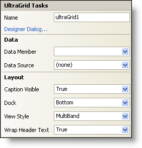

////

|metadata|
{
    "name": "wingrid-smart-tag",
    "controlName": ["WinGrid"],
    "tags": ["Grids"],
    "guid": "{CB30B27B-3AF0-47E4-BF98-7E582EB1B8E7}",  
    "buildFlags": [],
    "createdOn": "2005-11-11T00:00:00Z"
}
|metadata|
////

= WinGrid Smart Tag

Each Infragistics Windows Forms control/component is equipped with a Smart Tag. By simply selecting the control/component, a Smart Tag anchor appears. When you click this anchor, a pop-up panel appears, providing you with quick and easy access to the most common properties and settings of the control/component.

The WinGrid™ Smart Tag contains the name of the control, as well as the following sections:

* Data -- Refers to any underlying data the control is using such as data sources and data members.
* Layout -- Offers properties that will determine where and how the control is placed on the form.

See below for a description of the item (e.g., field, drop-down list, checkbox) in each section, as well as the item's corresponding property in the properties grid.

[options="header", cols="a,a,a"]
|====
|Data|Description|Corresponding Property

|Data Member 
|Once you have selected a valid data source, you can select all available data members from this drop-down. 
| pick:[win-forms="link:infragistics4.win.ultrawingrid.v{ProductVersion}~infragistics.win.ultrawingrid.ultragridbase~datamember.html[DataMember]"]  

|Data Source 
|Click the drop-down and all available data sources in your project will be displayed. If you do not have a data source set up, you can select, "Add Project Data Source..." to create one.
| pick:[win-forms="link:infragistics4.win.ultrawingrid.v{ProductVersion}~infragistics.win.ultrawingrid.ultragridbase~datasource.html[DataSource]"] 
|====

[options="header", cols="a,a,a"]
|====
|Layout|Description|Corresponding Property

|Caption Visible
|Selecting True from the drop-down will display the caption at the top of the WinGrid.
| pick:[win-forms="link:infragistics4.win.ultrawingrid.v{ProductVersion}~infragistics.win.ultrawingrid.ultragridlayout~captionvisible.html[CaptionVisible]"] 

|Dock
|Choose to dock the control to the top, right, bottom, left, full, or none.
|Dock

|View Style
|View your data in the WinGrid in SingleBand or MultiBand mode.
| pick:[win-forms="link:infragistics4.win.ultrawingrid.v{ProductVersion}~infragistics.win.ultrawingrid.ultragridlayout~viewstyle.html[ViewStyle]"] 

|Wrap Header Text
|If header text is too large to fit in a column, select True from this drop-down and header text will wrap when it reaches the end of the column.
| pick:[win-forms="link:infragistics4.win.ultrawingrid.v{ProductVersion}~infragistics.win.ultrawingrid.ultragridoverride~wrapheadertext.html[WrapHeaderText]"] 

|====