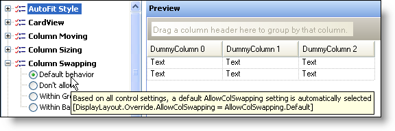

////

|metadata|
{
    "name": "wingrid-tooltips-in-feature-picker-whats-new-2005-3",
    "controlName": [],
    "tags": [],
    "guid": "{71C61932-E718-41EF-8A76-EBA6A94AA054}",  
    "buildFlags": [],
    "createdOn": "0001-01-01T00:00:00Z"
}
|metadata|
////

= ToolTips in Feature Picker

Designer feature that shows a tooltip when you hover over a node in the feature picker. The tooltip includes the description of the item and a pseudo code style line of code showing what property is being set to what value by selecting that option.

