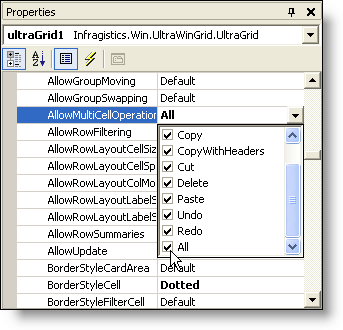

////

|metadata|
{
    "name": "wingrid-turning-on-clipboard-operations",
    "controlName": ["WinGrid"],
    "tags": ["Application Scenarios","Grids"],
    "guid": "{060D0658-62DA-41F8-A3CD-C9E1764CF3D4}",  
    "buildFlags": [],
    "createdOn": "2006-03-02T00:00:00Z"
}
|metadata|
////

= Turning On Clipboard Operations

In order to take advantage of WinGrid's™ clipboard operations, a single property needs to be set. Setting the  pick:[win-forms="link:{ApiPlatform}win.ultrawingrid{ApiVersion}~infragistics.win.ultrawingrid.ultragridoverride~allowmulticelloperations.html[AllowMultiCellOperations]"]  property (found in the Properties window by expanding DisplayLayout, then Override) to  pick:[win-forms="link:{ApiPlatform}win.ultrawingrid{ApiVersion}~infragistics.win.ultrawingrid.allowmulticelloperation.html[All]"]  will allow the end user to perform all clipboard operations, including Copy, Copy with headers, Cut, Delete, Paste, Undo, and Redo.

It is possible to only allow the end user to perform a select few operations. For example, if you wanted the end user to be able to copy and paste to and from WinGrid, but not delete data, then you would select the checkboxes by Copy and Paste, but deselect the checkbox next to Delete. Selecting None (same as Default) will not allow any multi-cell operations.

The code below demonstrates how to set the AllowMultiCellOperations property according to the above-mentioned example:

*In Visual Basic:*

----
Imports Infragistics.Win.UltraWinGrid
...
Private Sub Turn_On_Clipboard_Operations_Load(ByVal sender As System.Object, _
  ByVal e As System.EventArgs) Handles MyBase.Load
	' Set AllowMultiCellOperations to allow the end user to copy and paste
	Me.UltraGrid1.DisplayLayout.Override.AllowMultiCellOperations = _
	  AllowMultiCellOperation.Copy Or AllowMultiCellOperation.Paste
End Sub
----

*In C#:*

----
using Infragistics.Win.UltraWinGrid;
...
private void Turn_On_Clipboard_Operations_Load(object sender, EventArgs e)
{
	// Set AllowMultiCellOperations to allow the end user to copy and paste
	this.ultraGrid1.DisplayLayout.Override.AllowMultiCellOperations = 
	  AllowMultiCellOperation.Copy | AllowMultiCellOperation.Paste;
}
----