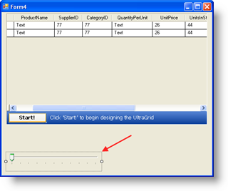
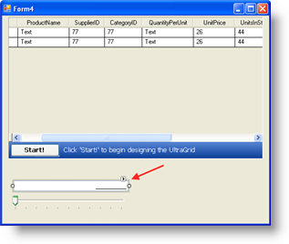
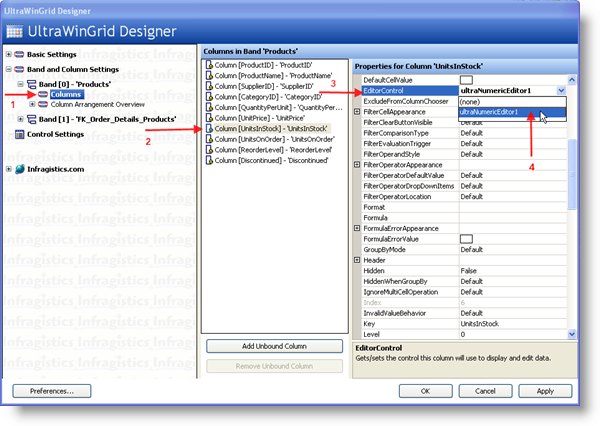
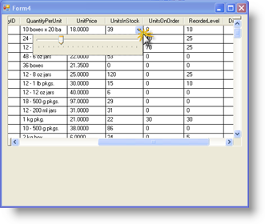
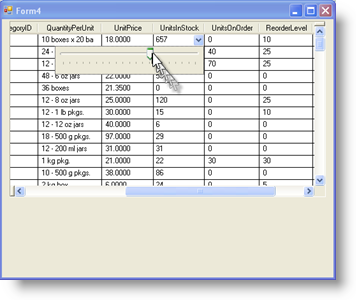

////

|metadata|
{
    "name": "wingrid-using-any-windows-forms-control-as-a-drop-down-inside-wingrid",
    "controlName": ["WinGrid"],
    "tags": ["Application Scenarios","Extending","Grids"],
    "guid": "{C526C026-781A-4227-92CC-EBF8B7CF6998}",  
    "buildFlags": [],
    "createdOn": "0001-01-01T00:00:00Z"
}
|metadata|
////

= Using Any Windows Forms Control as a Drop Down inside WinGrid

One of the most important features that come with the Infragistics Editors is the ability to show Editor Buttons. The Editor Buttons can be added to the left or right side. This section will explain how you can use this to build a UI with a WinGrid control that contains a DropDown that can contain any kind of Windows Forms Control. The following steps assume you have a Form with a WinGrid that is bound to the Northwind Products DataTable along with the code to populate the DataTable using the appropriate Data Adapters or Table Adapters. We will add the standard Windows Forms control the TrackBar to the UnitsInStock Column so that we can adjust the value by sliding the TrackBar.

[start=1]
. Within the standard Visual Studio toolbox, locate the TrackBar control. Drag and Drop an instance of it onto the Form:

[start=2]
. Set its Visible Property to False.
[start=3]
. Set its MinimumValue property to 0\.
[start=4]
. Set its MaximumValue property to 1000\.
[start=5]
. Set its TickFrequency property to 50\.
[start=6]
. In the Infragistics Toolbox, locate the UltraNumericEditor and drag and drop an instance of it onto the Form:

[start=7]
. Set its Visible Property to False.
[start=8]
. Set its NumericType property to Integer.
[start=9]
. Set its MinValue property to 0\.
[start=10]
. Set its MaxValue property to 1000\.
[start=11]
. Locate the ButtonsRight property and click the Ellipse (…) to show the EditorButtonBase Collection Editor.
[start=12]
. Click the Add button and select DropDownEditorButton.
[start=13]
. Within the properties of the DropDownEditorButton, set its Key property to “TRACKBAR”.
[start=14]
. Locate the Control property and from its combo box, select TrackBar1. This actually connects the DropDownButton with the TrackBar so that when we click this button, the TrackBar will show up.
[start=15]
. Click OK to close the EditorButtonBase Collection Editor.
[start=16]
. Click the WinGrid’s Start Button to show the UltraWinGrid Designer
[start=17]
. Under Band and Column Settings, expand Band[0] = ‘Products’ Node and click the Columns Node. This will show the available Columns in the Products Entity.
[start=18]
. Locate the UnitsInStock Column and Click it. Locate the EditorComponent property and from its Combo, select UltraNumericEditor1.

[start=19]
. Click Apply and OK to close the Designer.
[start=20]
. Save and Run the application and it should look like this:

If you scroll to the UnitsInStock Column and click on the DropDown Button, the TrackBar will drop down and you can slide it horizontally. Although this looks great and provides the end user with a nice way to adjust values, it is non-functional. This is because we need to write a little code to provide any interaction. The DropDown button simply serves to show a control whenever we click it; any and all interaction code and event handling must still be written.

The Infragistics Editor Controls expose a useful event that can help us achieve the functionality that we are looking for. The BeforeEditorButtonDropDown Event is fired the moment right before the control that is associated with the DropDownButton is shown. In this event, we can write some code to find the value of the current WinGrid cell and then set the TrackBar to that value. This will result in the TrackBar displaying the same exact value as the current cell that we are editing.

The following code shows how we handle the BeforeEditorButtonDropDown event to check the current WinGrid Cell’s value and then assign it to the TrackBar:

*In Visual Basic:*

----
Private Sub UltraNumericEditor1_BeforeEditorButtonDropDown( _
  ByVal sender As System.Object, _
  ByVal e As BeforeEditorButtonDropDownEventArgs) _
  Handles UltraNumericEditor1.BeforeEditorButtonDropDown
    If e.Button.Key = "TRACKBAR" _
    AndAlso _
    Not Me.UltraGrid1.ActiveCell Is Nothing Then
      Me.TrackBar1.Value = _
        CType(UltraGrid1.ActiveCell.Value, Int16)
    End If
End Sub
----

*In C#:*

----
private void ultraNumericEditor1_BeforeEditorButtonDropDown(
  object sender, 
  BeforeEditorButtonDropDownEventArgs e)
{
    if (e.Button.Key == "TRACKBAR" && 
      this.ultraGrid1.ActiveCell != null)
    {
        this.trackBar1.Value = 
          (Int16)this.ultraGrid1.ActiveCell.Value;
    }
}
----

Since the intention of having the TrackBar control is to allow the user to slide it to adjust the Cell Values, we also need to write the code to enable that functionality as well. Normally one would handle the appropriate event(s) on the control that is being interacted with. The TrackBar has a Scroll event that we can handle. In the Scroll event, we can test to make sure that there currently is a valid WinGrid Cell that is active and then we can assign the TrackBar’s Value into that WinGrid Cell. The following example code shows this in action:

*In Visual Basic:*

----
Private Sub TrackBar1_Scroll( _
  ByVal sender As System.Object, _
  ByVal e As System.EventArgs) _
  Handles TrackBar1.Scroll
    If Not Me.UltraGrid1.ActiveCell Is Nothing Then
      UltraGrid1.ActiveCell.Value = _
        Me.TrackBar1.Value
    End If
End Sub
----

*In C#:*

----
private void trackBar1_Scroll(
  object sender, EventArgs e)
{
    if (this.ultraGrid1.ActiveCell != null)
    {
        this.ultraGrid1.ActiveCell.Value = 
          this.trackBar1.Value;
    }
}
----

When running the application, you can click on the DropDown Button from within the UnitsInStock Column and slide the TrackBar to adjust the value. Notice how the Cell’s Text immediately changes as you scroll:

Another important event that can be used on the Infragistics Editor Controls is the AfterEditorButtonCloseUp event. This event fires immediately after the related Windows Forms control is hidden after you click the DropDown button again or when the User clicks elsewhere and the control loses focus. This event is useful for whenever you need to write values from your associated Control back to the WinGrid Cell or even back to your Data Model directly. An example of this would be if you were to associate a Checked ListBox with a certain Column. The End User will be able to select zero or many items from the ListBox. When the End User is done and the ListBox loses focus it will hide and the AfterEditorButtonCloseUp event fires. In this event, you can iterate through the list and identify the Checked Items. The entities that represent the Checked Items can then be added to the back end in the appropriate tables.

Leveraging this technique opens endless possibilities. Many kinds of UI designs can be implemented by simply assigning the appropriate control to the DropDown Button and then handling the various events in order to populate the Control as well as update the WinGrid Cells. You can create an interactive UI much like the example that used the TrackBar and ListBox, or you can also create a non-interactive UI such as associating a WinChart with the DropDown button to show relevant data that represents the current entity’s field.