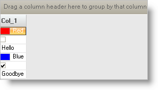

////

|metadata|
{
    "name": "wingrid-using-different-editors-in-individual-cells",
    "controlName": ["WinGrid"],
    "tags": ["Application Scenarios","Extending","Grids"],
    "guid": "{CF4C213D-092A-4CC0-A2FC-87B43B64B28E}",  
    "buildFlags": [],
    "createdOn": "0001-01-01T00:00:00Z"
}
|metadata|
////

= Using Different Editors in Individual Cells

In addition to using Embeddable Editors on a Column level, they can also be set at the Cell level. If you specify a particular Editor for a Column, then only one instance of that Editor is shared for all Cells in that Column. If you specify an Editor on an individual Cell, then that one Cell will use that single instance of the Editor. Most use cases require one editor to be assigned to the entire column. For example, the OrderDate Column may be configured to use WinCalendarCombo™ so that end users can navigate and select a Date value from the drop down calendar that appears within the cells of that column. Less frequent use cases require a different editor on a cell by cell basis. For example, you may have a column called Value that can represent different kinds of data types. Row 1 can have a Value cell which is a number, so you can create and assign a Numeric editor for that particular cell. Row 2’s Value cell may contain a Date data type, which can be represented using an instance of the WinCalendarCombo. Row 3’s Value cell may represent a Boolean which can be represented by an instance of the WinCheckEditor™ control. Either way, WinGrid™ supports both scenarios.

== Accommodating Multiple Data Types

Usually to accommodate for multiple data types, you will need a data model that has a property that can accommodate for multiple data types. The following code example shows a simple implementation using a DataTable:

*In Visual Basic:*

----
Dim t As New DataTable
t.Columns.Add("Col_1", GetType(Object))
t.Rows.Add(New Object() {Color.Red})
t.Rows.Add(New Object() {False})
t.Rows.Add(New Object() {"Hello"})
t.Rows.Add(New Object() {Color.Blue})
t.Rows.Add(New Object() {True})
t.Rows.Add(New Object() {"Goodbye"})
----

*In C#:*

----
DataTable t = new DataTable();
t.Columns.Add("Col_1", typeof(object));
t.Rows.Add(new object[] { Color.Red });
t.Rows.Add(new object[] { false });
t.Rows.Add(new object[] { "Hello" });
t.Rows.Add(new object[] { Color.Blue });
t.Rows.Add(new object[] { true });
t.Rows.Add(new object[] { "Goodbye" });
----

An appropriate event to test for and assign different editor types is the WinGrid’s InitializeRow event. This event will fire once for each WinGrid Row that is being rendered. The event arguments will expose each Row as it comes in through the event. Here is where you can perform your tests and depending on the results, you can assign different editors to the cells of interest.

The following code shows how the InitializeRow event is being handled in order to test the Data Type of a specific Cell Value and then assign the appropriate editor to that Cell:

*In Visual Basic:*

----
Imports Infragistics.Win
Imports Infragistics.Win.UltraWinEditors
...
Private Sub UltraGrid1_InitializeRow( _
    ByVal sender As System.Object, _
    ByVal e As InitializeRowEventArgs) _
    Handles UltraGrid1.InitializeRow
        'Create the Settings Object:
        Dim theSettings As New DefaultEditorOwnerSettings
        'as well as the Editor Owner:
        Dim theOwner As New DefaultEditorOwner(theSettings)
        Dim theEditor As EmbeddableEditorBase = Nothing
        Dim theValue As Object = e.Row.Cells(0).Value
        'Create an appropriate editor based on the
        'Value's Data Type:
        If TypeOf theValue Is Boolean Then
            theSettings.DataType = GetType(Boolean)
            theEditor = New CheckEditor(theOwner)
        ElseIf TypeOf theValue Is Color Then
            theSettings.DataType = GetType(Color)
            theEditor = New ColorPickerEditor(theOwner)
        ElseIf TypeOf theValue Is String Then
            theSettings.DataType = GetType(String)
            theEditor = New EditorWithText(theOwner)
        End If
        'Assign it to the Cell.Editor
        e.Row.Cells(0).Editor = theEditor
End Sub
----

*In C#:*

----
using Infragistics.Win;
using Infragistics.Win.UltraWinEditors;
...
private void ultraGrid1_InitializeRow(
    object sender, 
    Infragistics.Win.UltraWinGrid.InitializeRowEventArgs e)
{
    //Create the Settings Object:
    DefaultEditorOwnerSettings theSettings = 
        new DefaultEditorOwnerSettings();
    //as well as the Editor Owner:
    DefaultEditorOwner theOwner = new DefaultEditorOwner(theSettings);
    EmbeddableEditorBase theEditor = null;
    object theValue = e.Row.Cells[0].Value;
    //Create an appropriate editor based on the
    //Value's Data Type:
    if (theValue is bool)
    {
        theSettings.DataType = typeof(bool);
        theEditor = new CheckEditor(theOwner);
    }
    else if (theValue is Color)
    {
        theSettings.DataType = typeof(Color);
        theEditor = new ColorPickerEditor(theOwner);
    }
    else if (theValue is string)
    {
        theSettings.DataType = typeof(string);
        theEditor = new EditorWithText(theOwner);
    }
    //Assign it to the Cell.Editor
    e.Row.Cells[0].Editor = theEditor;
}
----

As each Row is being initialized, Cell 0's Value is being examined in order to determine its Data Type. If it is a Boolean, then we create a new instance of the CheckEditor and assign it to that Cell. If it is a Color, then we create a new instance of the Color Picker and assign it to that Cell. Finally if it is a String, we create a standard EditorWithText and assign it to that Cell. This can be elaborated to include more complex logic as well as diverse Data Types. When run, the grid will look similar to the following:

If you notice in the code, the class DefaultEditorOwnerSettings is being used. This is simply a class that contains property settings that will be applied to the various Editor Controls that it is associated with. The DefaultEditorOwnerSettings Class contains properties that allow you to configure the Mask characteristics, Formatting, Data Type, Minimum and Maximum Character Length as well as Minimum and Maximum Value. Whenever we assign editors on a Cell by Cell basis, we need to construct the Editors on a lower level much like we have shown in this example.

Now that you understand how to implement both Column and Cell level Editors, you can build a UI that can accommodate any of these use cases.