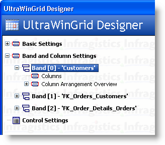
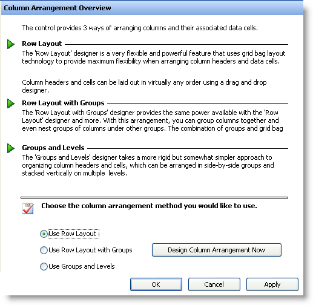
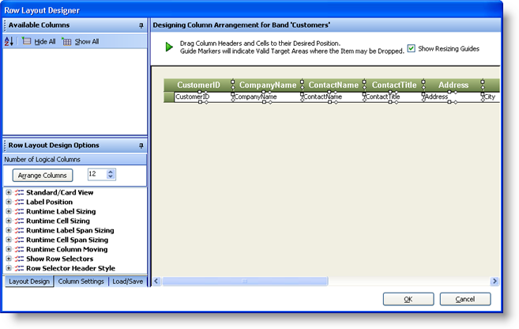
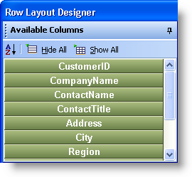
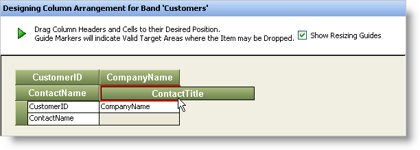
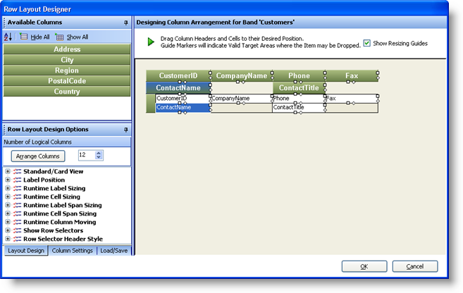
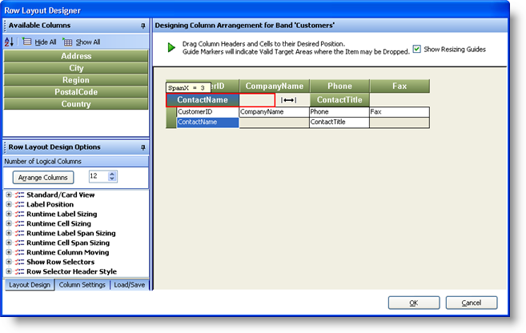
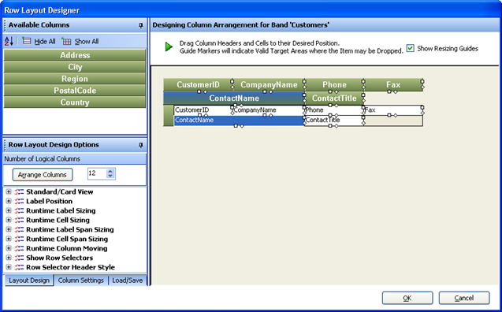
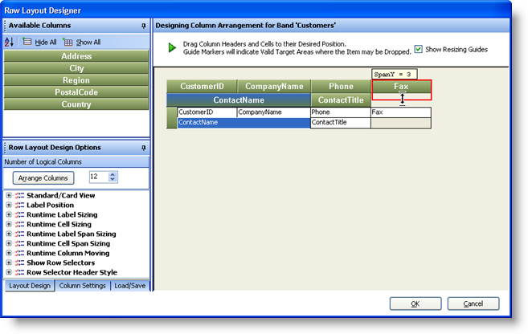

////

|metadata|
{
    "name": "wingrid-using-row-layouts-designer",
    "controlName": ["WinGrid"],
    "tags": ["Application Scenarios","Grids"],
    "guid": "{C16D4E77-9468-430E-B187-0060F375FE42}",  
    "buildFlags": [],
    "createdOn": "0001-01-01T00:00:00Z"
}
|metadata|
////

= Using Row Layouts Designer

== Before You Begin

In the past, it was difficult to customize WinGrid™ to have a complex Row Layout. Understanding of how Row Layouts worked was required in order to set properties and write code in order to get the look you were after. To improve this experience, Infragistics answered this call by providing a full featured, intuitive Row Layouts Designer. This tool allows you to create and design a complex, custom Row Layout in seconds. This is possible because it is all What You See Is What You Get (WYSIWYG) and drag and drop interaction so that you can quickly move the column headers around until they look the way you want them to look.

== What You Will Accomplish

The following steps show you how to launch the Row Layouts Designer. It is assumed you already have a Windows Form with a WinGrid instance placed on it which is bound to a design time available Data Source with several Bands / Entities:

== Follow these Steps

[start=1]
. Click the Start Button on the WinGrid. This will launch the UltraWinGrid Designer.
[start=2]
. Locate the Band and Column Settings node in the menu tree on the left hand side. Expand this.
[start=3]
. You will have one node per Entity / Band that is available in the WinGrid. For this example, we will work on the Customers Band

[start=4]
. Expand the Customers Band and click on Column Arrangement Overview.
[start=5]
. Towards the right of the Designer, you will see the option to Use Row Layout, Use Row Layout with Groups or to Use Groups and Levels. Select Use Row Layout.
[start=6]
. Click the Design Column Arrangement Now button. This will cause the Row Layout Designer to launch:

[start=7]
. At this point, the Grid and its Schema for the Customers Band is available for customization. To get started, double click on each Column Header on the Preview Grid so that all Column Headers vanish from the Preview.

.Note
[NOTE]
====
If you notice, as you double click each Column Header, they vanish from the Preview Grid and re-appear inside the Available Columns area:
====

[start=8]
. This allows you to start from a clean slate. From this point on, you can now drag and drop the Columns from the Available Columns into the Preview Grid.
[start=9]
. You can drag, drop and arrange the Columns however you like to achieve any look:

[start=10]
. If you notice, you will see small "Handles" or little shapes that outline each Column Header and Cells. These are called Resizing Guides. These will allow you to resize Column Headers and Cells as well as cause them to Span vertically and Horizontally.
[start=11]
. Starting off with an arrangement that looks like this:

[start=12]
. Click on the Diamond Resizing Guide located on the right hand side of the ContactName Column Header and drag it across until the blank area is completely filled:

[start=13]
. Once completed the Layout should look like this:

[start=14]
. You have now just configured the Horizontal Span of the ContactName Column Header. Each Column Header and Cell occupies two (2) virtual units both horizontally and vertically. By dragging the Column Header across towards the Right, we have caused it to occupy 2 more horizontal units which is now a total of 4.
[start=15]
. To configure the Fax Column Header to span Vertically, click the Diamond Resizing Guide located on the bottom of the Column Header and Drag it downward until the blank area underneath it is completely filled:

[start=16]
. When complete, the Grid's Layout should look like this:

image::images/WinGrid_Using_the_Row_Layouts_Designer_10.png[using ultragrid's row layout designer]

Any Column Header that you leave inside the Available Columns area will not be visible in the WinGrid. Clicking the OK button will cause the Layout to be set directly on the WinGrid. Understanding these simple steps will allow you to create great looking Grid views for your end users. Keep in mind that Row Layouts are great to arrange a Grid that has many column headers and varying Column Data Types. For example, you may have a "Notes" field that consists of a large paragraph of text. Normally, it is not practical to show this type of data in a simple tiny cell. It is more practical to expose this as a larger text area with text wrapping, scroll bar and perhaps some formatting. Using Row Layouts along with the built in Column Properties will allow you to achieve this very easily.