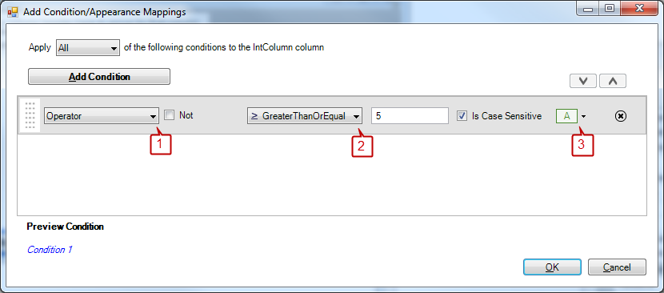

////

|metadata|
{
    "name": "wingrid-using-the-conditional-formatting-dialog-box",
    "controlName": ["WinGrid"],
    "tags": ["Grids","Styling"],
    "guid": "{34AF6C72-C205-4B1B-BC28-2236746898CC}",  
    "buildFlags": [],
    "createdOn": "0001-01-01T00:00:00Z"
}
|metadata|
////

= Using the Conditional Formatting Dialog Box

The Conditional Formatting dialog box allows you to easily create Condition/Appearance mappings. To access this dialog box for a certain column, expand the DisplayLayout object in the Properties window. Navigate through the Bands object and down to the Columns collection. Click the ellipsis and the Columns Collection Editor appears. Select the column that you want to set condition/appearance mappings for. Find the ValueBasedAppearance property in the Properties window and click the ellipsis next to it. The Conditional Formatting dialog box appears.

== Adding and Removing Conditions

The section on the left (labeled section 1 in the image above) allows you to add operator and formula conditions as well as Condition groups. Condition groups are simply collections of other operator and formula conditions. By default, all conditions that are matched will have their appearances applied. To remove a condition, click the remove button that can be found on the right side of the condition row.

== Editing Conditions

The section in the middle (labeled section 2 in the image above) displays all conditions (built-in and formula) and condition groups.

== Operator Condition

When you add a built-in condition, it will display in this section with default values.

* *IsComplement* -- Select the IsComplement checkbox to convert the condition into its inverse.
* *CaseSensitive* -- Deselect the CaseSensitive checkbox to allow the column to ignore casing when matching strings.
* *Operator* -- Select an operator from the Operator drop-down list to perform an evaluation between the cell value and condition value.
* *Value* -- The editor type is the same type as the DataSource column. If the data type in the DataSource is an Integer, than you will only be able to place a number in the editor. If the data type in the DataSource is a String, you will be able to type any text, but it will be treated as a string, even if you place numbers in the editor. The column will use the cell's value and test it against this value with the chosen operator.

== Formula Condition

When you add a formula condition, an editor with a Formula Builder button appears. Clicking this button opens the Formula Builder dialog. Through this dialog box, you can create a myriad of complex formulae. For more help on the Formula Builder, see link:using-wincalcmanager-with-wingrid.html[Using WinCalcManager with WinGrid]. Once finished with the formula, click OK to close the Formula Builder dialog box. The new formula will appear in the editor, identifying it as a formula condition. To edit the formula condition again, click the Formula Builder button in the editor.

== Condition Group

Selecting Condition Group from the drop down will create a new Condition Group.

The addition to this selection is the Logical Operator. The two choices, All and Any, allowing you to match condition 1 and condition 2, or condition 1 or condition 2 respectively. If you use the All operator, all conditions in the group must be met in order to apply the matching appearance. Using the Any operator will apply the matching appearance to whichever condition returns true, it does not rely on all conditions.

== Matching Appearances

The section to the right (labeled section 3 in the image above) is a drop down that allows you to change the appearance of the cells matching the condition. Each operator condition, formula condition, and condition group have a matching appearance object associated with them.