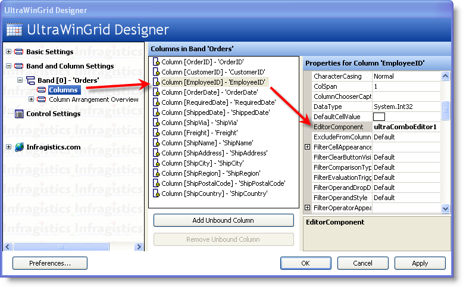
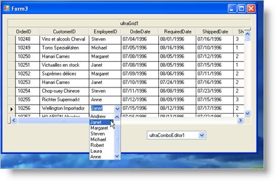

////

|metadata|
{
    "name": "wingrid-using-wincomboeditor-inside-wingrid",
    "controlName": ["WinGrid"],
    "tags": ["Application Scenarios","Data Presentation","Extending","Grids"],
    "guid": "{2299CD73-0A3E-4CFE-BBF2-426594996B4B}",  
    "buildFlags": [],
    "createdOn": "0001-01-01T00:00:00Z"
}
|metadata|
////

= Using WinComboEditor inside WinGrid

== Before You Begin

This topic is part 2 of a 2-part walkthrough. Please read link:wingrid-using-windropdown-inside-wingrid.html[Using WinDropDown inside WinGrid] to maximize your understanding of this topic.

== What You Will Accomplish

Using the existing Windows Form sample you have been working on in Using WinDropDown in WinGrid, we will use WinComboEditor™ to add a simple drop down list of values to the EmployeeID column, which represents a Foreign Key that relates the Orders Entity to the Employees Entity.

== Follow these Steps

[start=1]
. In the Visual Studio toolbox, locate the UltraComboEditor control and drag it onto the Form
[start=2]
. Set its DataSource property to the Employees DataTable.
[start=3]
. Set its DisplayMember property to FirstName. This will tell the ComboEditor to use the data within this field to display within the drop down list.
[start=4]
. Set its ValueMember property to EmployeeID. This will tell the ComboEditor to use the data within this field to assign it to the EmployeeID Column of the WinGrid. In other words, when a user selects a list item, the associated EmployeeID value from that selected item will be assigned to the actual WinGrid EmployeeID cell of that row. This also dictates which List Item is automatically selected based on the existing values within that column.
[start=5]
. Launch the UltraWinGrid Designer by clicking the WinGrid’s Start button.
[start=6]
. Under Band and Column Settings, expand the Band [0] 'Orders' node and click the Columns node.
[start=7]
. Locate the EmployeeID Column and click it.
[start=8]
. Assign the ComboEditor to the  pick:[win-forms="link:{ApiPlatform}win.ultrawingrid{ApiVersion}~infragistics.win.ultrawingrid.ultragridcolumn~editorcomponent.html[EditorComponent]"]  property of the column. Locate the EditorComponent property and from the drop down, select UltraComboEditor1:

[start=9]
. Assuming you have the code to fill and populate the Employees DataTable using the appropriate Data Adapters or Table Adapters, running the application will cause your WinGrid to now look like the following image:

Notice how this time, we have a very simple drop down list of values. The ComboEditor only shows one column of information as opposed to the DropDown which shows many columns. Another thing to make a note of is the fact that the ComboEditor is still visible on the Windows Form when it runs. You must set its Visible Property to False so that the end users do not see it. Normally, all IProvidesEmbeddableEditor implementations require that you set its Visible property to False so that it is hidden at runtime. This is usually the case because controls that implement this interface almost always can be used as standalone editors placed on a Windows Form, in addition to also being able to be embedded inside the WinGrid. The beauty of using the UltraComboEditor is that even if you have a WinGrid that is not meant for data entry (read only) you can still use this strategy to show the user friendly string associated with the Foreign Key fields. This is much simpler than to create your own list of objects by modifying the SQL Statement to include a Join to the Lookup Table.