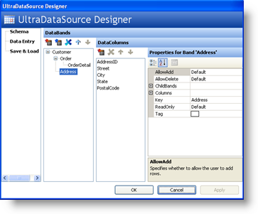
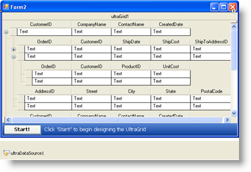

////

|metadata|
{
    "name": "wingrid-using-windatasource",
    "controlName": ["WinGrid"],
    "tags": ["Extending","Grids"],
    "guid": "{255EB302-9753-4EE9-8241-FF7D90E53E91}",  
    "buildFlags": [],
    "createdOn": "0001-01-01T00:00:00Z"
}
|metadata|
////

= Using WinDataSource

Rather than using a DataTable to act as the intermediate layer between WinGrid™ and your unbound data, WinDataSource™, another tool in your Infragistics toolbox, is there for that purpose. The WinDataSource, when added to a Windows Form, sits in the Component Tray as a non-visual component. You can use the Quick Designer to rapidly create entities and schemas. The following image shows the WinDataSource Quick Designer and how simple it is to create a complex data model in moments:

When using the designer to assign the WinDataSource to the WinGrid, notice how all entities are available and reproduced within the WinGrid schema:

Customer is the parent most band and Customer has 2 child collections: Order and Address which each in itself represents all the Orders that a Customer could have as well as all of the Customer’s different Addresses. The Order entity also has a child collection OrderDetail which represents the Line Items that compose an Order.

Creating a complex hierarchical data model can be done in moments using the WinDataSource and the Quick Designer. All IList / IBindingList functionality is automatically included.