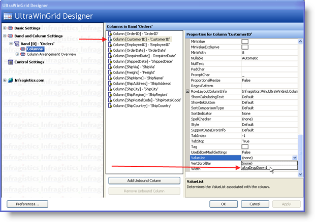

////

|metadata|
{
    "name": "wingrid-using-windropdown-inside-wingrid",
    "controlName": ["WinGrid"],
    "tags": ["Application Scenarios","Data Presentation","Extending","Grids"],
    "guid": "{EF394DF0-A350-4047-B086-EE5DFFEA3AE7}",  
    "buildFlags": [],
    "createdOn": "0001-01-01T00:00:00Z"
}
|metadata|
////

= Using WinDropDown inside WinGrid

== Before You Begin

When working with data models whether it is a Visual Studio generated DataSet or a custom business object library, most of the time you will have entities that contain a property or properties that represent a Key which relates to an item in another table. These properties or fields are normally related on the database through a Foreign Key object or they can be logically related through the business logic layer in your library. However this is implemented, the point is to understand that you have a collection of objects that you want to show to your end users through WinGrid™ and you will have these Foreign Key fields that will be displayed as well. Traditionally you would have had to come up with a way to show the end user something that is more meaningful because as it is, foreign key values do not make any sense for a user. Another dilemma is allowing the end user to modify the records means that you must also come up with a way for them to enter only the values that are possible for entry in that field. For example, if you have a collection of Orders and you bind this to WinGrid, you will have a CustomerID column which happens to be a Foreign Key that relates the Order Table to the Customer Table. The CustomerID value that is entered in this field must exist in the Customer table; otherwise, an exception will be thrown whenever you attempt to resolve the changes back to the Database. Using the tools available in the Infragistics Toolbox, there is an easy and elegant way to solve this problem. The following will be based on using a Visual Studio generated DataSet containing objects found in the Northwind Database. We will be working with the Customers and Orders entities.

== Valuelists

Each WinGrid Column has a  pick:[win-forms="link:{ApiPlatform}win.ultrawingrid{ApiVersion}~infragistics.win.ultrawingrid.ultragridcolumn~valuelist.html[ValueList]"]  property. A ValueList is simply a list of mutually exclusive items that can appear as a single column or multi-column drop down combo box. In the case of WinGrid bound directly to the Orders DataTable, we have a CustomerID column which is related to the Customers Entity. Normally we would see the actual Foreign Key value if we run the application:

== What You Will Accomplish

In this example, we will show how to use WinDropDown™ control to provide the end user with a dropdown list of values. The following steps assume you have a Windows Forms Application with a Form that has a WinGrid that is bound to the Customers DataTable using a Visual Studio generated DataSet pointing to the Northwind Database. This also assumes that you have already written the code to fill the Customers and Orders DataTables with data from the database using the correct Data Adapters or Table Adapters:

== Follow these Steps

[start=1]
. Locate the UltraDropDown control in your Visual Studio Toolbox and drag an instance onto the Form.
[start=2]
. At design time, the UltraDropDown may paint in such a way that does not make sense. It in fact, it may resemble a WinGrid and appear as shown in the following image:

[start=3]
. Click the UltraDropDown control and in the Properties Window, set its DataSource to the Customers DataTable within the Northwind DataSet.
[start=4]
. Locate the DisplayMember property and set its value to CompanyName. This tells the drop-down which field from the underlying data source it must use to display to the end users whenever it is not dropped down.
[start=5]
. Locate the ValueMember property and set its value to CustomerID. This tells the drop-down which field from the underlying data source it must use to assign a value to the related WinGrid Cell when a selection is made.
[start=6]
. Click the Start button directly on the WinGrid and bring up the UltraWinGrid Designer.
[start=7]
. Under the Band and Column Settings node, Expand the Band[0] ‘Orders’ node and click on the Columns node. This will bring up the list of Columns in Band ‘Orders’
[start=8]
. Locate the CustomerID column and click it. Locate its ValueList property.
[start=9]
. Since we placed a ValueList implementing control on our Windows Form, we should be able to see it from the ValueList drop-down button:

[start=10]
. Select UltraDropDown1 from the combo box.
[start=11]
. When you save and run the application, you will see the difference in the CustomerID column.

Instead of the CustomerID Column showing the actual foreign key values, it shows whatever data is within the CompanyName field from the UltraDropDown’s Data Source. This makes it easier for the end user to identify the associated Customer for this Order. Another benefit is rather than having to enter a CustomerID directly into the column, the end users can simply select from the drop down list of values. Since the UltraDropDown supports the display of multiple columns, the end user has plenty of information to identify records and make the correct selection