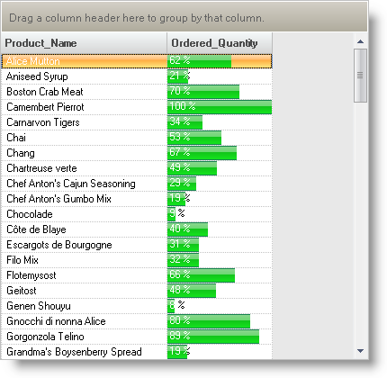

////

|metadata|
{
    "name": "wingrid-using-winprogressbar-inside-wingrid",
    "controlName": ["WinGrid"],
    "tags": ["Application Scenarios","Extending","Grids"],
    "guid": "{7A2DA339-21BF-41BD-B795-B416B7991DC4}",  
    "buildFlags": [],
    "createdOn": "0001-01-01T00:00:00Z"
}
|metadata|
////

= Using WinProgressBar inside WinGrid

Among the different Infragistics editors that can be embedded into a WinGrid™ column, WinProgressBar™ is very useful in showing a graphical, progress-like indication of numeric values. The progress bar requires three properties for it to work in general. It requires a Minimum Value, Maximum Value as well as an actual Value. When embedded in WinGrid, WinProgressBar uses the Cell values as its Value. You will need to set the Minimum and Maximum values directly on the progress bar so that it knows how to render the bar length.

Notice how we are using the WinGrid's  pick:[win-forms="link:{ApiPlatform}win.ultrawingrid{ApiVersion}~infragistics.win.ultrawingrid.ultragrid~initializelayout_ev.html[InitializeLayout]"]  event to assign the Progress Bar. If you choose to assign the control at runtime as we are doing here, this is the best event to use because at this time the WinGrid’s Schema (Columns and Bands) is ready for use. The Progress Bar’s Minimum Value is assumed to be 0. The Maximum Value should be set to a value that represents the highest number in the column. This particular example shows a WinGrid bound to numeric data that represents the quantity of Sales transactions. The lowest possible number could be 0 and the maximum number could be whatever is returned by our under lying data.

The following code shows how you can assign WinProgressBar to a numeric WinGrid column at runtime (All  pick:[win-forms="link:{ApiPlatform}win{ApiVersion}~infragistics.win.iprovidesembeddableeditor.html[IProvidesEmbeddableEditor]"]  implementations can be assigned at runtime in this fashion):

*In Visual Basic:*

----
Private Sub UltraGrid1_InitializeLayout(
ByVal sender As System.Object,ByVal e As InitializeLayoutEventArgs)Handles UltraGrid1.InitializeLayout
    Me.ultraProgressBar1.Minimum = 0
    Me.ultraProgressBar1.Maximum = CalculateMaximum()
    e.Layout.Bands(0).Columns("Ordered_Quantity").EditorComponent = Me.ultraProgressBar1
End Sub
----

*In C#:*

----
private void ultraGrid1_InitializeLayout(
  object sender, 
  InitializeLayoutEventArgs e)
{
    this.ultraProgressBar1.Minimum = 0;
    this.ultraProgressBar1.Maximum = CalculateMaximum();
    e.Layout.Bands[0].Columns["Ordered_Quantity"].EditorComponent = 
      this.ultraProgressBar1;
}
----