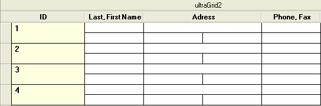

////

|metadata|
{
    "name": "wingrid-whats-new-2005-1",
    "controlName": [],
    "tags": [],
    "guid": "{2B9F36F7-76CF-4EE1-851B-F7DE9E0DA9B1}",  
    "buildFlags": [],
    "createdOn": "0001-01-01T00:00:00Z"
}
|metadata|
////

= WinGrid 2005.1

== Merged Cell Functionality

The WinGrid™ now supports merging cells with like values. The following new properties have been added to support this functionality:

* UltraGridOverride object: MergedCellStyle, MergedCellContentArea and MergedCellAppearance
* UltraGridColumn object: MergedCellStyle, MergedCellContentArea, MergedCellAppearance, MergedCellEvaluator and MergedCellEvaluationType

For more information on Merged Cell functionality, see link:wingrid-merging-cells-with-the-same-values.html[Merge Cells with the Same Values].

The following snapshot shows merged cells functionality.

== *IDataErrorInfo* Support

The WinGrid now supports displaying errors through the IDataErrorInfo interface. The following new properties have been added to support this functionality:

* UltraGridOverride object: SupportDataErrorInfo, DataErrorCellAppearance, DataErrorRowAppearance and DataErrorRowSelectorAppearance
* UltraGridColumn object: SupportDataErrorInfo

SupportDataErrorInfo property must be set to enable this functionality. The following snapshot shows IDataErrorInfo errors being displayed.

For more information on IDataErrorInfo support, see link:wingrid-displaying-row-cell-errors-using-idataerrorinfo.html[Display Row/Cell Errors Using IDataErrorInfo].

== Formula Support

The WinGrid now supports formula columns and summaries. The formulas are calculated using the UltraCalcManager component. The following new properties have been added to support this functionality:

* UltraGridColumn object: Formula, FormulaErrorAppearance, FormulaValueConverter, FormulaAbsoluteName and ShowCalculatingText
* SummarySettings object: Formula, FormulaValueConverter, FormulaAbsoluteName and ShowCalculatingText
* UltraGridOverride object: FormulaErrorAppearance, FormulaRowIndexSource and ShowCalculatingText

== CardView Scrolling

The WinGrid now supports vertical scrolling of the card view area. Previously, when the vertical area used to display cards was less than the height of the cards, the height of the cards was reduced, causing the bottom of the card to disappear. Now, a vertical scrollbar is displayed on the right-hand side of the card area (CardAreaUIElement). This provides the ability to scroll up or down and bring any part of the card into view. The following screenshot shows a multi-band grid with a card view area that is shorter than the cards it contains (notice the presence of a vertical scrollbar (inner) which appears automatically when required). When the height of the CardView area (CardAreaUIElement) is less than the height of any card that needs to be displayed, we now display a vertical scrollbar so that any part of the card can be brought into view. The vertical scrollbar appears and disappears as needed. The SmallChange value for the vertical scrollbar is set so that it takes approximately 10 clicks to scroll the entire range. The LargeChange value is set to five times that amount, so that only two clicks on the scroll track are required to scroll the entire range. The CardAreaUIElement now supports mouse wheeling and mouse panning for both horizontal and vertical scrolling. When the middle mouse button is clicked over the card area, the appropriate panning image is displayed depending on whether horizontal and/or vertical scrolling is possible. When the mouse wheel is moved while the cursor is positioned over the horizontal scrollbar, the card area is scrolled horizontally. When the cursor is positioned anywhere else, it is scrolled vertically (provided that scrolling is possible).

== Support for Sorting, Filtering and Column Resizing through UI in UltraCombo and UltraDropDown

The UltraCombo and UltraDropDown now support sorting, filtering and column resizing through the UI. No new properties have been added for this. Existing HeaderClickAction, AllowRowFiltering and AllowColSizing properties on the Override object can be used to enable/disable support for each of these features. The following snapshot shows filter drop down in an UltraCombo.

== Row Selector Header Style

RowSelectorHeaderStyle and RowSelectorHeaderAppearance properties have been added to the Override object. The RowSelectorHeaderStyle determines the look and position of the area above Row Selectors if Row Selectors are visible. If the RowSelectorHeaderStyle is set to None there will be no visible element assigned to this area and the first header will be aligned with the left edge of the column. If the RowSelectorHeaderStyle is set to ExtendFirstColumn the first header will extend to the left over the area above the Row Selectors. If the RowSelectorHeaderStyle is set to SeparateElement a  _RowSelectorHeaderUIElement_  will be positioned above the Row Selectors and the first header will be aligned with the left edge of the column. The Default value is ExtendFirstColumn. If the RowSelectorHeaderStyle is set to SeparateElement the RowSelectorHeaderAppearance object can be used to set the appearance of the RowSelectorHeader. The following snapshot shows RowSelectorHeaderUIElement highlighted as blue:

== LimitToList support on UltraCombo

UltraCombo now exposes LimitToList property and ItemNotInList event. Setting LimitToList to true will cause the UltraCombo to by default retain focus when the user attempts to leave the control after entering a non-existent value. Also ItemNotInList event is fired whenever the user attempts to leave the control with an invalid value.

== ButtonsLeft and ButtonsRight Properties For UltraCombo

ButtonsLeft and ButtonsRight properties have been added to the UltraCombo. These properties allow you to add editor buttons to the left and right side of the text area, respectively. The following snapshot shows an UltraCombo with various custom buttons on the left and the right of the edit portion.

== Column Resizing using cells

WinGrid now supports resizing of columns using the right edge of the cells. This functionality previously existed in row-layout mode. Now it's supported in non-row-layout mode as well. ColumnSizingArea property has been added to the Override object to support this functionality.

== Hiding headers or cells of a column in row-layout mode

WinGrid now supports hiding either the headers or the cells of a column in row-layout mode. Previously the capability to hide headers or cells of a column was only available in headers-with-cells mode, where column headers are contained within every row. Now you can hide headers or cells of a column in non-headers-with-cells mode as well. This provides even greater flexibility when it comes to creating row-layouts. In the following snapshot, the headers are four unbound columns that do not have their cells visible at all. Where as the other columns have their headers hidden and only their cells visible. LabelOnly member was added to the LabelPosition enum (which is associated with the LabelPosition property of the RowLayoutColumnInfo) and also None enum member is now honored in non-headers-with-cells mode.

== Before/After Expand/Collapse Events for Compressed Cardview

BeforeCardCompressedStateChanged and AfterCardCompressedStateChanged events have been added to the WinGrid. These events fire before and after a Card Row is Expanded/Compressed in CardCompressedView. The event arguments for these methods specify the new compressed state of the Card Row and provide a reference to the row itself. The BeforeCardCompressedStateChanged is cancelable.

== Synchronous Sorting and Filtering

A ProcessMode event argument property has been added to the BeforeSortChangeEventArgs and BeforeRowFilterChangedEventArgs objects that are passed to the BeforeSortChange and BeforeRowFilterChanged events. The ProcessMode property specifies whether all rows, or all expanded rows, will be sorted synchronously. Overloaded EnsureSortedAndFiltered methods have been added to provide fine grained control over synchronous sorting. A typical use for synchronously sorting or filtering is to show a wait cursor during the sort and filter operations.

== Spin Button SpinWrap Feature

A SpinWrap property has been added to the UltraNumericEditor, UltraCurrencyEditor, UltraDateTimeEditor, UltraMaskedEdit, and UltraCalendarCombo controls. The SpinWrap property gets/sets a value indicating whether the control's spin button should wrap its value. If set to true, the spin button will wrap the value incremented/decremented based on its Min/Max value.

== Visual Overflow Indicator In Text Editors (i.e., An Ellipsis)

ShowOverflowIndicator and OverflowIndicatorImage properties have been added to the Text Editor controls (UltraTextEditor, UltraColorPicker, UltraDropDownCalculator, UltraComboEditor, and any control that uses the EditorWithText class). If ShowOverflowIndicator is set to true, and the text of the editor is not entirely visible when  _not_  in edit mode, an overflow indicator image, functionally similar to an ellipsis, appears in the right side of the text area. Hovering the mouse cursor over the image will display a tooltip with the full text. The OverflowIndicatorImage property permits a customized image to be displayed instead of the default image. Below snapshot shows a column in an UltraGrid displaying overflow indicators. The following code shows you how to enable this on an UltraGrid column.

----
UltraGridColumn gridColumn = this.ultraGrid1.DisplayLayout.Bands[0].Columns["State"];
// Create an editor control that supports displaying overflow indicators. Only 
// editors listed above support overflow indicators.
Infragistics.Win.UltraWinEditors.UltraTextEditor textEditorControl = 
        new Infragistics.Win.UltraWinEditors.UltraTextEditor( );
textEditorControl.ShowOverflowIndicator = true;                                 
gridColumn.EditorControl = textEditorControl;
----

== UltraGridPrintDocument component

A new component - UltraGridPrintDocument - has been added to WinGrid assembly. The UltraGridPrintDocument is a custom .Net PrintDocument that can be used to print the contents of an UltraGrid control and may be used with any .net control or component that works with PrintDocument objects including the new UltraPrintPreviewDialog component as well as the intrinsic .net components such as the PrintDialog, PageSetupDialog and PrintPreviewDialog.