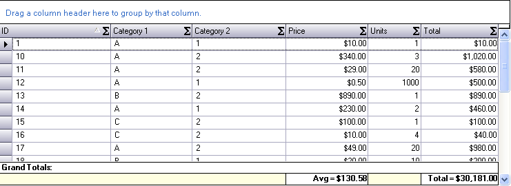
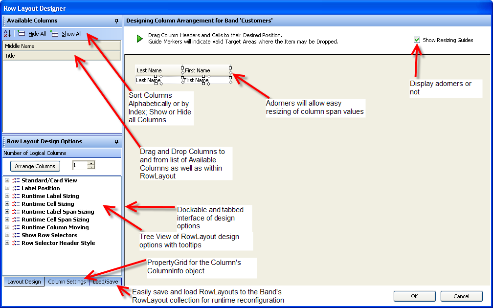

////

|metadata|
{
    "name": "wingrid-whats-new-2005-2",
    "controlName": [],
    "tags": [],
    "guid": "{3CA5146C-A1A6-42C7-ADA1-EEB06CF6D4BB}",  
    "buildFlags": [],
    "createdOn": "0001-01-01T00:00:00Z"
}
|metadata|
////

= WinGrid 2005.2

== Fixed Row Support

Fixed Rows feature allows you to fix (freeze) rows on the top or the bottom so that when the grid is scrolled vertically, the fixed rows do not get scrolled out of view. Fixed rows are supported in root bands. For more information, see link:wingrid-row-layouts.html[Row Layouts].

The following image shows three rows fixed on top. Rows can be fixed on bottom as well.

== Fixed Filter Row Support

Filter Row is a fixed row in the column headers area used for filtering rows. Filter Row functionality lets you display a filter row in which the user can type in values to filter rows by. The values typed into the filter row cells are filter operands. The filter row can also have UI for selecting the filter operators. For more information, see link:wingrid-using-the-filter-row-feature.html[Use the Filter Row Feature].

The following image shows an UltraGrid with filter row. The filter row has the operator user interface enabled on the left of the operand. When clicked upon, a filter operator drop down appears for selecting the operator. The button in the row selector is for clearing the filters of all the columns.

The following image shows the filter row with filter operator UI above the operand.

== Fixed Add Row Support

This feature emulates the behavior of the add-row in Microsoft Outlook, most notably the fact that the add-row is fixed. It does not scroll as other rows are scrolled. Although Microsoft Outlook shows the add-row on the top, the UltraGrid offers the ability to show the fixed add-row on the top or the bottom of the row collection. To facilitate this functionality, FixedAddRowOnTop and FixedAddRowOnBottom members have been added to the existing AllowAddNew enumeration, which is associated with the Override’s AllowAddNew property. These enumeration members differ from the existing TemplateOnTop and TemplateOnBottom members in the sense that they keep the add-row fixed so it does not scroll as the UltraGrid is scrolled. For more information, see Set Template AddRows to Fixed.

The following image shows fixed add-row at the top of the row collection. Notice the position of the scrollbar. Rows are scrolled out of view at the top however fixed add-row remains visible at all times.

You can also display the fixed add-row at the bottom of the row collection.

== Summaries In GroupBy Rows

UltraGrid also extends the summaries functionality by showing summaries in group-by rows aligned with columns. Previously the summaries were displayed in the group-by rows by appending the summaries to the group-by row description text. For more information, see link:wingrid-separating-and-aligning-summaries-of-grouped-rows.html[Separate and Align Summaries of GroupBy Rows].

The following image shows an UltraGrid with group-by rows. Notice how the summaries are displayed aligned with the associated columns in the group-by rows. They are also in their own UI elements with separate appearance.

Now it also supports the ability to display summary footers of group-by row collections. Also previously the group-by row collections did not show summary footers. For more information, see link:wingrid-displaying-summary-footers-for-all-groupby-rows.html[Display Summary Footers for All GroupBy Rows].

To maintain backward compatibility, the new SummaryDisplayArea property must be set either on the Override or the SummarySettings object to make use of this new capability.

== Fixed Summary On Top or Bottom

UltraGrid now has the capability to display summaries in fixed areas either at the top in the column headers area or at the bottom. This feature is supported in root bands and works in a similar fashion as the fixed rows feature. For more information, see link:wingrid-displaying-non-scrolling-summaries.html[Display Non-Scrolling Summaries].

The following image shows an UltraGrid with fixed summary area at the top. Notice the position of the scrollbar. Rows are scrolled out of view at the top however the summary area remains visible at all times.

The following image shows an UltraGrid with fixed summary area at the bottom. Rows are scrolled out of view at the bottom however the summary area remains visible at all times.

== New Default Look

When the developer creates a WinGrid at design time, the grid will automatically take on a new, more modern look and feel. This look and feel is specified in a Preset file. A developer can specify a Preset to apply to all new WinGrids created at design time. This option is available in the WinGrid designer. For more information, see link:wingrid-default-design-time-look.html[Default Design-Time Look].

image::images/Whats_New_UltraWinGrid_2005_2_10.png[new default look in ultragrid]

== Extend Last Column To Fill Grid

Existing autofit feature resizes all the columns of a band to fit them in the visible area. AutoFit – Extend Last Column feature extends this and offers a different autofit mode where the last visible column is resized to fit the visible area instead of resizing all the columns. For more information, see link:wingrid-auto-fit-columns-using-the-autofitstyle-property.html[Auto-Fit Columns Using the AutoFitStyle Property].

== XSD Schema Support

The UltraGrid now has the ability to apply constraints on the data it contains by reading in those constraints from an XML Schema Definition (XSD). The constraints apply to both the Bands and the Columns of the grid. Band-level constraints involve the number of rows allowed in the band. Column-level constraints involve restrictions on the data allowed in cells of a column. Each constraint that is read in from the XSD has a corresponding property on the appropriate sub-object in the UltraGrid. For more information, see link:wingrid-enforcing-constraints-defined-in-an-xsd-schema-part-4-of-4.html[Enforcing Constraints Defined in an XSD Schema (Part 4 of 4)].

== RegexPattern Added to Column class

The UltraGrid column data can now be constrained based on a given regular expression. This regular expression can either be extracted from an XSD schema, or provided by the developer manually. In order to assist the developer in creating the correct regular expression for a column, a new UITypeEditor has been assigned to the ‘RegexPattern’ property. This design-time feature allows the developer to test regular expressions against arbitrary test data and view the results of the test. For more information, see link:wingrid-using-regular-expression-editor.html[Use the Regular Expression Editor].

This new class, RegexUITypeEditor, has been added to the Win assembly to allow other controls to leverage it in the future. Below is an image of this new design-time facility:

The screenshot above shows a simple regular expression which matches most US telephone numbers. The user typed in the regular expression, then some test data (containing some telephone numbers). After the ‘Find Matches’ button was clicked, the list box was populated with the telephone numbers found in the test data. Then the user clicked on one of the telephone numbers in the list box and the test data text box highlighted the corresponding text. If the user types in an invalid regular expression, a message box alerts the user to the problem and why the expression could not be successfully parsed.

== Ability to Show Row Numbers in Row Selectors

Row numbers can be displayed in row selectors. The WinGrid’s Override RowSelectorNumberStyle property row numbers can be based on the filter rows (visible rows), all rows, or the order in which the rows occur in the underlying IBindingList. For more information, see link:wingrid-displaying-row-numbers-in-row-selectors.html[Display Row Numbers in Row Selectors].

The following image shows an UltraGrid with Row Numbers feature enabled.

image::images/Whats_New_UltraWinGrid_2005_2_10.png[ability to show row numbers in row selectors in ultragrid]

== Special Row Separator

The SpecialRowSeparatorUIElement provides a UI element for separating headers, filter row, fixed add-row, fixed summary footer, fixed rows, and non-fixed rows from each other. For more information, see link:wingrid-displaying-special-row-separators.html[Display Special Row Separators].

The following image shows special row separators displayed after the headers, filter row and the template add-row.

== New Property to Control GroupBy Break Behavior

This feature allows the developer to easily specify that the UltraGrid should create GroupBy rows based on a particular aspect of the data found in a column. For example, the developer can cause the grid to group on all of the names in a column based on the first letter of the name. Alternatively the developer could tell the grid to create groups based on the month portion of date values. For more information, see link:wingrid-grouping-criteria.html[Configuring the Grouping Criterion (WinGrid, GroupBy)].

== GroupBy Expansion Options

This feature allows the programmer to specify how the groupby rows can be expanded by the end-user. One option is to use the current default technique, which is to toggle a groupby row via an expansion indicator or a double click on the row itself. Another option is to remove the expansion indicator and only allow the end-user to double click on the groupby row. A third option is to disable the expansion functionality altogether. If this latter option is used, then it becomes necessary to automatically expand all of the groupby rows when the end-user groups on a column. For more information, see link:wingrid-expanding-grouped-records.html[Configuring the Expanding of Grouped Rows (WinGrid, GroupBy)].

== GroupBy Row Indentation

This feature allows the programmer to specify the indentation of the groupby rows. The value of the property is a number which represents the number of pixels by which the groupby rows of a band should be offset from the left. For more information, see link:wingrid-indenting-grouped-records.html[Configuring the Indenting Grouped Rows (WinGrid, GroupBy)].

== GroupBy Row Expansion Indicator Indentation

This feature allows the programmer to specify a pixel offset for the expansion indicator of a band's groupby rows. Using the functionality in conjunction with the new GroupBy Row Indentation feature, the programmer can have all of a band’s groupby rows flush against the left edge of the control, and allow the relative positions of the groupby row expansion indicators to depict the nested relationships of said groups. For more information, see link:wingrid-indenting-grouped-records.html[Configuring the Indenting Grouped Rows (WinGrid, GroupBy)].

== Hide Grid Caption

This feature allows the programmer to specify whether the UltraGrid should display a caption area which displays the value of the Text property of the control. By default, the grid displays the caption area and the only way that the programmer could hide it was to set the control’s Text property to an empty string. For more information.

== Select All Cell Text On Edit

EditAndSelectText allows the programmer to specify whether clicking on a cell should put the cell into edit mode and select the text in the cell. For more information, see link:wingrid-specifying-the-cell-behavior-on-cell-click.html[Specify the Cell Behavior on Cell-Click].

== 'Click Here To Add Row' Text Property

A prompt can now be displayed in the template add-row by setting the Override’s TemplateAddRowPrompt property.

== Support For Or’ing Filters Instead of And'ing

The LogicalOperator property on the ColumnFiltersCollection can now be set to 'OR' to perform a logical operation between the column filters. For more information, see link:wingrid-using-the-or-logical-operator-to-filter-across-columns.html[Use the "OR" Logical Operator to Filter Across Columns].

== New Row Layout Designer

Developers can design and save a Band's Row Layout with a new easy to use and intuitive Drag and Drop Designer interface. Columns can be dragged and dropped in the grid designer to and from a sortable list of available columns; as well as within the RowLayout itself. Adorners allow intuitive resizing of Column and Row Spans. The new Office2003 look and feel, expanded design surface, extensive Tool Tip Help, and at-hand Context Menu and KeyBoard commands are all designed to make the task of designing the UltraWinGrid’s RowLayout easy, intuitive, logical, and feature rich. For more information, see link:wingrid-row-layouts.html[Row Layouts].

== HeaderStyle and RowSelectorStyle Properties

Allows the programmer to specify the visual appearance of column headers and row selectors. For more information, see link:wingrid-changing-the-style-of-column-headers-row-selectors.html[Change the Style of Column Headers and Row Selectors].

== ButtonStyle Property

Allows the programmer to specify the visual appearance of buttons in the UltraGrid. The buttons affected by this property are those found in cells and in the AddNew box. For more information, see link:wingrid-setting-the-style-of-buttons.html[Set the Style of Buttons].

== New DoubleClick Events For Row, Cell, Header, Etc.

=== DoubleClickRow event will fire when:

* Double click on Row Area around Cells (ex. if CellSpacing is > 0)
* Double click on Cell
* Double click on Row Selector
* Double click on GroupBy row
* Double click on Row Preview Area
* Double click on TemplateAddRow
* Double click on FilterRow

=== Properties Of The EventArgs:

* A reference to the Row which was double clicked on.
* A 'RowArea' value which indicates the area of the row which was clicked on:

----
public enum RowArea
{
	GroupByRowArea,
	RowAndCellArea,
	RowPreviewArea,
	RowSelectorArea
}
----

=== DoubleClickCell event will fire when:

* Double click on Cell.

=== Properties Of The EventArgs:

* A reference to the Cell which was double clicked on.

=== DoubleClickHeader event will fire when:

* Double click on Column, Group, or Band Header.

=== Properties Of The EventArgs:

* A reference to the HeaderBase which was double clicked on.

== New Filter Operators

New filter operators have been added in version 5.2:

=== Existing:

* *Equals* - Tests for two values being equal.
* *NotEquals* - Tests for two values being not equal.
* *LessThan* - Tests for the column's value being less than the value.
* *LessThanOrEqualTo* - Tests for the column's value being less than or equal to the value.
* *GreaterThan* - Tests for the column's value being greater than the value.
* *GreaterThanOrEqualTo* - Tests for the column's value being greater than or equal to the value.
* *Like* - Will do a wildcard comparison of the column's value to the comparison value taking comparison value as the string with wild cards.
* *Match* - Will do a regular expression comparison of the column's value to the comparison value taking comparison value as regular expression string.
* *NotLike* - Complement of Like.

=== New in 5.2:

* *DoesNotMatch* - Complement of Match.
* *StartsWith* - Tests to see if the cell value starts with the operand.
* *DoesNotStartWith* - Complement of StartsWith.
* *EndsWith* - Tests to see if the cell value ends with the operand.
* *DoesNotEndWith* - Complement of EndsWith.
* *Contains* - Tests to see if the cell value contains the operand.
* *DoesNotContain* - Complement of Contains.

== ApplyPreset Methods

Either the ApplyPresetFromXML or ApplyPresetFromBinary method can be called at runtime with the appropriate file. A second argument determines if the existing presetable settings are reset before the new settings are applied. For more information, see link:wingrid-applying-presets-at-run-time.html[Apply Presets at Run Time].

== Wrap Text In Headers

Column headers can automatically wrap caption text and increase the header height to fit the caption. For more information, see link:wingrid-wrapping-text-in-a-header.html[Wrap Text in a Header].