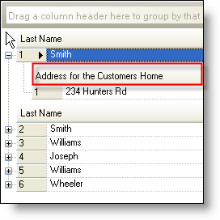

////

|metadata|
{
    "name": "wingrid-wrap-header-text-in-rowlayout-whats-new-2005-3",
    "controlName": [],
    "tags": [],
    "guid": "{9B4576F7-563E-4E35-BF2F-400073CC37A0}",  
    "buildFlags": [],
    "createdOn": "0001-01-01T00:00:00Z"
}
|metadata|
////

= Wrap Header Text in RowLayout

We added this property in Infragistics Windows Forms 2005 Volume 2. However, it was only implemented in regular mode (non-card-view and non-row-layout mode). In Infragistics Windows Forms 2005 Volume 3, it's implemented in all modes: Row-Layout regular view, card-view non-row-layout and card-view row-layout modes.

When  pick:[win-forms="link:infragistics4.win.ultrawingrid.v{ProductVersion}~infragistics.win.ultrawingrid.ultragridoverride~wrapheadertext.html[WrapHeaderText]"]  is set to True, the WinGrid™ will automatically wrap the caption in a header and increase the header's height to accommodate the header caption. This typically happens when the width of the header is smaller (for example when you resize it smaller) than what's necessary to display the caption fully.

_WrapHeaderText set to False_ 

image::images/WinGrid_Whats_New_Wrap_Header_Text_in_RowLayout_02.png[wrap header text in row layout in ultragrid]

_WrapHeaderText set to True_ 

== Related Topic

link:wingrid-wrapping-text-in-a-header.html[Wrap Text in a Header]