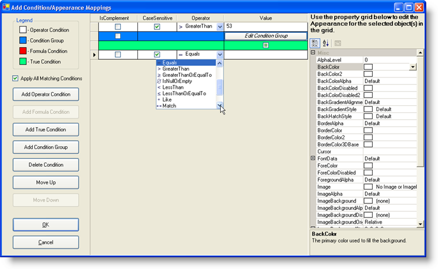

////

|metadata|
{
    "name": "wingrid-you-can-now-conditionally-format-cells-in-a-wingrid-column-whats-new-20071",
    "controlName": [],
    "tags": [],
    "guid": "{7F375A35-6ECE-4DA4-B1A2-A1F576106C1E}",  
    "buildFlags": [],
    "createdOn": "2006-11-12T15:30:59Z"
}
|metadata|
////

= You Can Now Conditionally Format Cells in a WinGrid Column

Changing the appearance of a cell based on its value used to be a tedious task, as you had to test each value during the  pick:[win-forms="link:{ApiPlatform}win.ultrawingrid{ApiVersion}~infragistics.win.ultrawingrid.ultragrid~initializerow_ev.html[InitializeRow]"]  event. This code had to be highly customized and was very time-consuming. We now offer a more timely and efficient way of conditionally formatting different cells in a column.

Using our new conditional formatting feature, you can create conditional statements easily in simple dialog boxes. All you need to do is create a new  pick:[win-forms="link:{ApiPlatform}win{ApiVersion}~infragistics.win.operatorcondition.html[OperatorCondition]"]  and link it to a  pick:[win-forms="link:{ApiPlatform}win.ultrawingrid{ApiVersion}~infragistics.win.ultrawingrid.ultragridcolumn~valuebasedappearance.html[ValueBasedAppearance]"]  property of any column. Once the ValueBasedAppearance property is set, the column will use the OperatorCondition to test all values of cells in the column against whatever condition you supply.

You can even use multiple conditional statements by adding several OperatorConditions to a  pick:[win-forms="link:{ApiPlatform}win{ApiVersion}~infragistics.win.conditiongroup.html[ConditionGroup]"] . You can choose to have the appearance applied if all conditions are met, or only one condition is met.

== Related Topics

link:wingrid-using-the-conditional-formatting-dialog-box.html[Using the Conditional Formatting Dialog Box]

link:wingrid-creating-an-operator-condition.html[Create an Operator Condition]

link:wingrid-creating-a-formula-condition.html[Create a Formula Condition]

link:wingrid-combining-multiple-conditions.html[Combining Multiple Conditions]

link:wingrid-implementing-conditional-formatting-at-design-time.html[Implementing Conditional Formatting at Design Time]