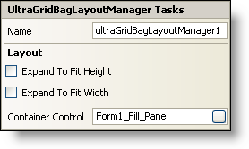

////

|metadata|
{
    "name": "wingridbaglayoutmanager-smart-tag",
    "controlName": [],
    "tags": ["Getting Started"],
    "guid": "{EEBC17EE-FC1E-46F7-9BC7-535E0D7EED1D}",  
    "buildFlags": [],
    "createdOn": "2005-07-11T00:00:00Z"
}
|metadata|
////

= WinGridBagLayoutManager Smart Tag

In Visual Studio 2005 (.NET Framework 2.0), each Infragistics Windows Forms control/component is equipped with a Smart Tag. By simply selecting the control/component, a Smart Tag anchor appears. When you click this anchor, a pop-up panel appears, providing you with quick and easy access to the most common properties and settings of the control/component.

The WinGridBagLayoutManager™ Smart Tag contains the name of the component, as well as the following section:

* Layout -- Offers properties that will determine how the WinGridBagLayoutManager component positions and arranges the controls that it manages on the form.

See below for a description of the item (e.g., field, drop-down list, checkbox) in each section, as well as the item's corresponding property in the properties grid.

[options="header", cols="a,a,a"]
|====
|Layout|Description|Corresponding Property

|Expand To Fit Height
|If you select this checkbox, WinGridBagLayoutManager component will proportionally resize all the logical rows to fit any extra height in the container.
| pick:[win-forms="link:infragistics4.win.misc.v{ProductVersion}~infragistics.win.misc.ultragridbaglayoutmanager~expandtofitheight.html[ExpandToFitHeight]"] 

|Expand To Fit Width
|If you select this checkbox, WinGridBagLayoutManager component will proportionally resize all the logical columns to fit any extra width in the container.
| pick:[win-forms="link:infragistics4.win.misc.v{ProductVersion}~infragistics.win.misc.ultragridbaglayoutmanager~expandtofitwidth.html[ExpandToFitWidth]"] 

|Container Control
|If you are using the WinGroupBox or WinExpandableGroupBox for instance, the WinGridBagLayoutManager will control the layout of whatever child controls are inside the container control. For example, set the container control (also available in the properties grid via the ContainerControl property) to "ultraGroupBox1" and the WinGridBagLayoutManager will govern the layout of the controls inside of "ultraGroupBox1."
| pick:[win-forms="link:infragistics4.win.misc.v{ProductVersion}~infragistics.win.misc.controllayoutmanagerbase~containercontrol.html[ContainerControl]"] 

|====