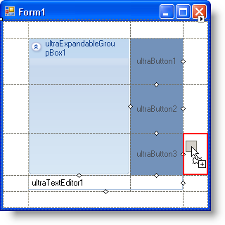
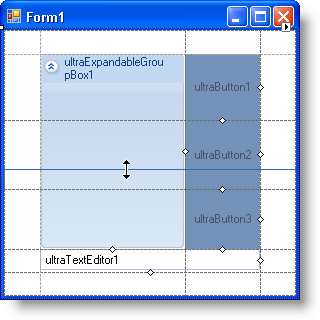
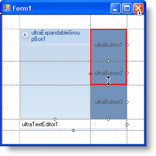

////

|metadata|
{
    "name": "wingridbaglayoutpanel-about-wingridbaglayoutpanel",
    "controlName": ["WinGridBagLayoutPanel"],
    "tags": ["Getting Started","Layouts"],
    "guid": "{EFE10B38-BF7C-450B-8862-8D3722595005}",  
    "buildFlags": [],
    "createdOn": "0001-01-01T00:00:00Z"
}
|metadata|
////

= About WinGridBagLayoutPanel

WinGridBagLayoutPanel™ resembles the WinGridBagLayoutManager™ in every way but one; WinGridBagLayoutPanel allows you to manage the layout of its owned controls at design time. The WinGridBagLayoutPanel control is a virtual grid consisting of virtual rows and columns, both of which can be resized with the click of a button.

*Drag and Drop* -- When dragging controls from the Microsoft® Visual Studio® toolbox into WinGridBagLayoutPanel, you will see red outlines acting as visual cues identifying where the control will be set once dropped. If you drag the control over an area between two managed controls, you will see two, large, red arrows identifying where the control will be inserted.

*Row and column resizing* -- By clicking and dragging the dotted lines separating the managed controls, you can resize the virtual rows and columns. You can set properties on individual controls to determine whether that control will then take up any extra space if you resized the row or column larger than the control.

*Row and column spanning* -- Managed controls can also span multiple rows and columns by clicking the small, white, diamond glyphs on the right and bottom of each control. Once clicked, drag the glyph into another row or column and you will see a red outline showing where the control will span once you let go of the mouse button.

*Extender properties* -- Each control managed by the WinGridBagLayoutPanel control receives a set of extender properties. Through these properties, you can dictate whether or not a particular control is managed by the WinGridBagLayoutPanel control. You can also edit that control's individual link:{ApiPlatform}win{ApiVersion}~infragistics.win.layout.gridbagconstraint.html[GridBagConstraint].