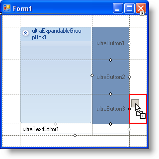
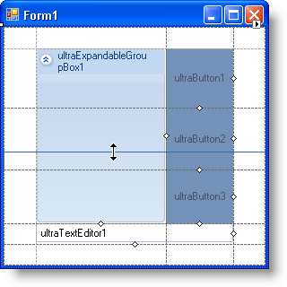
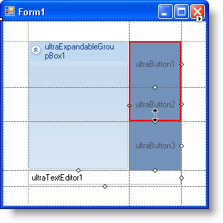

////

|metadata|
{
    "name": "wingridbaglayoutpanel-arranging-controls-in-wingridbaglayoutpanel",
    "controlName": ["WinGridBagLayoutPanel"],
    "tags": ["Design Environment","How Do I","Layouts"],
    "guid": "{85B393D7-296B-4E59-A884-BEC572697153}",  
    "buildFlags": [],
    "createdOn": "0001-01-01T00:00:00Z"
}
|metadata|
////

= Arranging Controls in WinGridBagLayoutPanel

The WinGridBagLayoutPanel™ control is a mirror image of the WinGridBagLayoutManager™ component; the main difference is that the panel supports design-time editing. The concept of the grid bag is fully realized in WinGridBagLayoutPanel as you can actually see the virtual grid and manipulate it as you would any other design-time control. Continue reading this topic for an in-depth discussion of how you can add controls to the panel and then manipulate the size of the virtual columns and rows.

== Drag and Drop

By far, the easiest way to add controls to WinGridBagLayoutPanel's virtual grid is to drag them from the Microsoft® Visual Studio® toolbox into the virtual grid. Upon dragging a control into the virtual grid, you will notice a red outline displaying in the grid area. This outline shows you where in the grid bag layout the control will be situated when dropped.

== Resizing Virtual Rows and Columns

The WinGridBagLayoutPanel control contains a virtual grid consisting of virtual columns and rows. You can modify the size of these columns and rows by clicking on the dotted lines that represent the columns/rows, and dragging them until the size of the column/row is acceptable. The top and left dotted lines, however, are not resizable. Use the bottom and right dotted lines to resize the top/bottom and left/right edges, respectively.

== Spanning Rows and Columns

Controls within the WinGridBagLayoutPanel control aren't restricted to being placed in only one column or row at a time. A control can span two, three, or as many columns or rows as are in the grid bag layout. Each control contained within the layout has two small, white diamond glyphs on its right and bottom sides. Clicking and dragging these glyphs allows you to span multiple rows (if clicking and dragging the right glyph) and multiple columns (if clicking and dragging the bottom glyph). A red outline will display, letting you know exactly which columns or rows will be spanned.

== Tweaking Individual Controls

If resizing and spanning columns and rows doesn't give you the amount of control you need, each control maintained by the WinGridBagLayoutPanel control is extended with properties from WinGridBagLayoutPanel. These properties let you tweak how individual controls behave within the virtual grid.

The following extender properties are available to controls managed by WinGridBagLayoutPanel:

* link:{ApiPlatform}win{ApiVersion}~infragistics.win.layout.gridbagconstraint.html[GridBagConstraint] -- Contains several useful properties to manage where a control is placed in the grid bag layout, as well as how many virtual rows or columns it spans.
* link:{ApiPlatform}win.misc{ApiVersion}~infragistics.win.misc.controllayoutitem~includeinlayout.html[IncludeInLayout] -- Determines whether or not the control is included in the grid bag layout (i.e., whether or not the control is managed by WinGridBagLayoutPanel).
* link:{ApiPlatform}win.misc{ApiVersion}~infragistics.win.misc.controllayoutitem~preferredsize.html[PreferredSize] -- WinGridBagLayoutPanel will attempt to resize the control based on this value. The PreferredSize property is ignored if the GridBagConstraint.Fill property is set.