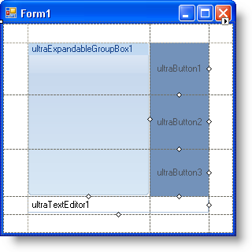
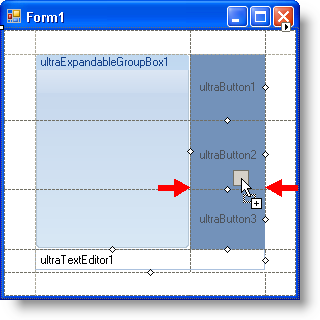

////

|metadata|
{
    "name": "wingridbaglayoutpanel-new-wingridbaglayoutpanel-control-whats-new-20072",
    "controlName": [],
    "tags": [],
    "guid": "{6887BAE1-33C0-4F3C-81CA-1A30B01022E5}",  
    "buildFlags": [],
    "createdOn": "0001-01-01T00:00:00Z"
}
|metadata|
////

= New WinGridBagLayoutPanel Control

For those of you who are familiar with the WinGridBagLayoutManager™ component, the WinGridBagLayoutPanel™ control will be a breath of fresh air. Unlike WinGridBagLayoutManager, the panel gives you the option of not writing a single line of code by offering a designer to place and resize controls at design time.

=== A Virtual Grid You Can See

Use WinGridBagLayoutPanel to visually arrange your controls in a virtual grid, giving you complete control over where each control resides. You can easily confirm that the controls are in the right place because you can see the layout with your own eyes! By clicking and dragging lines in the virtual grid, you can resize rows and columns to whatever size your application requires. Controls can also span rows and columns by dragging a control's span resizing glyph. A red outline will display, showing you exactly how the control will resize itself when spanning rows or columns.

=== Knowing What Happens Before it Happens

The WinGridBagLayoutPanel control includes several visual aids that allow you to simply drag a control into the panel, producing the correct result the first time. As you drag a control over the panel, you will see either red arrows or a red rectangular box identifying exactly where the control will end up if dropped at that location. This functionality is similar to the WinGrid™ and WinTree™ designers, so you get an added familiarity bonus!

=== The Same Object Model Means the Same Customizability

Since WinGridBagLayoutPanel was built off the same base class as the WinGridBagLayoutManager component, you get the same fine-grained control offered by the  pick:[win-forms="link:{ApiPlatform}win{ApiVersion}~infragistics.win.layout.gridbagconstraint.html[GridBagConstraint]"]  object. Therefore, if you need to modify the virtual grid or a control's placement in the virtual grid, you can do so at run time just as you would with the WinGridBagLayoutManager component.

== Related Topics

link:wingridbaglayoutpanel-about-wingridbaglayoutpanel.html[About WinGridBagLayoutPanel]

link:wingridbaglayoutpanel-arranging-controls-in-wingridbaglayoutpanel.html[Arranging Controls in WinGridBagLayoutPanel]