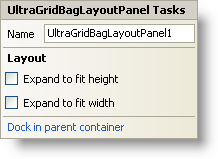

////

|metadata|
{
    "name": "wingridbaglayoutpanel-smart-tag",
    "controlName": ["WinGridBagLayoutPanel"],
    "tags": ["API","Design Environment"],
    "guid": "{B0A04413-3FCD-4F8E-8DD6-F713C5E88653}",  
    "buildFlags": [],
    "createdOn": "0001-01-01T00:00:00Z"
}
|metadata|
////

= WinGridBagLayoutPanel Smart Tag

In Visual Studio 2005 (.NET Framework 2.0), each Infragistics Windows Forms control/component is equipped with a Smart Tag. By simply selecting the control/component, a Smart Tag anchor appears. When you click this anchor, a pop-up panel appears, providing you with quick and easy access to the most common properties and settings of the control/component.

The WinGridBagLayoutPanel™ Smart Tag contains the name of the control, as well as the following sections:

* Layout -- Offers properties that will determine where and how the control is placed on the form.

See below for a description of the item (e.g., field, drop-down list, checkbox) in each section, as well as the item's corresponding property in the properties grid.

[options="header", cols="a,a,a"]
|====
|Layout|Description|Corresponding Property

|Expand to fit height
|Expands the height of all managed items to fit any extra available height.
| pick:[win-forms="link:infragistics4.win.misc.v{ProductVersion}~infragistics.win.misc.ultragridbaglayoutpanel~expandtofitheight.html[ExpandToFitHeight]"] 

|Expand to fit width
|Expands the width of all managed items to fit any extra available width.
| pick:[win-forms="link:infragistics4.win.misc.v{ProductVersion}~infragistics.win.misc.ultragridbaglayoutpanel~expandtofitwidth.html[ExpandToFitWidth]"] 

|Dock in parent container
|Sets the Dock property to Fill.
|Dock

|====