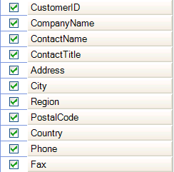

////

|metadata|
{
    "name": "wingridcolumnchooser-about-wingridcolumnchooser",
    "controlName": [],
    "tags": ["Extending","Getting Started","Grids"],
    "guid": "{23691E06-9DAC-47C6-9309-BFFA4A259753}",  
    "buildFlags": [],
    "createdOn": "0001-01-01T00:00:00Z"
}
|metadata|
////

= About WinGridColumnChooser

The WinGridColumnChooser™ control provides a list of grid columns so that the end user can hide or show columns, similar to the way the Field Chooser in Microsoft® Outlook® works. End users can select/deselect a checkbox in front of each column to hide/show the column, respectively. In addition, end users can drag columns from the column chooser to the grid and vice versa to arrange columns.

