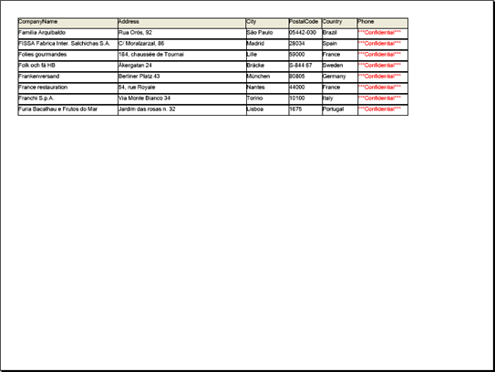

////

|metadata|
{
    "name": "wingriddocumentexporter-modifying-wingrids-layout-before-exporting-to-a-pdf-document",
    "controlName": ["WinGridDocumentExporter"],
    "tags": ["Exporting","Layouts","Styling"],
    "guid": "{E6CD73A9-EC4C-479D-810B-EA40CAFC3118}",  
    "buildFlags": [],
    "createdOn": "0001-01-01T00:00:00Z"
}
|metadata|
////

= Modifying WinGrid's Layout Before Exporting to a PDF Document

== Before You Begin

It is highly unlikely that your grid will be in perfect form for a printable document such as a PDF file. Because of this, WinGridDocumentExporter™ has an expansive Event model to give you as much control as possible over converting your grid into a PDF document. Some important events covered in this walkthrough are listed below:

pick:[win-forms="link:{ApiPlatform}win.ultrawingrid.documentexport{ApiVersion}~infragistics.win.ultrawingrid.documentexport.ultragriddocumentexporter~beginexport_ev.html[BeginExport]"]  – Fires when the entire exporting process first begins. This is where you would set Section-specific properties and modify the ExportLayout by hiding a few columns. The ExportLayout is the layout of the exported grid, just as the DisplayLayout is the layout of the on-screen grid. Whatever you modify in the ExportLayout object will not affect WinGrid's on-screen layout.

pick:[win-forms="link:{ApiPlatform}win.ultrawingrid.documentexport{ApiVersion}~infragistics.win.ultrawingrid.documentexport.ultragriddocumentexporter~initializerow_ev.html[InitializeRow]"]  – Fires when each individual row of the exported grid (not the on-screen grid) is initialized. This event gives you access to the row and all its cells, allowing you to modify appearances.

pick:[win-forms="link:{ApiPlatform}win.ultrawingrid.documentexport{ApiVersion}~infragistics.win.ultrawingrid.documentexport.ultragriddocumentexporter~cellexporting_ev.html[CellExporting]"]  – Fires when an individual cell is about to be exported to a report. This event is important if you need to change the Value of a cell.

== What You Will Accomplish

You will learn how to take a fully populated WinGrid™ and export it to a PDF document. You will modify the layout of the grid by:

* hiding several columns
* changing the value and appearance of individual cells
* only displaying certain rows by canceling all others

.Note
[NOTE]
====
This topic assumes that your grid is populated with the Customers table from the Northwind database. For information on how to populate your grid with the necessary data, see link:wingrid-binding-wingrid-to-a-flat-data-source-clr2.html[Bind WinGrid to a Flat Data Source].
====

== Follow these Steps

[start=1]
. *Set up your form.*

.. In a new Visual Basic or C# project, place an UltraGrid and an UltraButton control on the form.
.. Double-click the UltraGridDocumentExporter component in the toolbox. The component is added to the component tray.
.. With the button selected, find the Text property in the Properties window and change it to "Export to PDF".

[start=2]
. *Create the BeginExport event.*

Create the BeginExport event for the ultraGridDocumentExporter1 component either through the Properties window if using C# or the drop-down boxes above the code-behind if using Visual Basic. In this event, you will be performing two actions: setting the margins of the document and hiding several columns.

*In Visual Basic:*

----
Private Sub UltraGridDocumentExporter1_BeginExport(ByVal sender As Object, _
  ByVal e As Infragistics.Win.UltraWinGrid.DocumentExport.BeginExportEventArgs) _
  Handles UltraGridDocumentExporter1.BeginExport
	' This line effectively gives the page a 25 pixel margin.
	e.Section.PageMargins.All = 25
	' Hides columns 1, 3, 4, 7, and 11 (they will not be exported).
	e.Layout.Bands(0).Columns(0).Hidden = True
	e.Layout.Bands(0).Columns(2).Hidden = True
	e.Layout.Bands(0).Columns(3).Hidden = True
	e.Layout.Bands(0).Columns(6).Hidden = True
	e.Layout.Bands(0).Columns(10).Hidden = True
End Sub
----

*In C#:*

----
private void ultraGridDocumentExporter1_BeginExport(object sender,
	Infragistics.Win.UltraWinGrid.DocumentExport.BeginExportEventArgs e)
{
	// This line effectively gives the page a 25 pixel margin.
	e.Section.PageMargins.All = 25;
	// Hides columns 1, 3, 4, 7, and 11 (they will not be exported).
	e.Layout.Bands[0].Columns[0].Hidden = true;
	e.Layout.Bands[0].Columns[2].Hidden = true;
	e.Layout.Bands[0].Columns[3].Hidden = true;
	e.Layout.Bands[0].Columns[6].Hidden = true;
	e.Layout.Bands[0].Columns[10].Hidden = true;
}
----

[start=3]
. *Create the InitializeRow event.*

Create the InitializeRow event for the ultraGridDocumentExporter1 component either through the Properties window if using C# or the drop-down boxes above the code-behind if using Visual Basic. The code in this event will only export rows whose company name starts with the letter "F" as well as change the foreground color of the tenth cell to Red.

*In Visual Basic:*

----
Private Sub UltraGridDocumentExporter1_InitializeRow(ByVal sender As Object, _
  ByVal e As Infragistics.Win.UltraWinGrid.DocumentExport.DocumentExportInitializeRowEventArgs) _
  Handles UltraGridDocumentExporter1.InitializeRow
	' If the text in the cell does NOT start with 'F', skip the current row.
	If (Not e.Row.Cells(1).Text.StartsWith("F")) Then
		e.SkipRow = True
	End If
	' Change the text color of the tenth cell to red.
	e.Row.Cells(9).Appearance.ForeColor = Color.Red
End Sub
----

*In C#:*

----
private void ultraGridDocumentExporter1_InitializeRow(object sender,
	Infragistics.Win.UltraWinGrid.DocumentExport.DocumentExportInitializeRowEventArgs e)
{
	// If the text in the cell does NOT start with 'F', skip the current row.
	if (!e.Row.Cells[1].Text.StartsWith("F")) e.SkipRow = true;
	e.Row.Cells[9].Appearance.ForeColor = Color.Red;
}
----

[start=4]
. *Create the CellExporting event.*

Create the CellExporting event for the ultraGridDocumentExporter1 component either through the Properties window if using C# or the drop-down boxes above the code-behind if using Visual Basic. The code in the CellExporting event will change the Value of the tenth cell in each row to "$$*$$$$*$$$$*$$Confidential$$*$$$$*$$$$* $$".

*In Visual Basic:*

----
Private Sub UltraGridDocumentExporter1_CellExporting(ByVal sender As Object, _
  ByVal e As Infragistics.Win.UltraWinGrid.DocumentExport.CellExportingEventArgs) _
  Handles UltraGridDocumentExporter1.CellExporting
	' Change the value of the tenth cell of each row.
	If (e.GridColumn.Index = 9) Then
		e.ExportValue = "$$*$$$$*$$$$*$$Confidential$$*$$$$*$$$$* $$"
	End If
End Sub
----

*In C#:*

----
private void ultraGridDocumentExporter1_CellExporting(object sender, 
  Infragistics.Win.UltraWinGrid.DocumentExport.CellExportingEventArgs e)
{
	// Change the value of the tenth cell.
	if (e.GridColumn.Index == 9) e.ExportValue = "$$*$$$$*$$$$*$$Confidential$$*$$$$*$$$$* $$";
}
----

[start=5]
. *Export the grid through the button's Click event.*

In Design view, double-click the button to create the Click event. In this event, you will call the link:{ApiPlatform}win.ultrawingrid.documentexport{ApiVersion}~infragistics.win.ultrawingrid.documentexport.ultragriddocumentexporter~export.html[Export] method off the UltraGridDocumentExporter. The fourth overload accepts three parameters:

** the WinGrid that you want to export (UltraGrid)
** the file name and path (System.String)
** the file format you want to export the grid as (GridExportFileFormat)

You will export WinGrid as a PDF file to the root of C: and name it GridPDF.pdf.

*In Visual Basic:*

----
Private Sub UltraButton1_Click(ByVal sender As Object, _
  ByVal e As System.EventArgs) Handles UltraButton1.Click
	Me.UltraGridDocumentExporter1.Export( _
		Me.UltraGrid1, _
		"C:\GridPDF.pdf", _
		Infragistics.Win.UltraWinGrid.DocumentExport.GridExportFileFormat.PDF)
End Sub
----

*In C#:*

----
private void ultraButton1_Click(object sender, EventArgs e)
{
this.ultraGridDocumentExporter1.Export(
	this.ultraGrid1,
	@"C:\GridPDF.pdf",
	Infragistics.Win.UltraWinGrid.DocumentExport.GridExportFileFormat.PDF);
}
----

[start=6]
. *Run the application.*

When you run the application, you will see WinGrid fully populated with the entire Customers table from the Northwind database. When you click the button, a PDF file is created and placed in the root of C:. When you view the PDF file, it should look something like the following screen shot.

.Note
[NOTE]
====
If you'd like quicker access to your new PDF file, you can call the System.Diagnostic.Process.Start() method in the button's Click event and pass in the full filename and path as the parameter.
====

