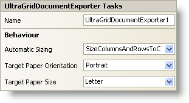

////

|metadata|
{
    "name": "wingriddocumentexporter-smart-tag",
    "controlName": ["WinGridDocumentExporter"],
    "tags": ["Design Environment"],
    "guid": "{B2D436E4-7830-4179-90FC-2DAFC6309522}",  
    "buildFlags": [],
    "createdOn": "0001-01-01T00:00:00Z"
}
|metadata|
////

= WinGridDocumentExporter Smart Tag

In Visual Studio 2005 (.NET Framework 2.0), each Infragistics Windows Forms control/component is equipped with a Smart Tag. By simply selecting the control/component, a Smart Tag anchor appears. When you click this anchor, a pop-up panel appears, providing you with quick and easy access to the most common properties and settings of the control/component.

The WinGridDocumentExporter™ Smart Tag contains the name of the control, as well as the following sections:

* Behavior -- Provides easy access to properties that govern how the control behaves on the form.

See below for a description of the item (e.g., field, drop-down list, checkbox) in each section, as well as the item's corresponding property in the properties grid.

[options="header", cols="a,a,a"]
|====
|Behavior|Description|Corresponding Property

|Automatic Sizing
|This allows you to determine whether or not WinGridDocumentExporter will automatically size columns and/or rows to its content.
| pick:[win-forms="link:infragistics4.win.ultrawingrid.documentexport.v{ProductVersion}~infragistics.win.ultrawingrid.documentexport.ultragriddocumentexporter~autosize.html[AutoSize]"] 

|Target Paper Orientation
|Export WinGrid as either Portrait or Landscape orientation.
| pick:[win-forms="link:infragistics4.win.ultrawingrid.documentexport.v{ProductVersion}~infragistics.win.ultrawingrid.documentexport.ultragriddocumentexporter~targetpaperorientation.html[TargetPaperOrientation]"] 

|Target Paper Size
|Choose from several predefined page sizes for your exported WinGrid.
| pick:[win-forms="link:infragistics4.win.ultrawingrid.documentexport.v{ProductVersion}~infragistics.win.ultrawingrid.documentexport.ultragriddocumentexporter~targetpapersize.html[TargetPaperSize]"] 

|====