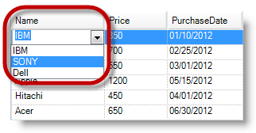
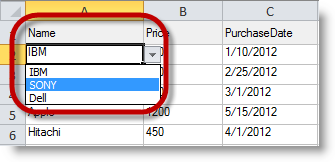

////

|metadata|
{
    "name": "wingridexceledporter-exporting-dropdown-list-to-excel",
    "controlName": ["WinGridExcelExporter"],
    "tags": [],
    "guid": "5e84b2a6-90ab-4f8c-a3c8-212a9a7da503",  
    "buildFlags": [],
    "createdOn": "2013-01-23T16:09:30.828864Z"
}
|metadata|
////

= Exporting DropDown List To Excel

== Topic Overview

=== Purpose

This topic provides an overview about exporting the  _WinGrid™_    __control__ ’s drop-down list to excel, where any column with a value list will have a drop-down capability in excel containing list of values as in the grid.

=== Required background

The following topics are prerequisites to understanding this topic:

[options="header", cols="a,a"]
|====
|Topic|Purpose

| link:wingridexcelexporter-about-wingridexcelexporter.html[About WinGridExcelExporter]
|This topic gives a general overview of the Excel exporting process and the elements involved.

| link:wingrid-using-windropdown-inside-wingrid.html[Using WinDropDown inside WinGrid]
|This topic provides detail information about embedding a drop-down control in _WinGrid_ .

|====

=== In this topic

This topic contains the following sections:

* <<_Ref345946088,Exporting the Drop-down List>>

** <<_Ref341518673,Introduction and preview>>
** <<_Ref341518679,Property settings>>

* <<_Ref341518687,Related Content>>

[[_Ref345946088]]
== Exporting the Drop-down List

[[_Ref341518673]]

=== Introduction and preview

Enhancements in exporting data from  _WinGrid_   to excel allow exporting the drop-down list. This is similar to the drop-down controls embedded in WinGrid. Any  _WinGrid_   column that contains value list such as  _WinComboEditor or WinDropDown_   (embedded in  _WinGrid_  ) will display a drop-down list for that column in the exported excel worksheet, unless disabled in the  _WinGridExcelExporter™_  .

The following two screenshots illustrate the before (deployed in WinGrid) and the after (imported to Excel).

The  _WinGrid_   with drop-down value list before exporting to excel

The Excel worksheet with the drop-down value list after importing from WinGrid

[[_Ref341518679]]

=== Property settings

The  _WinGridExcelExporter_   component includes the `ExportValueList` property required for exporting drop-down lists to excel, with its default value – True. You need to change this property to  _False_   if you want to prevent exporting the value lists to excel.

[[_Ref341518687]]
== Related Content

=== Topics

The following topic provides additional information related to this topic.

[options="header", cols="a,a"]
|====
|Topic|Purpose

| link:win-wingridexcelexporter-using-wingridexcelexporter.html[Using WinGridExcelExporter]
|In this section, you will find short, task-based topics that explain how to perform a specific task related to the _WinGridExcelExporter_ component.

|====