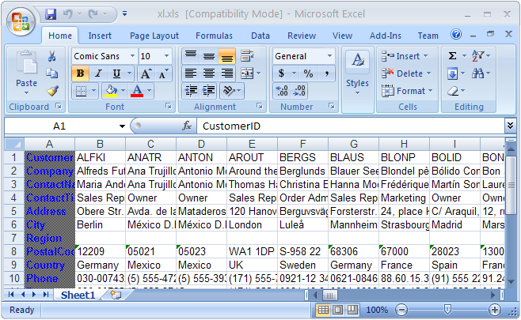

////

|metadata|
{
    "name": "wingridexcelexporter-transposing-rows-and-columns-using-wingrid-excel-exporter",
    "controlName": ["WinGridExcelExporter"],
    "tags": ["How Do I"],
    "guid": "{934828FE-2C9E-4ADD-8B2C-2568F17A85DC}",  
    "buildFlags": [],
    "createdOn": "0001-01-01T00:00:00Z"
}
|metadata|
////

= Transposing Rows and Columns using WinGrid Excel Exporter

== Before You Begin

The WinGridExcelExporter™ has the ability to export data from WinGrid™ to Microsoft® Excel® file format. By default, the Excel file’s layout has the standard horizontal rows and vertical column representation of data. However you may sometimes need the layout to be different from the standard way of representing the data.

== What You Will Accomplish

This topic will show you one technique that can be used to transpose WinGrid rows and columns that are being exported to an Excel Worksheet through the use of WinGridExcelExporter. Once you understand this technique of transposing rows and columns, you can adapt this code and logic to perform the same or similar operation in your application.

== Follow these Steps

[start=1]
. From the Visual Studio™ Toolbox, locate the UltraGrid and UltraGridExcelExporter controls and drag and drop them onto your WinForm. Name the UltraGrid control as “customersUltraGrid” and leave the UltraGridExcelExporter control with its default name.
[start=2]
. In this topic, we bind the grid with the Customers table of the Northwind database. For more information on how to bind the grid to data, see link:wingrid-binding-wingrid-to-a-flat-data-source-clr2.html[Binding WinGrid to a Flat Data Source].
[start=3]
. Before you start writing any code , you should place using/imports directives in your code-behind so you don’t need to always type out a member’s fully qualified name.

*In Visual Basic:*

----
Imports Infragistics.Documents.Excel
Imports Infragistics.Win.UltraWinGrid
Imports System.Diagnostics
----

*In C#:*

----
using Infragistics.Documents.Excel;
using Infragistics.Win.UltraWinGrid;
using System.Diagnostics;
----

[start=4]
. Declare a class scoped reference to  pick:[win-forms="link:{ApiPlatform}documents.excel{ApiVersion}~infragistics.documents.excel.iworksheetcellformat.html[IWorksheetCellFormat]"] . This will be used to customize the cell format of the Excel worksheet cells. We create and reuse only one instance of IWorkSheetCellFormat specifically for our data cells in order to keep the memory footprint to a minimum. You can create a new one each time the  pick:[win-forms="link:{ApiPlatform}win.ultrawingrid.excelexport{ApiVersion}~infragistics.win.ultrawingrid.excelexport.ultragridexcelexporter~rowexporting_ev.html[RowExporting]"]  event fires, however that will be more costly.

*In Visual Basic:*

----
Private _theCellFormat As IWorksheetCellFormat = Nothing
----

*In C#:*

----
private IWorksheetCellFormat _theCellFormat = null;
----

[start=5]
. Exporting the WinGrid Data to Excel - Now we need to provide the means to export the WinGrid data to Excel. Place the following code within the event handler of a Button. When clicked, this will export the WinGrid data using the WinGridExcelExporter.

*In Visual Basic:*

----
Dim theFile As String = Application.StartupPath & "\xl.xls"
Me.UltraGridExcelExporter1.Export(Me.customersUltraGrid, theFile)
Process.Start(theFile)
----

*In C#:*

----
string theFile = Application.StartupPath + @"\xl.xls";
this.ultraGridExcelExporter1.Export(this.customersUltraGrid, theFile);
Process.Start(theFile);
----

In this code, we create a file name for the Excel file, then we call the Export method of WinGridExcelExporter and we finally call the Process.Start method so that we can launch the Excel File with its associated application. In this case, Microsoft™ Excel™
[start=6]
. In this technique of transposing rows and columns in the Excel Worksheet, first we must cancel the default way of exporting data. This is done by cancelling the  pick:[win-forms="link:{ApiPlatform}win.ultrawingrid.excelexport{ApiVersion}~infragistics.win.ultrawingrid.excelexport.ultragridexcelexporter~headercellexporting_ev.html[HeaderCellExporting]"]  and  pick:[win-forms="link:{ApiPlatform}win.ultrawingrid.excelexport{ApiVersion}~infragistics.win.ultrawingrid.excelexport.ultragridexcelexporter~cellexporting_ev.html[CellExporting]"]  events of UltraGridExcelExporter1.

*In Visual Basic:*

----
Private Sub UltraGridExcelExporter1_HeaderCellExporting(ByVal sender As System.Object, ByVal e As Infragistics.Win.UltraWinGrid.ExcelExport.HeaderCellExportingEventArgs) Handles UltraGridExcelExporter1.HeaderCellExporting
        e.Cancel = True
End Sub
Private Sub UltraGridExcelExporter1_CellExporting(ByVal sender As System.Object, ByVal e As Infragistics.Win.UltraWinGrid.ExcelExport.CellExportingEventArgs) Handles UltraGridExcelExporter1.CellExporting
        e.Cancel = True
End Sub
----

*In C#:*

----
private void ultraGridExcelExporter1_HeaderCellExporting(object sender, Infragistics.Win.UltraWinGrid.ExcelExport.HeaderCellExportingEventArgs e)
{
            e.Cancel = true;
}
private void ultraGridExcelExporter1_CellExporting(object sender, Infragistics.Win.UltraWinGrid.ExcelExport.CellExportingEventArgs e)
{
            e.Cancel = true;
}
----

[start=7]
. Create a method TransposeRowAndColumn. This method takes three parameters  pick:[win-forms="link:{ApiPlatform}win.ultrawingrid{ApiVersion}~infragistics.win.ultrawingrid.ultragridrow.html[UltraGridRow]"] ,  pick:[win-forms="link:{ApiPlatform}documents.excel{ApiVersion}~infragistics.documents.excel.worksheet.html[Worksheet]"]  and IWorksheetCellFormat.

*In Visual Basic:*

----
  Private Sub TransposeRowAndColumn(ByVal r As UltraGridRow, ByVal w As Worksheet, ByVal cellFormat As IWorksheetCellFormat)
       For Each c As UltraGridCell In r.Cells
            If Not c.Column.Hidden Then
                'Populate the Worksheet Cells and set the Formatting 
                w.Rows(c.Column.Index).Cells(r.Index + 1).Value = c.Value
                w.Rows(c.Column.Index).Cells(r.Index +).CellFormat.SetFormatting(cellFormat)
            End If
        Next
    End Sub
----

*In C#:*

----
    private void TransposeRowAndColumn(UltraGridRow r,Worksheet w, 
            IWorksheetCellFormat cellFormat)
        {
            foreach (UltraGridCell c in r.Cells)
            {
                if (!c.Column.Hidden) //do not process hidden columns
                {
                    //Populate the Worksheet Cells and set the Formatting
                    w.Rows[c.Column.Index].Cells[r.Index + 1].Value = c.Value;
                    w.Rows[c.Column.Index].Cells[r.Index +].CellFormat.SetFormatting(cellFormat);                    
                }
            }
        }
----

.Note
[NOTE]
====
*Note:* This method is best used in the BEFORE Excel Exporter events.You must make sure you set e.Cancel = True in all your BEFORE events so that you can stop the default exporting behavior.
====

This is the logic that is used within the TransposeRowAndColumn method:

** First we loop through each cell of the grid and check if the Cell’s Column is hidden so that we don’t export the hidden columns to the Excel Worksheet.
** Since the first Worksheet Column represents the WinGrid Column Headers, we need to write our data starting at the second Worksheet column onward. This is why we use r.Index + 1 when referring to the WorkSheet Cells.
** Finally, the Cell is styled by calling the SetFormatting method and passing in the IWorkSheetCellFormat instance.

[start=8]
. So far, we have written a method to handle the transposing of Rows, however we need one more method to transpose Column Headers. Create a method TransposeHeader(), which takes three parameters  pick:[win-forms="link:{ApiPlatform}win.ultrawingrid{ApiVersion}~infragistics.win.ultrawingrid.columnscollection.html[ColumnsCollection]"] , Worksheet and IWorksheetCellFormat.

*In Visual Basic:*

----
Private Sub TransposeHeader(ByVal c As ColumnsCollection, ByVal w As Worksheet, ByVal headerFormat As IWorksheetCellFormat)
          For Each column As UltraGridColumn In c
            If Not column.Hidden Then
                w.Rows(column.Index).Cells(0).Value = column.Header.Caption
                w.Rows(column.Index).Cells(0).CellFormat.SetFormatting(headerFormat)
            End If
          Next
   End Sub
----

*In C#:*

----
private void TransposeHeader(ColumnsCollection c, Worksheet w, IWorksheetCellFormat headerFormat)
{
           foreach (UltraGridColumn column in c)
            {
                if (!column.Hidden)
                {
                    w.Rows[column.Index].Cells[0].Value = column.Header.Caption;
                    w.Rows[column.Index].Cells[0].CellFormat.SetFormatting(headerFormat);
                }
            }
 }
----

This is the logic that is used within the TransposeHeader method:

** First we loop through each Column in the ColumnsCollection and check if the Column is hidden so that we don’t export the hidden Columns to the Excel Worksheet.
** Since the first Worksheet Column represents the WinGrid Column Headers, we write the WinGrid Header Captions to the Worksheet Cells.
** Finally, the Cell is styled by calling the SetFormatting method and passing in the IWorkSheetCellFormat instance. You may want to create a style that distinguishes the Column Headers apart from the Data Cells.

[start=9]
. Finally we handle UltraGridExcelExporter’s ,  pick:[win-forms="link:{ApiPlatform}win.ultrawingrid.excelexport{ApiVersion}~infragistics.win.ultrawingrid.excelexport.ultragridexcelexporter~headerrowexporting_ev.html[HeaderRowExporting]"]  and RowExporting events so that we can cancel the default exporting behavior and then call our TransposeRowAndColumn and TransposeHeader methods respectively.

*In Visual Basic:*

----
 Private Sub UltraGridExcelExporter1_HeaderRowExporting(ByVal sender As System.Object, ByVal e As Infragistics.Win.UltraWinGrid.ExcelExport.HeaderRowExportingEventArgs) Handles UltraGridExcelExporter1.HeaderRowExporting
             e.Cancel = True
             Dim theHeaderFormat As IWorksheetCellFormat =      e.Workbook.CreateNewWorksheetCellFormat()
             theHeaderFormat.Font.Bold = ExcelDefaultableBoolean.[True]
             theHeaderFormat.Font.Name = "Comic Sans"
             theHeaderFormat.Font.Color = Color.Blue
             theHeaderFormat.FillPatternBackgroundColor = Color.LightGray
             Me.TransposeRowAndColumn(e.Band.Columns, e.CurrentWorksheet, theHeaderFormat)
     End Sub
                  Private Sub UltraGridExcelExporter1_RowExporting(ByVal sender As System.Object, ByVal e As Infragistics.Win.UltraWinGrid.ExcelExport.RowExportingEventArgs) Handles UltraGridExcelExporter1.RowExporting
             e.Cancel = True
            'Cancel the event to stop the default export behavior. 
            If _theCellFormat Is Nothing Then
            'create it only once 
            'set whatever properties you feel will represent your Cell Data: 
            _theCellFormat = e.Workbook.CreateNewWorksheetCellFormat()
            _theCellFormat.Font.Bold = ExcelDefaultableBoolean.[False]
            _theCellFormat.Font.Name = "Comic Sans"
            _theCellFormat.Font.Color = Color.Black
             End If
              Me.TransposeRowAndColumn(e.GridRow, e.CurrentWorksheet, _theCellFormat)
     End Sub
----

*In C#:*

----
private void ultraGridExcelExporter1_HeaderRowExporting(object sender, Infragistics.Win.UltraWinGrid.ExcelExport.HeaderRowExportingEventArgs e)
          {
              e.Cancel = true;
              IWorksheetCellFormat theHeaderFormat = e.Workbook.CreateNewWorksheetCellFormat();
               theHeaderFormat.Font.Bold = ExcelDefaultableBoolean.True;
               theHeaderFormat.Font.Name = "Comic Sans";
               theHeaderFormat.Font.Color = Color.Blue;
               theHeaderFormat.FillPatternBackgroundColor = Color.LightGray;
               this.TransposeHeader(e.Band.Columns, e.CurrentWorksheet, theHeaderFormat);
       }
          private void ultraGridExcelExporter1_RowExporting(
            object sender, 
            Infragistics.Win.UltraWinGrid.ExcelExport.RowExportingEventArgs e)
          {
                e.Cancel = true; //Cancel the event to stop the default export behavior.
                if (_theCellFormat == null) //create it only once
                {
                //set whatever properties you feel will represent your Cell Data:
                  _theCellFormat = e.Workbook.CreateNewWorksheetCellFormat();
                  _theCellFormat.Font.Bold = ExcelDefaultableBoolean.False;
                  _theCellFormat.Font.Name = "Comic Sans";
                  _theCellFormat.Font.Color = Color.Black;
                 }  
                this.TransposeRowAndColumn(e.GridRow, e.CurrentWorksheet, _theCellFormat);
        }
----

[start=10]
. Save and run the application. Click the Button that you used to generate the Excel File. The Excel file should automatically launch and will look similar to the following image:

