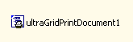

////

|metadata|
{
    "name": "wingridprintdocument-about-wingridprintdocument",
    "controlName": ["WinGridPrintDocument"],
    "tags": ["Getting Started","Grids"],
    "guid": "{C52B267B-8716-4C89-BC4D-1091ADEED6DF}",  
    "buildFlags": [],
    "createdOn": "0001-01-01T00:00:00Z"
}
|metadata|
////

= About WinGridPrintDocument

WinGridPrintDocument™ is a Windows Forms component that allows you to easily print out a WinGrid. The following is a list of some of the functionalities available in WinGridPrintDocument:

* Print Preview -- The WinGridPrintDocument component can be used with the WinPrintPreviewDialog component in order to preview a WinGrid document before it is printed. See link:winprintpreviewdialog-wingridprintdocument-using-winprintpreviewdialog-with-wingridprintdocument.html[Using WinPrintPreviewDialog with WinGridPrintDocument] for details.
* Headers/Footers -- Allows you to specify custom headers and footers to print along with the WinGrid control.

