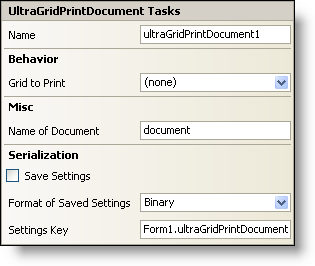

////

|metadata|
{
    "name": "wingridprintdocument-smart-tag",
    "controlName": ["WinGridPrintDocument"],
    "tags": ["Grids"],
    "guid": "{0A7EABB3-955A-4705-8A20-1066E437AA9B}",  
    "buildFlags": [],
    "createdOn": "2005-11-11T00:00:00Z"
}
|metadata|
////

= WinGridPrintDocument Smart Tag

In Visual Studio 2005 (.NET Framework 2.0), each Infragistics Windows Forms control/component is equipped with a Smart Tag. By simply selecting the control/component, a Smart Tag anchor appears. When you click this anchor, a pop-up panel appears, providing you with quick and easy access to the most common properties and settings of the control/component.

The WinGridPrintDocument™ Smart Tag contains the name of the component, as well as the following sections:

* Behavior -- Provides easy access to properties that govern how the control behaves on the form.
* Misc -- Provides various options that will enhance the overall look or performance of the control.
* Serialization -- Provides quick access to properties used in the IPersistComponentSettings interface.

See below for a description of the item (e.g., field, drop-down list, checkbox) in each section, as well as the item's corresponding property in the properties grid.

[options="header", cols="a,a,a"]
|====
|Behavior|Description|Corresponding Property

|Grid to Print
|Click the drop-down and all available WinGrids on the form will be shown. Select the WinGrid you wish to print.
| pick:[win-forms="link:{ApiPlatform}win.ultrawingrid{ApiVersion}~infragistics.win.ultrawingrid.ultragridprintdocument~grid.html[Grid]"] 

|====

[options="header", cols="a,a,a"]
|====
|Misc|Description|Corresponding Property

|Name of Document
|Enter a name for the document that will be shown to the user.
|DocumentName

|====

[options="header", cols="a,a,a"]
|====
|Serialization|Description|Corresponding Property

|Save Settings
|Selecting True from the drop-down will allow the control to automatically save the applications' settings properties.
| pick:[win-forms="link:{ApiPlatform}win{ApiVersion}~infragistics.win.printing.ultraprintdocument~savesettings.html[SaveSettings]"] 

|Format of Saved Settings
|The control can save its settings to either Binary or XML files.
| pick:[win-forms="link:{ApiPlatform}win{ApiVersion}~infragistics.win.printing.ultraprintdocument~savesettingsformat.html[SaveSettingsFormat]"] 

|Settings Key
|You can set the settings key of the current instance of the control.
| pick:[win-forms="link:{ApiPlatform}win{ApiVersion}~infragistics.win.printing.ultraprintdocument~settingskey.html[SettingsKey]"] 

|====