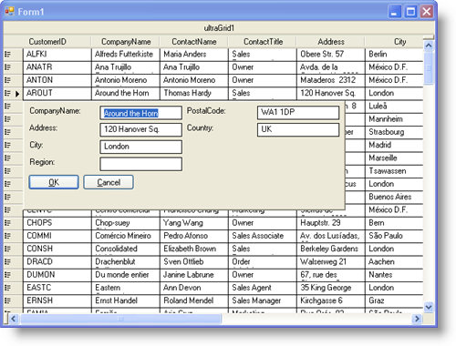

////

|metadata|
{
    "name": "wingridrowedittemplate-about-wingridrowedittemplate",
    "controlName": [],
    "tags": ["Getting Started","Templating"],
    "guid": "{79EC85EC-4550-4D44-9B8D-D15E4ABDD0EB}",  
    "buildFlags": [],
    "createdOn": "0001-01-01T00:00:00Z"
}
|metadata|
////

= About WinGridRowEditTemplate

With the new WinGridRowEditTemplate™ control, you can essentially display an entire form overtop WinGrid™, showing your end user only the data they need to modify. WinGridRowEditTemplate displays the data from a single row, allowing your end user to focus on the data they are currently editing.

Creating a row's edit template is easy with the UltraGridRowEditTemplate wizard. Once you drop WinGridRowEditTemplate on the form, and connect it to a band, the wizard displays, allowing you to choose which columns you'd like to show on the template. Once finished, the template is automatically populated, so all you have to do is arrange the controls.

WinGridRowEditTemplate contains the following features:

* *A full-featured designer* -- WinGridRowEditTemplate includes a fully functional designer to help you create a row's edit template as quickly and easily as possible.
* *WinGridCellProxy* -- WinGridCellProxy is a special control that you can bind to a specific data member within a row's edit template. WinGridCellProxy will perform the editor roll of whatever data is in the specified column, whether it be a number, text, or a DateTime object.
* *Fully customizable* -- Because WinGridRowEditTemplate derives from System.Windows.Forms.Panel, you can add any Windows Forms object to it.
* *Presentation Layer Framework™* -- WinGridRowEditTemplate inherits all the Appearance and Filtering support from the PLF; therefore, you'll be able to style the template in any way imaginable.

