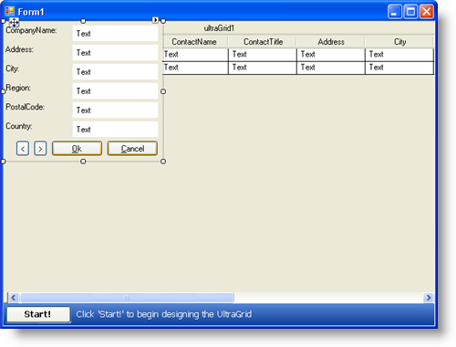

////

|metadata|
{
    "name": "wingridrowedittemplate-adding-buttons-to-wingridrowedittemplates-dialog-box",
    "controlName": [],
    "tags": ["How Do I","Templating"],
    "guid": "{DE23C131-083A-40BF-AED7-FA5E0BD16240}",  
    "buildFlags": [],
    "createdOn": "0001-01-01T00:00:00Z"
}
|metadata|
////

= Adding Buttons to WinGridRowEditTemplate's Dialog Box

== Before You Begin

.Note
[NOTE]
====
This topic is a continuation of link:wingridrowedittemplate-adding-a-wingridrowedittemplate-dialog-box-to-wingrid.html[Adding a WinGridRowEditTemplate Dialog Box to WinGrid]. Please be sure to read that topic before continuing.
====

In Adding a WinGridRowEditTemplate Dialog Box to WinGrid, you learned how to associate a WinGrid band with a RowEditTemplate and then set up the template to edit the row. However, with the template being a modal dialog box, you were only able to edit one row at a time before closing the dialog box. You can side-step this limitation by setting the  pick:[win-forms="link:{ApiPlatform}win.ultrawingrid{ApiVersion}~infragistics.win.ultrawingrid.ultragridrowedittemplate~displaymode.html[DisplayMode]"]  property to Modeless.

Since  pick:[win-forms="link:{ApiPlatform}win.ultrawingrid{ApiVersion}~infragistics.win.ultrawingrid.ultragridrowedittemplate.html[UltraGridRowEditTemplate]"]  derives from the System.Windows.Forms.Panel object, you can add any windows forms control to the template, even another WinGrid control if your data source is hierarchical. Therefore, you can add additional buttons to perform navigation-type actions.

== What You Will Accomplish

You will learn how to add two WinButton™ controls to the WinGridRowEditTemplate in order to help your end user navigate the underlying WinGrid when the template's dialog box is modeless.

== Follow these Steps

[start=1]
. *Change WinGridRowEditTemplate's dialog box to modeless.*

Open WinGridRowEditTemplate's smart tag and set the DisplayMode to Modeless. Setting the dialog box to modeless will allow you to traverse the grid from the template while keeping the dialog box open.
[start=2]
. *Add buttons to the template for navigation* .

.. Drag two  pick:[win-forms="link:{ApiPlatform}win.misc{ApiVersion}~infragistics.win.misc.ultrabutton.html[UltraButton]"]  controls from the Microsoft® Visual Studio® toolbox into the RowEditTemplate.
.. Name one of the buttons 'btnScrollDown' and the other button 'btnScrollUp'.
.. Set the Text property of these two buttons to be greater than (>) and less than (<), respectively.
.. Set the Width property for both buttons to 20\.
.. Arrange the two buttons to the left of the Ok button so they look similar to the screen shot below. Ensure that btnScrollUp is to the left of btnScrollDown.

[start=3]
. *Add the code to navigate back in the rows collection* .

Your end user will use btnScrollUp to cycle backwards in the band's Rows collection. WinGrid exposes an incredibly useful method called  pick:[win-forms="link:{ApiPlatform}win.ultrawingrid{ApiVersion}~infragistics.win.ultrawingrid.ultragrid~performaction.html[PerformAction]"] . Through the method's one parameter, you can perform a myriad of useful and common actions, such as move to the next and previous rows. The parameter accepts values from the  pick:[win-forms="link:{ApiPlatform}win.ultrawingrid{ApiVersion}~infragistics.win.ultrawingrid.ultragridaction.html[UltraGridAction]"]  enumeration, and there happens to be a NextRow action, which selects the next row in the band and activates it. You don't have to worry about any error testing as WinGrid does the work for you (you won't get an exception if you move to the previous row from the first row).

Double-click the btnScrollUp button in Design view to have Visual Studio generate the button's Click event. Add the following code to the button's Click event.

*In Visual Basic:*

----
'Select and Activate the previous row.
Me.UltraGrid1.PerformAction _
	(Infragistics.Win.UltraWinGrid.UltraGridAction.PrevRow)
----

*In C#:*

----
//Select and Activate the previous row.
this.ultraGrid1.PerformAction
	(Infragistics.Win.UltraWinGrid.UltraGridAction.PrevRow);
----

[start=4]
. *Add the code to navigate forward in the rows collection* .

Now that your end user can move back in the rows collection, now you want to allow them to move forward. Double-click the btnScrollDown button in Design view to have Visual Studio generate the button's Click event. Add the following code to the button's Click event.

*In Visual Basic:*

----
'Select and Activate the next row.
Me.UltraGrid1.PerformAction _
	(Infragistics.Win.UltraWinGrid.UltraGridAction.NextRow)
----

*In C#:*

----
//Select and Activate the next row.
this.ultraGrid1.PerformAction
	(Infragistics.Win.UltraWinGrid.UltraGridAction.NextRow);
----

[start=5]
. *Modify the Ok button to commit changes, but not close the template* .

To make editing the row template easier, you may want to modify the generated code for the Ok button. By default, clicking Ok will call WinGridRowEditTemplate's  pick:[win-forms="link:{ApiPlatform}win.ultrawingrid{ApiVersion}~infragistics.win.ultrawingrid.ultragridrowedittemplate~close.html[Close]"]  method. The Close method accepts a Boolean determining whether or not to commit any changes to the data source. Both the Ok and Cancel buttons call this method, but they pass in True (commit changes) and False (do not commit changes), respectively.

Instead of calling the Close method for the Ok button, you can call the  pick:[win-forms="link:{ApiPlatform}win.ultrawingrid{ApiVersion}~infragistics.win.ultrawingrid.ultragridrowedittemplate~commitchanges.html[CommitChanges]"]  method. The CommitChanges method returns True if the changes were committed successfully. Therefore, you can use an IF statement to check if the changes were made, and then use WinGrid's PerformAction method again to move to the next row.

Locate btnTemplateOk's Click event in the code-behind and replace the code with the following code.

*In Visual Basic:*

----
 ' Save any pending changes and move to the next row.
If Me.ultraGridRowEditTemplate1.CommitChanges() Then
   ' If you'd rather not move to the next row, remove this line.
   Me.UltraGrid1.PerformAction _
     (Infragistics.Win.UltraWinGrid.UltraGridAction.NextRow)
End If
----

*In C#:*

----
// Save any pending changes and move to the next row.
if(this.ultraGridRowEditTemplate1.CommitChanges())
	// If you'd rather not move to the next row, remove this line.
	this.ultraGrid1.PerformAction
		(Infragistics.Win.UltraWinGrid.UltraGridAction.NextRow);
----

[start=6]
. *Run the application*

When you run the application, click a row's edit template button to see the modified WinGridRowEditTemplate dialog box. You will see two new buttons. Click the right button to go forward in the data and the left button to go backwards in the data.

