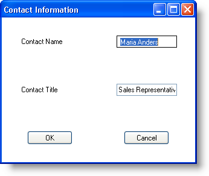

////

|metadata|
{
    "name": "wingridrowedittemplate-creating-a-wingridrowedittemplate-programmatically",
    "controlName": [],
    "tags": ["How Do I","Templating"],
    "guid": "{DB65C4EF-2D4B-4D35-A1B6-D5528262BE05}",  
    "buildFlags": [],
    "createdOn": "0001-01-01T00:00:00Z"
}
|metadata|
////

= Creating a WinGridRowEditTemplate Programmatically

== Before You Begin

The WinGridRowEditTemplate™ control is a powerful editing tool for your end user. You can manage the layout of the template just as you would a normal Windows Forms panel. Since the template derives from System.Windows.Forms.Panel, you can use any one of our layout managers to control the template's layout at run time. Adding labels, text boxes, and buttons to the panel requires only the Add method off the template's Controls object. Laying out the controls in a suitable pattern requires only the  pick:[win-forms="link:{ApiPlatform}win.misc{ApiVersion}~infragistics.win.misc.ultragridbaglayoutmanager~setgridbagconstraint.html[SetGridBagConstraint]"]  method off the  pick:[win-forms="link:{ApiPlatform}win.misc{ApiVersion}~infragistics.win.misc.ultragridbaglayoutmanager.html[UltraGridBagLayoutManager]"]  object. For more information on the WinGridBagLayoutManager™ control, see link:winlayoutmanager-using-the-winlayoutmanager-components.html[Using the Layout Manager Components].

== What You Will Accomplish

Upon completing this topic, you will have learned how to instantiate a WinGridRowEditTemplate control and populate it with labels, a WinGridCellProxy™ control, an in-box TextBox, and buttons. You will also learn how to manage these control's layouts with the WinGridBagLayoutManager control.

== Follow these Steps

[start=1]
. *Add a WinGrid control to your form and bind it to the Northwind Customers table* .

.. In a new Windows Forms project, double-click  pick:[win-forms="link:{ApiPlatform}win.ultrawingrid{ApiVersion}~infragistics.win.ultrawingrid.ultragrid.html[UltraGrid]"]  from the Microsoft® Visual Studio® toolbox. WinGrid is added to your form and the UltraWinGrid Quick Start dialog box appears.
.. Click Finish to dismiss the dialog box.
.. With WinGrid still selected, locate the Dock property in the properties window and set it to Fill.
.. Bind WinGrid to the Customers table in the Northwind database. For more information, see link:wingrid-binding-wingrid-to-a-flat-data-source-clr2.html[Bind WinGrid to a Flat Data Source].

[start=2]
. *Create a new instance of an UltraGridRowEditTemplate object* .

In order to use a row's edit template, you need to create one and set it to the band's  pick:[win-forms="link:{ApiPlatform}win.ultrawingrid{ApiVersion}~infragistics.win.ultrawingrid.ultragridband~rowedittemplate.html[RowEditTemplate]"]  property. Just above the form's Load event in the code-behind, instantiate a new UltraGridRowEditTemplate object. In the form's Load event, you'll set WinGrid's first band's RowEditTemplate property to the template you just instantiated. You'll then set a few aesthetic properties on the template, add it to the form's Controls collection, and set the template to the first band in WinGrid.

*In Visual Basic:*

----
 'Instantiate an UltraGridRowEditTemplate object.
Dim ret As New Infragistics.Win.UltraWinGrid.UltraGridRowEditTemplate()
Private Sub Form1_Load(sender As Object, e As EventArgs)
   'Set the template's size, caption, backcolor, 
   'and add it to the Controls collection.
   Me.ret.Size = New Size(320, 240)
   Me.ret.DialogSettings.Caption = "Contact Information"
   Me.ret.Appearance.BackColor = Color.White
   Me.ret.Visible = False
   Me.Controls.Add(Me.ret)
   Me.UltraGrid1.DisplayLayout.Bands(0).RowEditTemplate = Me.ret
End Sub 'Form1_Load
----

*In C#:*

----
//Instantiate an UltraGridRowEditTemplate object.
Infragistics.Win.UltraWinGrid.UltraGridRowEditTemplate ret = 	new Infragistics.Win.UltraWinGrid.UltraGridRowEditTemplate();
private void Form1_Load(object sender, EventArgs e)
{
	//Set the template's size, caption, backcolor, 
	//and add it to the Controls collection.
	this.ret.Size = new Size(320, 240);
	this.ret.DialogSettings.Caption = "Contact Information";
	this.ret.Appearance.BackColor = Color.White;
	this.ret.Visible = false;
	this.Controls.Add(this.ret);
	this.ultraGrid1.DisplayLayout.Bands[0].RowEditTemplate = this.ret;
}
----

[start=3]
. *Manage WinGridRowEditTemplate's controls with the WinGridBagLayoutManager* .

In order to easily manage controls on the template, you can use the WinGridBagLayoutManager component. WinGridBagLayoutManager enables you to place controls in a container control in a grid-like pattern. Therefore, since you are using multiple controls (labels, text boxes, buttons, etc.), you need an easy way to manage them so you don’t have to set the location and size of each control yourself.

*In Visual Basic:*

----
'Instantiate an UltraGridBagLayout component.
Dim gridBag As Infragistics.Win.Misc.UltraGridBagLayoutManager = _
	New Infragistics.Win.Misc.UltraGridBagLayoutManager()
'Set the container whose layout will be managed
'by WinGridBagLayoutManager.
gridBag.ContainerControl = ret
'These two properties will space the controls out
'evenly in the available space.
gridBag.ExpandToFitHeight = True
gridBag.ExpandToFitWidth = True
----

*In C#:*

----
//Instantiate an UltraGridBagLayout component.
Infragistics.Win.Misc.UltraGridBagLayoutManager gridBag = 
	new Infragistics.Win.Misc.UltraGridBagLayoutManager();
//Set the container whose layout will be managed
//by WinGridBagLayoutManager.
gridBag.ContainerControl = ret;
//These two properties will space the controls out
//evenly in the available space.
gridBag.ExpandToFitHeight = true;
gridBag.ExpandToFitWidth = true;
----

[start=4]
. *Add labels to the template and manage their layout* .

Add labels so your end user knows what fields they are editing. You will simply instantiate two labels, add them to the template's Controls collection, and set a few aesthetic properties. Once the labels themselves are setup, you will need to call the SetGridBagConstraint method on both of them to set their positions in the grid bag layout.

*In Visual Basic:*

----
'create the labels and add them to the 
'row's edit template.
Dim ultraLabel1 As New Infragistics.Win.Misc.UltraLabel()
ret.Controls.Add(ultraLabel1)
ultraLabel1.Text = "Contact Name"
ultraLabel1.Appearance.TextVAlign = _
   Infragistics.Win.VAlign.Middle
'Place the label in row 1, column 1
'of the grid bag layout.
gridBag.SetGridBagConstraint(ultraLabel1, _
   New Infragistics.Win.Layout.GridBagConstraint(0, 0, 1, 1))
Dim ultraLabel2 As New Infragistics.Win.Misc.UltraLabel()
ret.Controls.Add(ultraLabel2)
ultraLabel2.Text = "Contact Title"
ultraLabel2.Appearance.TextVAlign = _
   Infragistics.Win.VAlign.Middle
'Place the label in row 2, column 1
'of the grid bag layout.
gridBag.SetGridBagConstraint(ultraLabel2, _
   New Infragistics.Win.Layout.GridBagConstraint(0, 1, 1, 1))
----

*In C#:*

----
//create the labels and add them to the 
//row's edit template.
Infragistics.Win.Misc.UltraLabel ultraLabel1 = 	new Infragistics.Win.Misc.UltraLabel();
ret.Controls.Add(ultraLabel1);
ultraLabel1.Text = "Contact Name";
ultraLabel1.Appearance.TextVAlign = 
	Infragistics.Win.VAlign.Middle;
//Place the label in row 1, column 1
//of the grid bag layout.
gridBag.SetGridBagConstraint(
	ultraLabel1, 
	new Infragistics.Win.Layout.GridBagConstraint(0, 0, 1, 1));
Infragistics.Win.Misc.UltraLabel ultraLabel2 = 	new Infragistics.Win.Misc.UltraLabel();
ret.Controls.Add(ultraLabel2);
ultraLabel2.Text = "Contact Title";
ultraLabel2.Appearance.TextVAlign =
	Infragistics.Win.VAlign.Middle;
//Place the label in row 2, column 1
//of the grid bag layout.
gridBag.SetGridBagConstraint(
	ultraLabel2, 
	new Infragistics.Win.Layout.GridBagConstraint(0, 1, 1, 1));
----

[start=5]
. *Add a WinGridCellProxy control to the template* .

The WinGridCellProxy control is a unique textbox that only functions properly within an associated WinGridRowEditTemplate control. WinGridCellProxy must be a member of WinGridRowEditTemplate's Controls collection in order for it to inherit the proper data bindings. Once a member of the Controls collection, you only need to set the link:{ApiPlatform}win.ultrawingrid{ApiVersion}~infragistics.win.ultrawingrid.ultragridcellproxy~columnkey.html[ColumnKey] property to whichever column's key that you want to display from the WinGridRowEditTemplate's associated band.

*In Visual Basic:*

----
'Instantiate a new UltraGridCellProxy object.
Dim proxy1 as Infragistics.Win.UltraWinGrid.UltraGridCellProxy = _	New Infragistics.Win.UltraWinGrid.UltraGridCellProxy()
'Set the proxy to show data from the ContactName column.
proxy1.ColumnKey = "ContactName"
proxy1.Size = New Size(100, 20)
'Add the proxy to the template's Controls collection.
ret.Controls.Add(proxy1)
'Place the proxy in row 1, column 2 of the grid bag layout.
gridBag.SetGridBagConstraint( _
	proxy1, _
	New Infragistics.Win.Layout.GridBagConstraint(1, 0, 1, 1))
----

*In C#:*

----
//Instantiate a new UltraGridCellProxy object.
Infragistics.Win.UltraWinGrid.UltraGridCellProxy proxy1 = 	new Infragistics.Win.UltraWinGrid.UltraGridCellProxy();
//Set the proxy to show data from the ContactName column.
proxy1.ColumnKey = "ContactName";
proxy1.Size = new Size(100, 20);
//Add the proxy to the template's Controls collection.
ret.Controls.Add(proxy1);
//Place the proxy in row 1, column 2 of the grid bag layout.
gridBag.SetGridBagConstraint(
	proxy1,
	new Infragistics.Win.Layout.GridBagConstraint(1, 0, 1, 1));
----

[start=6]
. *Add a bound, in-box text box to the template* .

Although the WinGridCellProxy control was designed specifically for WinGridRowEditTemplate, you can also use a standard, in-box text box to display column data in a row's edit template. The TextBox control exposes a DataBindings object which allows you to add data bindings with the Add method. The Add method includes seven overloads; you'll be using the second overload. The second overload accepts three parameters:

** The name of the property on the text box you'd like to bind the column data to.
** The data source (in this case, the WinGridRowEditTemplate control) the text box will receive data from.
** The data member (in the case of a row's edit template, the key of a column on the associated band) of the associated data source.

*In Visual Basic:*

----
'Instantiate a new TextBox object.
Dim text1 As TextBox = New TextBox()
'Add the TextBox to template's Controls collection.
ret.Controls.Add(text1)
'Bind the TextBox to the template and show the data
'from the ContactTitle column in the text box.
text1.DataBindings.Add("Text", ret, "ContactTitle")
'Place the TextBox in row 2, column 2 of the grid bag's layout.
gridBag.SetGridBagConstraint( _
	text1, _
	New Infragistics.Win.Layout.GridBagConstraint(1, 1, 1, 1))
----

*In C#:*

----
//Instantiate a new TextBox object.
TextBox text1 = new TextBox();
//Add the TextBox to template's Controls collection.
ret.Controls.Add(text1);
//Bind the TextBox to the template and show the data
//from the ContactTitle column in the text box.
text1.DataBindings.Add("Text", ret, "ContactTitle");
//Place the TextBox in row 2, column 2 of the grid bag's layout.
gridBag.SetGridBagConstraint(
	text1,
	new Infragistics.Win.Layout.GridBagConstraint(1, 1, 1, 1));
----

[start=7]
. *Add Accept and Cancel buttons to the template* .

Your end users need a way to update the data and cancel any changes, if necessary. Therefore, you need to add two buttons to the template that will act as accept and cancel buttons. To do this, you need to instantiate two buttons and add event handlers so you can later call the template's link:{ApiPlatform}win.ultrawingrid{ApiVersion}~infragistics.win.ultrawingrid.ultragridrowedittemplate~close.html[Close] method and either save or cancel changes depending on the button.

The following example code instantiates two buttons, adds handlers for their Click events, and places them in the grid bag's layout.

*In Visual Basic:*

----
'Instatiate a new UltraButton object.
Dim accept As Infragistics.Win.Misc.UltraButton = 	New Infragistics.Win.Misc.UltraButton()
'Set the button's text.
accept.Text = "OK"
'Add the button to the template's Controls collection.
ret.Controls.Add(accept)
'Create a handler for the accept button.
AddHandler accept.Click, AddressOf Accept_Click
'Place the button in row 3, column 1 of the grid bag's layout.
gridBag.SetGridBagConstraint( _
	accept, _
	New Infragistics.Win.Layout.GridBagConstraint(0, 2, 1, 1))
'Instatiate a new UltraButton object.
Dim cancel As Infragistics.Win.Misc.UltraButton = 	New Infragistics.Win.Misc.UltraButton()
'Set the button's text.
cancel.Text = "Cancel"
'Add the button to the template's Controls collection.
ret.Controls.Add(cancel)
'Create a handler for the cancel button.
AddHandler cancel.Click, AddressOf Accept_Click
'Place the button in row 3, column 2 of the grid bag's layout.
gridBag.SetGridBagConstraint( _
	cancel, _
	New Infragistics.Win.Layout.GridBagConstraint(1, 2, 1, 1))
----

*In C#:*

----
//Instatiate a new UltraButton object.
Infragistics.Win.Misc.UltraButton accept = 	new Infragistics.Win.Misc.UltraButton();
//Set the button's text.
accept.Text = "OK";
//Add the button to the template's Controls collection.
ret.Controls.Add(accept);
//Create a handler for the accept button.
accept.Click += new EventHandler(accept_Click);
//Place the button in row 3, column 1 of the grid bag's layout.
gridBag.SetGridBagConstraint(
	accept,
	new Infragistics.Win.Layout.GridBagConstraint(0, 2, 1, 1));
//Instatiate a new UltraButton object.
Infragistics.Win.Misc.UltraButton cancel = 	new Infragistics.Win.Misc.UltraButton();
//Set the button's text.
cancel.Text = "Cancel";
//Add the button to the template's Controls collection.
ret.Controls.Add(cancel);
//Create a handler for the cancel button.
cancel.Click += new EventHandler(cancel_Click);
//Place the button in row 3, column 2 of the grid bag's layout.
gridBag.SetGridBagConstraint(
	cancel,
	new Infragistics.Win.Layout.GridBagConstraint(1, 2, 1, 1));
----

[start=8]
. *Handle the accept and cancel buttons' Click events* .

The WinGridRowEditTemplate control exposes a Close method which gives you the option through a boolean parameter to either save all pending changes, or discard the changes. Passing True as a parameter will save changes while passing False will cancel. Regardless of which parameter you pass, the template will close as a result of calling the Close method.

Add the following code after the form's Load event.

*In Visual Basic:*

----
Sub accept_Click(sender As Object, e As EventArgs)
   'Close the template and save any pending changes.
   Me.ret.Close(True)
End Sub 'accept_Click
Sub cancel_Click(sender As Object, e As EventArgs)
   'Close the template and discard any pending changes.
   Me.ret.Close(False)
End Sub 'cancel_Click
----

*In C#:*

----
void accept_Click(object sender, EventArgs e)
{
	//Close the template and save any pending changes.
	this.ret.Close(true);
}
void cancel_Click(object sender, EventArgs e)
{
	//Close the template and discard any pending changes.
	this.ret.Close(false);
}
----

[start=9]
. *Run the application*

When you run the application, you will see WinGrid bound to the Northwind Customers table. You will see a row edit button to the left of each row. If you click a row's row edit button, that particular row's edit template will appear. The template includes two text boxes, both bound to the ContactName and ContactTitle columns, and two buttons to allow you to save changes and cancel.

