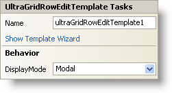

////

|metadata|
{
    "name": "wingridrowedittemplate-smart-tag",
    "controlName": [],
    "tags": ["Getting Started"],
    "guid": "{3F386CCF-8840-4A64-878D-1C4CDF156C8A}",  
    "buildFlags": [],
    "createdOn": "0001-01-01T00:00:00Z"
}
|metadata|
////

= WinGridRowEditTemplate Smart Tag

In Visual Studio 2005 (.NET Framework 2.0), each Infragistics Windows Forms control/component is equipped with a Smart Tag. By simply selecting the control/component, a Smart Tag anchor appears. When you click this anchor, a pop-up panel appears, providing you with quick and easy access to the most common properties and settings of the control/component.

The WinGridRowEditTemplate™ Smart Tag contains the name of the control, as well as the following sections:

* Behavior -- Provides easy access to properties that govern how the control behaves on the form.

See below for a description of the item (e.g., field, drop-down list, checkbox) in each section, as well as the item's corresponding property in the properties grid.

[options="header", cols="a,a,a"]
|====
|Behavior|Description|Corresponding Property

|DisplayMode
|Since WinGridRowEditTemplate is a panel, you have the option of display it as a modal dialog box, non-modal dialog box, or as a popup.
| link:{ApiPlatform}win.ultrawingrid{ApiVersion}~infragistics.win.ultrawingrid.ultragridrowedittemplate~displaymode.html[DisplayMode]

|====