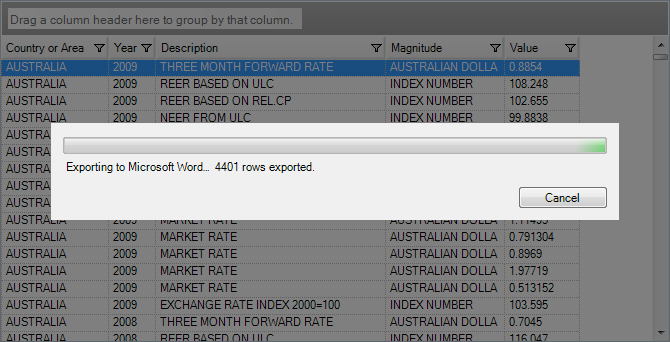

////

|metadata|
{
    "name": "wingridwordwriter-export-wingrid-asynchronously",
    "controlName": ["WinGridWordWriter"],
    "tags": ["Exporting","Grids","Reporting"],
    "guid": "793491bf-846d-46a9-8d27-31b24bbdab6d",  
    "buildFlags": [],
    "createdOn": "2011-08-08T13:45:09.2718754Z"
}
|metadata|
////

= Export WinGrid Asynchronously

The WinGridWordWriter™ component enables you to asynchronously export your entire WinGrid™ directly into a Microsoft Word document. You do this by calling the link:{ApiPlatform}win.ultrawingrid.wordwriter{ApiVersion}~infragistics.win.ultrawingrid.wordwriter.ultragridwordwriter~exportasync.html[ExportAsync] method of the UltraGridWordWriter object.

== Introduction

Asynchronous exporting, as opposed to synchronous, allows users to interact with the user interface of the application while the export process is executing. You must ensure that neither the WinGrid, nor its data source is accessed by your application in any way while the asynchronous export is in progress. The link:{ApiPlatform}win.ultrawingrid{ApiVersion}~infragistics.win.ultrawingrid.ultragrid~isexportasyncinprogress.html[IsExportAsyncInProgress] property of the WinGrid can be used to determine whether or not the asynchronous export is still in progress to avoid any access conflicts.

== Requirements

* A Microsoft Visual Studio solution using .NET Framework 3.0 or higher
* A Windows Forms Application Solution using the WinGrid and bound to data
* A WinGridWordWriter control on the form

== Overview

[start=1]
. <<Anchor4154,Exporting the WinGrid asynchronously>>
[start=2]
. <<Anchor828,(Optional) Verifying the result>>

== Steps

[[Anchor4154]]
[start=1]
. Export the WinGrid Asynchronously

*In C#:*

----
this.ultraGridWordWriter1.ExportAsync(this.ultraGrid1, "C:\\Reports\\WordExport.doc");
----

*In Visual Basic:*

----
Me.UltraGridWordWriter1.ExportAsync(Me.UltraGrid1, "C:\Reports\WordExport.doc")
----

[[Anchor828]]
[start=2]
. (Optional) Verify the resultsTo verify the result, run your application and perform the export (Figure 1).

Figure 1: WinGrid asynchronously exporting to a Microsoft Word document

== Related Topics

* link:wingridwordwriter-export-wingrid-with-paragraphs-to-word.html[Exporting WinGrid with Paragraphs to Word]
* link:wingridwordwriter-export-multiple-wingrid-to-word.html[Exporting Multiple WinGrids to Word]