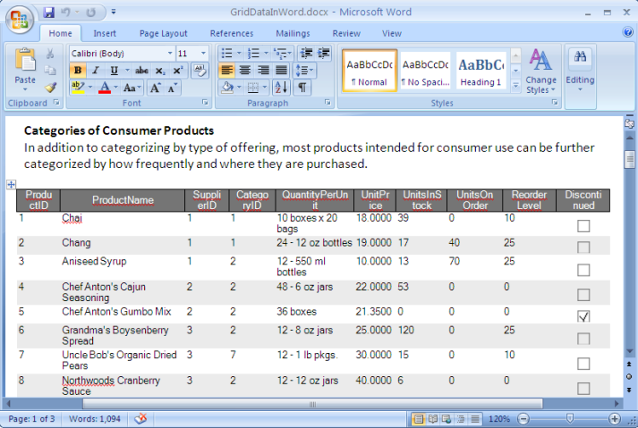

////

|metadata|
{
    "name": "wingridwordwriter-export-wingrid-with-paragraphs-to-word",
    "controlName": ["WinGridWordWriter"],
    "tags": ["Exporting","Getting Started","How Do I"],
    "guid": "228dea03-dcfa-4762-be93-0873749b291a",  
    "buildFlags": [],
    "createdOn": "2011-03-15T16:09:45.9785985Z"
}
|metadata|
////

= Exporting WinGrid with Paragraphs to Word

The WinGridWordWriter™ component enables data export from the WinGrid™ control to a new Word document. Additionally other elements such as paragraphs, images, hyperlinks etc., can also be inserted into the document either before or after the WinGrid control.

The following screenshots depicts how an exported grid may look in Word:

Exporting is possible by calling the Export method on the WinGridWordWriter component, based on the link:{ApiPlatform}documents.io{ApiVersion}~infragistics.documents.word.worddocumentwriter.html[WordDocumentWriter] class in the Infragisitcs.Documents.IO assembly. The link:{ApiPlatform}win.ultrawingrid.wordwriter{ApiVersion}~infragistics.win.ultrawingrid.wordwriter.ultragridwordwriter~export.html[Export] method accepts as parameters an instance of the WinGrid control along with a destination file name, stream or an instance of the WordDocumentWriter.

The following code demonstrates how to export the UltraGrid control to a new Word document with a specified file name.

*In C#:*

----
// The Export method takes in the Grid control and the file name as parameters
this.ultraGridWordWriter1.Export(ultraGrid1,"C:\\Samples_Projects\\GridDataInWord.docx");
----

*In Visual Basic:*

----
'  The Export method takes in the Grid control and the file name as parameters
Me.ultraGridWordWriter1.Export(ultraGrid1, "C:\Samples_Projects\GridDataInWord.docx")
----

In addition to exporting raw data to a document, you also have the ability to add other elements to the page that accompany the exported data. The following code illustrates how to export data from an UltraGrid control along with programmatically-added paragraphs to a new Word document.

To begin, drag and drop an UltraGrid control and an UltraGridWordWriter component from the toolbox onto the form. Then, bind the UltraGrid control to the Products table of Northwind database. References to the Infragistics3.Documents.IO, Infragistics3.Win.UltraWinGrid.WordWriter and Infragistics4.Win.UltraWinGrid assemblies are required.

.Note
[NOTE]
====
For information on how to data bind the WinGrid control, see the Bind WinGrid to a Flat Data Source topic.
====

*In C#:*

----
// Create a new instance of the WordDocumentWriter class
// using the static 'Create' method.
// After writing content, this instance must be closed.
WordDocumentWriter wordDocWriter = WordDocumentWriter.Create(@"C:\Samples_Projects\GridDataInWord.docx");
// Create an instance of the Font class
Infragistics.Documents.Word.Font font = wordDocWriter.CreateFont();
// Start the document...note that each call to
// StartDocument must be balanced with a corresponding
// call to EndDocument.
wordDocWriter.StartDocument();
// Begin a paragraph. This must be
// balanced with a corresponding call to EndParagraph.
wordDocWriter.StartParagraph();
font.Reset();
font.Bold = true;
wordDocWriter.AddTextRun("Categories of Consumer Products", font);
wordDocWriter.AddNewLine();
font.Reset();
wordDocWriter.AddTextRun("In addition to categorizing by type of offering, most products intended for consumer use can be further categorized by how frequently and where they are purchased.");
// End paragraph
wordDocWriter.EndParagraph();
wordDocWriter.AddEmptyParagraph();
// Call the Export method on WinGridWordWriter and
// pass the Grid control and WordDocumentWriter object as parameters. this.ultraGridWordWriter1.Export(ultraGrid1, wordDocWriter); 
// End the Document
wordDocWriter.EndDocument();
// Close the writer and finalize content
wordDocWriter.Close();
----

*In Visual Basic:*

----
' Create a new instance of the WordDocumentWriter class
' using the static 'Create' method.
' After writing content, this instance must be closed.
Dim wordDocWriter As WordDocumentWriter = WordDocumentWriter.Create("C:\Samples_Projects\GridDataInWord.docx")
Dim font As Infragistics.Documents.Word.Font = wordDocWriter.CreateFont()
' Start the document...note that each call to
' StartDocument must be balanced with a corresponding
' call to EndDocument.
wordDocWriter.StartDocument()
' Begin a paragraph. This must be
' balanced with a corresponding call to EndParagraph.
wordDocWriter.StartParagraph()
font.Reset()
font.Bold = True
wordDocWriter.AddTextRun("Categories of Consumer Products", font)
wordDocWriter.AddNewLine()
font.Reset()
wordDocWriter.AddTextRun("In addition to categorizing by type of offering, most products intended for consumer use can be further categorized by how frequently and where they are purchased.")
' End paragraph
wordDocWriter.EndParagraph()
wordDocWriter.AddEmptyParagraph()
' Call the Export method on WinGridWordWriter and
' pass the Grid control and WordDocumentWriter object as parameters.
Me.ultraGridWordWriter1.Export(ultraGrid1, wordDocWriter)
wordDocWriter.EndDocument()
' Closes the writer and finalize content
wordDocWriter.Close()
----

== Related Topics

* link:wingridwordwriter-about-wingridwordwriter.html[About WinGridWordWriter]
* link:wingridwordwriter-export-multiple-wingrid-to-word.html[Exporting Multiple WinGrids to Word]