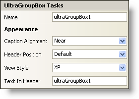

////

|metadata|
{
    "name": "wingroupbox-smart-tag",
    "controlName": ["WinGroupBox"],
    "tags": ["API","Design Environment"],
    "guid": "{45D3FCF1-3EEF-4E0E-A7CA-EA6EE2B0F0D2}",  
    "buildFlags": [],
    "createdOn": "2005-07-11T00:00:00Z"
}
|metadata|
////

= WinGroupBox Smart Tag

In Visual Studio 2005 (.NET Framework 2.0), each Infragistics Windows Forms control/component is equipped with a Smart Tag. By simply selecting the control/component, a Smart Tag anchor appears. When you click this anchor, a pop-up panel appears, providing you with quick and easy access to the most common properties and settings of the control/component.

The WinGroupBox™ Smart Tag contains the name of the control, as well as the following section:

* Appearance -- Provides common tasks involving the appearance, look, and feel of the control.

See below for a description of the item (e.g., field, drop-down list, checkbox) in each section, as well as the item's corresponding property in the properties grid.

[options="header", cols="a,a,a"]
|====
|Appearance|Description|Corresponding Property

|Caption Alignment
|The caption is the text at the top of the WinGroupBox. Choose to place the caption Near (Left), Center, or Far (Right).
| pick:[win-forms="link:{ApiPlatform}win.misc{ApiVersion}~infragistics.win.misc.ultragroupbox~captionalignment.html[CaptionAlignment]"] 

|Header Position
|You can place the header on any of the four sides of the WinGroupBox inside, on, or outside of the border.
| pick:[win-forms="link:{ApiPlatform}win.misc{ApiVersion}~infragistics.win.misc.ultragroupbox~headerposition.html[HeaderPosition]"] 

|View Style
|The style of the WinGroupBox can be changed to mimic Windows XP, Office 2000, Office 2003, Visual Studio 2005, Office 2007.
| pick:[win-forms="link:{ApiPlatform}win.misc{ApiVersion}~infragistics.win.misc.ultragroupbox~viewstyle.html[ViewStyle]"] 

|Text In Header
|This is the text that displays in the header.
| pick:[win-forms="link:{ApiPlatform}win.misc{ApiVersion}~infragistics.win.misc.ultragroupbox~text.html[Text]"] 

|====