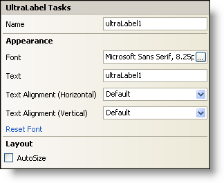

////

|metadata|
{
    "name": "winlabel-smart-tag",
    "controlName": ["WinLabel"],
    "tags": ["API","Design Environment"],
    "guid": "{09FBB01E-A2A0-4E7B-833E-FC73A9942715}",  
    "buildFlags": [],
    "createdOn": "2005-07-11T00:00:00Z"
}
|metadata|
////

= WinLabel Smart Tag

In Visual Studio 2005 (.NET Framework 2.0), each Infragistics Windows Forms control/component is equipped with a Smart Tag. By simply selecting the control/component, a Smart Tag anchor appears. When you click this anchor, a pop-up panel appears, providing you with quick and easy access to the most common properties and settings of the control/component.

The WinLabel™ Smart Tag contains the name of the control, as well as the following sections:

* Appearance -- Provides common tasks involving the appearance, look, and feel of the control.
* Layout -- Offers properties that will determine where and how the control is placed on the form.

See below for a description of the item (e.g., field, drop-down list, checkbox) in each section, as well as the item's corresponding property in the properties grid.

[options="header", cols="a,a,a"]
|====
|Appearance|Description|Corresponding Property

|Font
|Click on the ellipsis (...) to open the Font Dialog. From here you can choose the font, font size, font style, etc...
| pick:[win-forms="link:{ApiPlatform}win{ApiVersion}~infragistics.win.appearance~fontdata.html[Font]"] 

|Text
|This is the text that appears on the label.
| pick:[win-forms="link:{ApiPlatform}win.misc{ApiVersion}~infragistics.win.misc.controlbase~text.html[Text]"] 

|Text Alignment 

(Horizontal)
|Align the text horizontally to Left, Center, or Right.
| pick:[win-forms="link:{ApiPlatform}win{ApiVersion}~infragistics.win.appearance~texthalign.html[TextHAlign]"] 

|Text Alignment 

(Vertical)
|Align the text vertically to Top, Middle, or Bottom.
| pick:[win-forms="link:{ApiPlatform}win{ApiVersion}~infragistics.win.appearance~textvalign.html[TextVAlign]"] 

|Reset Font
|Clicking this will reset the label's font to its default value.
|n/a

|====

[options="header", cols="a,a,a"]
|====
|Layout|Description|Corresponding Property

|AutoSize
|Checking this checkbox will force the label to resize itself based on the size of its contents.
| pick:[win-forms="link:{ApiPlatform}win.misc{ApiVersion}~infragistics.win.misc.autosizecontrolbase~autosize.html[AutoSize]"] 

|====